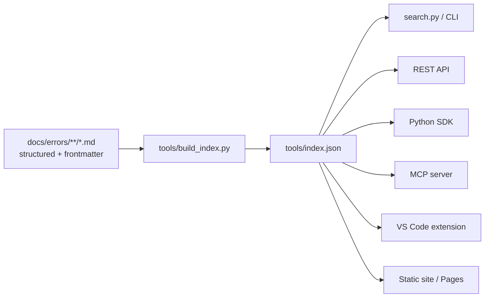

# Roadmap

This project starts as the most comprehensive open-source Kubernetes
troubleshooting **knowledge base** and grows toward a full troubleshooting
**platform**. The repository is deliberately architected so each future
interface reads from the same structured content (`docs/errors/**` + the
generated `tools/index.json`).

## Now — v1.x (knowledge base)

- [x] 300+ structured production-error pages
- [x] Subsystem-organized error library (`docs/errors/<area>/`)
- [x] Incident playbooks for the major failure domains
- [x] Extensive `kubectl` troubleshooting reference + cheatsheets
- [x] Mermaid diagrams (architecture, decision trees, flowcharts)
- [x] Offline Python search tool (`search.py`) + JSON index
- [x] Read-only diagnostic scripts
- [x] CI: markdown lint, link check, spell check, index validation, tests

## Next — v2.x (programmable access)

- [ ] **REST API** over `tools/index.json` (FastAPI) — `/errors`, `/search`
- [ ] **Python SDK** (`pip install`) wrapping the index and search
- [ ] **CLI application** (`kt search ...`, `kt show CrashLoopBackOff`)
- [ ] **Interactive search** (fuzzy, faceted) in the terminal
- [ ] Stable, versioned `index.json` schema

## Later — v3.x (surfaces & intelligence)

- [ ] **Static documentation site** (GitHub Pages) with client-side search
- [ ] **VS Code extension** — hover an error string, get the page
- [ ] **MCP server** so AI agents can query the library during incidents
- [ ] **AI-powered incident assistant** that maps live cluster signals to pages
- [ ] **Web dashboard** for browsing by subsystem and severity

## How the architecture supports this

Want to drive one of these? Open a
[Discussion](https://github.com/devopsaitoolkit/kubernetes-troubleshooting/discussions)
— contributors are credited and we love co-maintainers.
