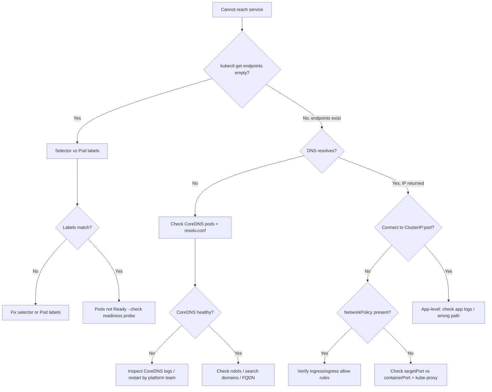

# Networking & DNS Troubleshooting Cheatsheet

Service unreachable? Walk the path from client to Pod. Everything below is **read-only**.

## Quick checks

| Goal | Command |
|------|---------|
| Service spec + selector | `kubectl describe svc <svc> -n <ns>` |
| Backing Pod IPs (the key check) | `kubectl get endpoints <svc> -n <ns>` |
| EndpointSlices (newer) | `kubectl get endpointslices -n <ns> -l kubernetes.io/service-name=<svc>` |
| Do selector labels match Pods? | `kubectl get pods -n <ns> --show-labels` |
| Pod IPs and nodes | `kubectl get pods -n <ns> -o wide` |
| CoreDNS health | `kubectl get pods -n kube-system -l k8s-app=kube-dns` |
| DNS from a Pod | `kubectl exec -it <pod> -n <ns> -- nslookup <svc>.<ns>.svc.cluster.local` |
| resolv.conf in Pod | `kubectl exec -it <pod> -n <ns> -- cat /etc/resolv.conf` |
| Reach service from Pod | `kubectl exec -it <pod> -n <ns> -- wget -qO- http://<svc>.<ns>:<port>` |
| NetworkPolicies in ns | `kubectl get networkpolicy -n <ns>` |
| Ingress rules | `kubectl describe ingress <name> -n <ns>` |

## The golden rule: check endpoints first

A Service is just a stable name plus a selector. If `kubectl get endpoints <svc>` is **empty**, the Service matches no ready Pods — fix that before suspecting DNS or the network. Empty endpoints almost always means a **selector/label mismatch** or all Pods are **not Ready** (failing readiness probes).

## DNS name forms

- Same namespace: `my-svc`
- Cross namespace: `my-svc.other-ns`
- Fully qualified: `my-svc.other-ns.svc.cluster.local`
- Default cluster DNS IP is usually `10.96.0.10` (check `resolv.conf`).

## Decision flow



## Common gotchas

- **targetPort vs port:** the Service `port` is what clients dial; `targetPort` must match the container's actual listening port. A mismatch gives "connection refused" even with healthy endpoints.
- **Readiness gates endpoints:** a Pod only appears in endpoints when its readiness probe passes. Failing readiness silently removes it from rotation.
- **Default-deny NetworkPolicy:** once any policy selects a Pod, all non-matching traffic is dropped. Check both ingress (to the server) and egress (from the client), including egress to CoreDNS on UDP/TCP 53.
- **ndots:5:** the default `resolv.conf` `ndots:5` means short names trigger multiple search-domain lookups; an external name without a trailing dot can be slow or fail. Test with the FQDN.
- **headless services** (`clusterIP: None`) return Pod IPs directly via DNS, not a single VIP — different debugging path.

## Verifying from inside the network

When you must test from a Pod's network identity but the app image is minimal, launch a throwaway debug Pod instead of `exec`-ing tools into the workload:

```bash
kubectl run netcheck --rm -it --image=nicolaka/netshoot -n <ns> -- bash
# inside: dig my-svc.<ns>.svc.cluster.local ; curl -v http://my-svc:<port>
```

`kubectl run --rm -it` is a temporary diagnostic Pod that deletes itself on exit — low blast radius, but it does create a Pod, so name it clearly and let `--rm` clean it up.

## NetworkPolicy quick read

```bash
kubectl describe networkpolicy <name> -n <ns>
```

Read the `PodSelector` (who it applies to), then `Ingress`/`Egress` rules. Remember: policies are **additive allow-lists**; the absence of a rule is a deny once a policy selects the Pod.
