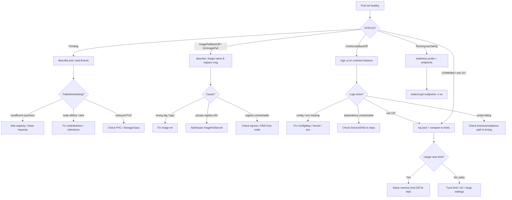

# Pod Troubleshooting Cheatsheet

One page to go from a broken Pod to a root cause. Everything here is **read-only** unless noted.

## Quick commands

| Goal | Command |
|------|---------|
| First look (spec + status + events) | `kubectl describe pod <pod> -n <ns>` |
| Current app logs | `kubectl logs <pod> -n <ns> -c <container>` |
| Crashed instance logs | `kubectl logs <pod> -n <ns> -p` |
| Live tail, last 15m | `kubectl logs <pod> -n <ns> -f --since=15m` |
| Status + restarts + node/IP | `kubectl get pod <pod> -n <ns> -o wide` |
| Why pending / why killed | `kubectl get events -n <ns> --sort-by=.lastTimestamp` |
| Resource usage now | `kubectl top pod <pod> -n <ns> --containers` |
| Requests/limits configured | `kubectl get pod <pod> -n <ns> -o jsonpath='{.spec.containers[*].resources}'` |
| Inspect inside (no fix!) | `kubectl exec -it <pod> -n <ns> -- sh` |
| Distroless / no shell | `kubectl debug -it <pod> -n <ns> --image=busybox --target=<c> -- sh` |

## Read the signals

- **STATUS column** tells you the failure class (see tree below).
- **RESTARTS** climbing = crash loop. Pair with `logs -p`.
- **Exit code** in `describe` → `Last State`: `137` = OOMKilled/SIGKILL, `143` = SIGTERM, `1`/`2` = app error.
- **Events** at the bottom of `describe` carry kubelet/scheduler reasons (`FailedScheduling`, `Failed`, `BackOff`, `Unhealthy`).

## Decision tree



## Failure-class quick notes

**CrashLoopBackOff** — the container starts then exits repeatedly. The truth is in `kubectl logs <pod> -p` (previous instance). Common causes: missing env/config, failed migrations, unreachable dependency at startup, or a liveness probe that kills a slow-starting app (raise `initialDelaySeconds`).

**ImagePullBackOff / ErrImagePull** — kubelet can't fetch the image. Check the exact image string and the Event message in `describe`. Typos, missing tags, missing `imagePullSecret` for private registries, or node egress/DNS problems.

**Pending** — the scheduler can't place the Pod. `describe` Events show `FailedScheduling` with the reason: insufficient CPU/memory, taints without tolerations, node affinity mismatch, or an unbound PersistentVolumeClaim.

**OOMKilled (exit 137)** — the container exceeded its memory **limit**. Compare `kubectl top pod` against the limit from the spec. Either raise the limit, fix the leak, or tune runtime memory (e.g. JVM heap, Node `--max-old-space-size`).

## Capture before you lose it

Logs and Events disappear when a Pod is deleted or after the Event TTL (~1h). Save them first:

```bash
kubectl logs <pod> -n <ns> -p > crash.log
kubectl describe pod <pod> -n <ns> > describe.txt
```

## State-changing escape hatches (use deliberately)

These mutate workloads — blast radius noted:

```bash
kubectl rollout restart deploy/<name> -n <ns>   # restarts ALL replicas
kubectl rollout undo    deploy/<name> -n <ns>   # reverts ALL replicas
```
