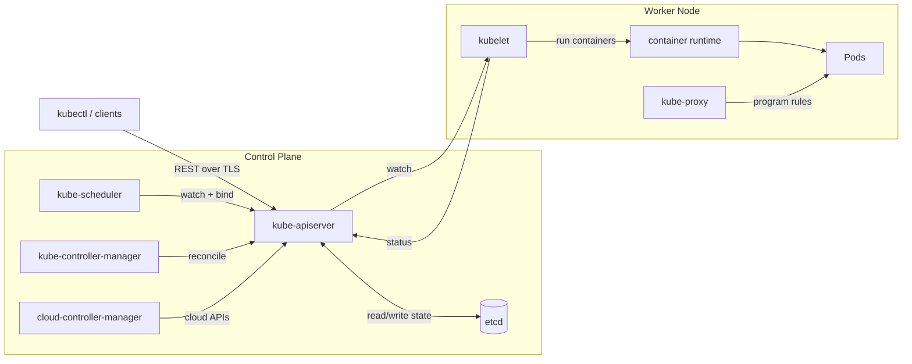
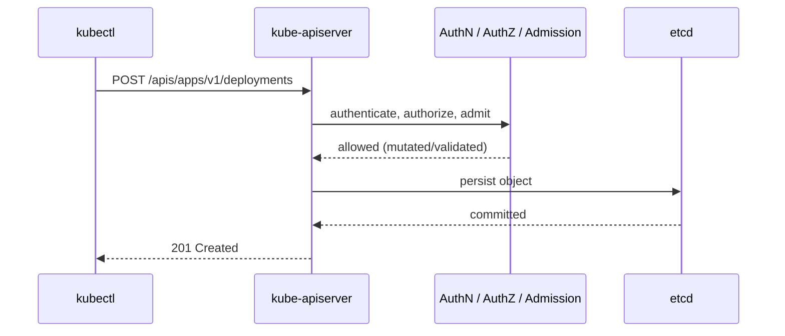
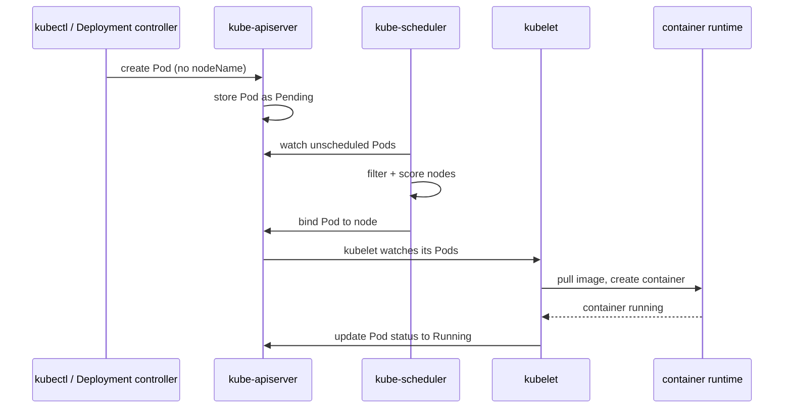
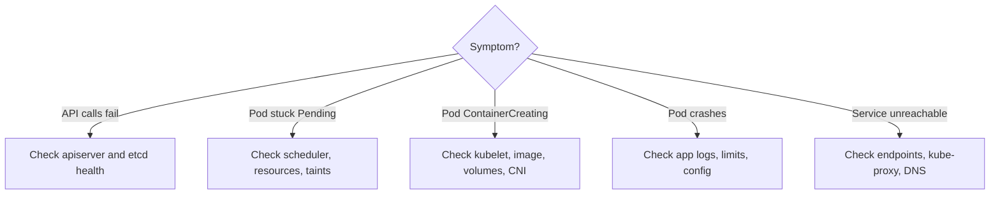

# Kubernetes Architecture Diagrams

Understanding where a failure can occur starts with a mental model of the
cluster. Kubernetes is split into a **control plane** (the brain that decides
desired state) and a set of **worker nodes** (the muscle that runs your
workloads). The two halves communicate almost exclusively through the
API server, which makes it the single most important component to understand
when troubleshooting.

## Control plane and nodes overview

### Control plane components

- **kube-apiserver** is the front door. Every read and write — from `kubectl`,
  from controllers, from the kubelet — goes through it. It validates requests,
  enforces authentication/authorization/admission, and persists the result.
  If the API server is down, nothing else can make progress.
- **etcd** is the consistent key-value store that holds the entire cluster
  state. It is the source of truth. Loss of etcd quorum (an even or
  insufficient number of healthy members) freezes all writes. etcd is the one
  component you must back up.
- **kube-scheduler** watches for Pods that have no node assignment and picks a
  node for each based on resource requests, affinity, taints/tolerations, and
  topology constraints. It does not start containers; it only writes the chosen
  node back to the Pod object.
- **kube-controller-manager** runs the reconciliation loops (Deployment,
  ReplicaSet, Node, Job, endpoints, and many more). Each controller compares
  desired state to observed state and nudges the cluster toward desired.
- **cloud-controller-manager** integrates with the underlying cloud: it
  provisions load balancers, attaches volumes, and manages node lifecycle when
  running on a managed or cloud-hosted cluster.

### Node components

- **kubelet** is the node agent. It watches the API server for Pods bound to
  its node, asks the container runtime to start them, runs liveness/readiness
  probes, and reports node and Pod status back. A node going `NotReady` almost
  always traces back to the kubelet.
- **kube-proxy** programs the data path for Services. Depending on mode it
  configures iptables or IPVS rules (or a CNI may replace it entirely) so that
  traffic to a Service IP is load-balanced across healthy Pod endpoints.
- **container runtime** (containerd, CRI-O) actually pulls images and runs
  containers via the Container Runtime Interface (CRI). Image-pull and
  runtime-startup failures surface here.

## How an API request flows

A write request is authenticated (who are you?), authorized (are you allowed?),
and passed through admission controllers (mutate defaults, validate policy)
before it is ever written to etcd. Only after etcd confirms the write does the
client get a success response. This is why RBAC, admission webhooks, and etcd
health all show up as request failures at the API server.

## How a Pod gets scheduled and started

The lifecycle is fully **declarative and asynchronous**. The client creates a
Pod object and returns immediately; the object is just a record of intent. The
scheduler later assigns a node, and the kubelet on that node later starts the
containers. Each handoff is a place where things can stall:

- Stuck at **Pending** with no node → a scheduling problem (resources,
  affinity, taints). See the *Pod not running* decision tree.
- Bound to a node but **ContainerCreating** for a long time → image pull,
  volume mount, or CNI problem on that node.
- Running then crashing → an application or configuration problem
  (CrashLoopBackOff, OOMKilled).

Because every component watches the API server rather than calling each other
directly, troubleshooting usually means asking the API server what it observed:
`kubectl get`, `kubectl describe`, and `kubectl get events` reconstruct the
story of which handoff failed.

## Where things break

Use this map to decide which detailed diagram or error page to open next. In
nearly every case the investigation is "follow the request from the client to
the component that owns that handoff, and read its status and events."
