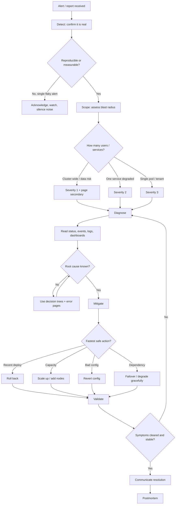
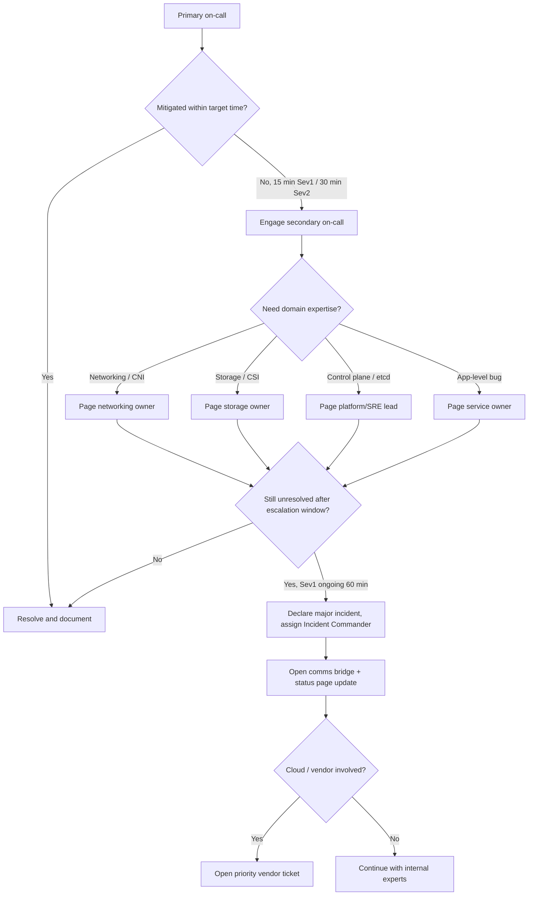

# Incident Response Flowcharts

When a cluster is on fire, a repeatable process beats improvisation. These
flowcharts describe the on-call triage workflow and the escalation path so that
anyone holding the pager can move calmly from alert to resolution to learning.

## On-call triage workflow

### The six stages

1. **Detect.** Confirm the alert reflects real user impact before you wake
   anyone. A single flaky probe is not an incident; a sustained error-rate jump
   is. Acknowledge the page so others know it's being handled.
2. **Scope.** Measure blast radius — one Pod, one service, or the whole
   cluster — and assign a severity. Scope drives both urgency and who you pull
   in. Cluster-wide or data-at-risk situations justify paging a second
   responder immediately.
3. **Diagnose.** Gather evidence: `kubectl get`/`describe`, events, logs,
   metrics, recent change history. Use the
   [decision trees](./troubleshooting-decision-trees.md) and
   [error pages](../errors/) to convert symptoms into a root cause. Loop here
   until you can name the cause.
4. **Mitigate.** Restore service with the fastest *safe* action — usually a
   rollback, a scale-up, or a config revert — even before the permanent fix.
   Stopping the bleeding is more important than elegance.
5. **Validate.** Confirm the symptom is gone and the system is stable, not just
   momentarily quiet. If it isn't, go back to diagnose; a partial fix can mask
   a second cause.
6. **Postmortem.** Once stable, write up the timeline, root cause,
   contributing factors, and action items. Blameless and concrete.

## Escalation tree

### Escalation principles

- **Time-box every level.** If the primary cannot mitigate within the severity
  target (for example 15 minutes for Sev1), pull in the secondary rather than
  pressing on alone. Escalation is a sign of good judgment, not failure.
- **Escalate by domain.** Route to the team that owns the failing layer —
  networking, storage, control plane, or the application — using the diagnosis
  to choose. Paging the wrong team wastes the window.
- **Declare a major incident** when a Sev1 stays unresolved past the
  escalation window. Assign an Incident Commander whose only job is
  coordination: they run the bridge, keep the timeline, update the status page,
  and decide when to involve the cloud provider.
- **Hand off cleanly.** On long incidents, follow-the-sun handoffs need a
  written current-state summary so the next responder doesn't restart
  diagnosis from zero.

## After the incident

Every Sev1 and Sev2 earns a blameless postmortem within a few business days.
Capture the detection-to-resolution timeline against the workflow above, note
where the process slowed you down (slow detection? wrong escalation?
missing runbook?), and file action items with owners and due dates. The goal is
not to assign blame but to make the next incident shorter — ideally by turning
this one's diagnosis into a new entry in the
[decision trees](./troubleshooting-decision-trees.md) or
[playbooks](../playbooks/).
