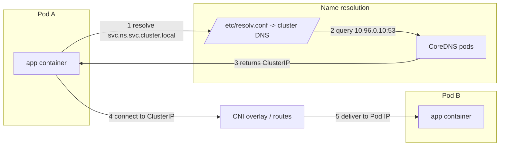
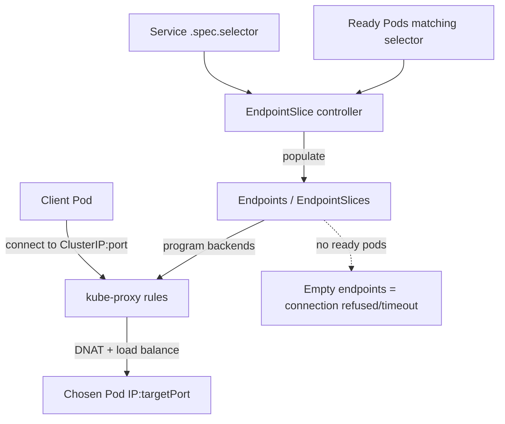
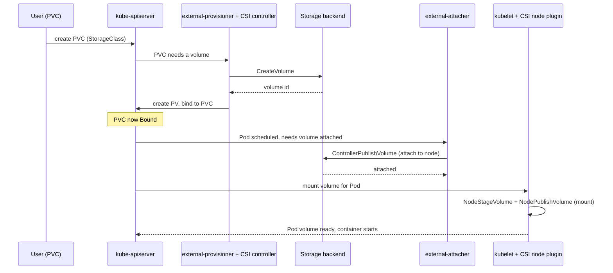
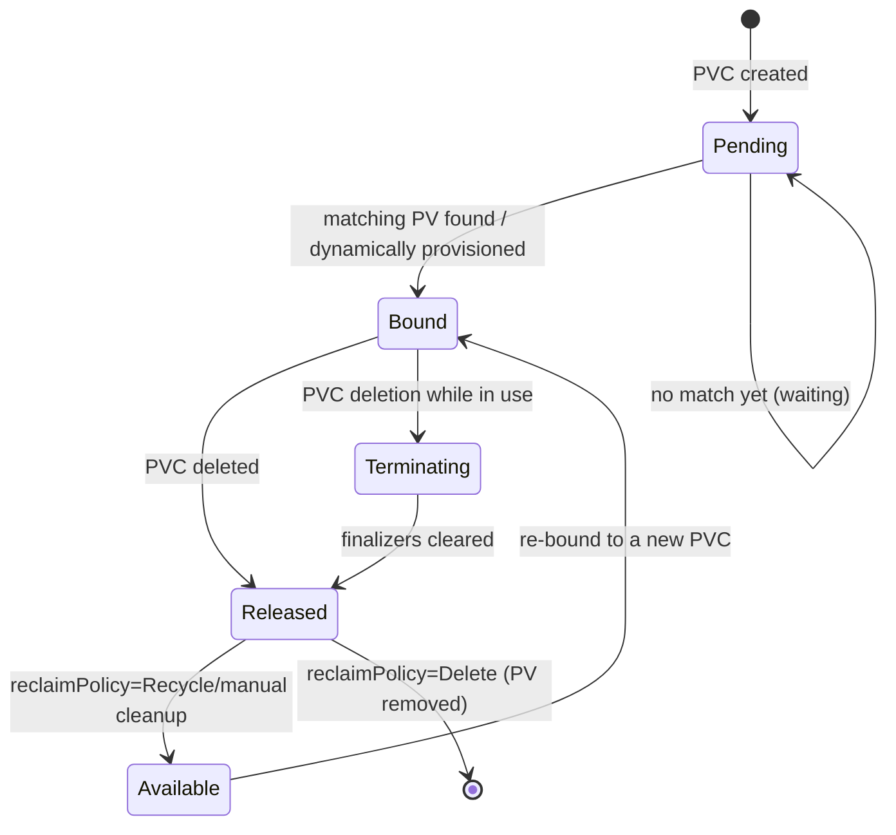

# Networking & Storage Diagrams

Networking and storage are the two subsystems that fail in the most confusing
ways, because the symptom (a timeout, a Pod stuck creating) is far from the
cause (a missing endpoint, an unattached volume). These diagrams trace the full
path of a packet and the full lifecycle of a volume so you know exactly which
hop or stage to inspect.

## Pod-to-pod and DNS resolution path

**How to read it.** An application first turns a name into an IP and then opens
a connection. DNS failures (steps 1-3) look like "host not found" and point to
CoreDNS or the Pod's `resolv.conf` / `ndots` configuration — see
[`dns-failures.md`](../playbooks/dns-failures.md). Connectivity
failures (steps 4-5) look like timeouts and point to the CNI, routing, or
NetworkPolicy — see
[`networking-failures.md`](../playbooks/networking-failures.md). Knowing
*which half* fails (resolve vs. connect) cuts the search space in half.

## Service, Endpoints, and kube-proxy data path

**How to read it.** A Service is just a stable virtual IP; the real work is the
**EndpointSlice** that lists the healthy backing Pods and the **kube-proxy**
rules that DNAT traffic to them. The number-one Service bug is empty endpoints:
the selector matches nothing, or the matched Pods are not `Ready`. Confirm with
`kubectl get endpoints <svc>`. If endpoints are present but traffic still
fails, suspect a port/targetPort mismatch, a NetworkPolicy, or unhealthy
kube-proxy on a node.

## CSI provision, attach, and mount flow

**How to read it.** A volume goes through three distinct CSI phases, each owned
by a different component: **provision** (create the disk, done by the
external-provisioner sidecar and CSI controller), **attach** (make the disk
visible to the chosen node, done by the external-attacher), and **mount**
(stage and bind-mount into the Pod, done by the kubelet and the CSI node
plugin). A Pod stuck in `ContainerCreating` with a volume error tells you which
phase failed via `kubectl describe pod` events:
`FailedAttachVolume` is the attach phase, `FailedMount` is the mount phase, and
a `Pending` PVC is the provision phase. See
[`storage-failures.md`](../playbooks/storage-failures.md).

## PV / PVC binding lifecycle

**How to read it.** A PVC starts `Pending` and becomes `Bound` only when a PV
satisfies its size, access mode, and StorageClass. When the PVC is deleted, the
PV moves to `Released`; what happens next depends on the **reclaim policy**:
`Delete` removes the backing disk, `Retain` leaves it `Released` for manual
recovery, and the legacy `Recycle` scrubs and returns it to `Available`. A PVC
stuck `Terminating` usually has a finalizer because a Pod is still using it.
For binding problems see
[`persistent-volume-failures.md`](../playbooks/persistent-volume-failures.md).

## Connecting symptoms to stages

| Symptom | Likely subsystem | Stage to inspect | Error page |
| --- | --- | --- | --- |
| `host not found` from app | DNS | CoreDNS / resolv.conf | dns-failures.md |
| Connection times out to Service | Networking | Endpoints / kube-proxy / policy | networking-failures.md |
| PVC stays `Pending` | Storage | Provision | persistent-volume-failures.md |
| Pod `ContainerCreating`, `FailedAttachVolume` | Storage | Attach | storage-failures.md |
| Pod `ContainerCreating`, `FailedMount` | Storage | Mount | storage-failures.md |

The unifying idea across both subsystems is the same as everywhere else in
Kubernetes: each stage is owned by a specific component that records its
progress as **status and events**. Identify the failing hop or phase from the
diagram, read that component's events, and the fix follows.
