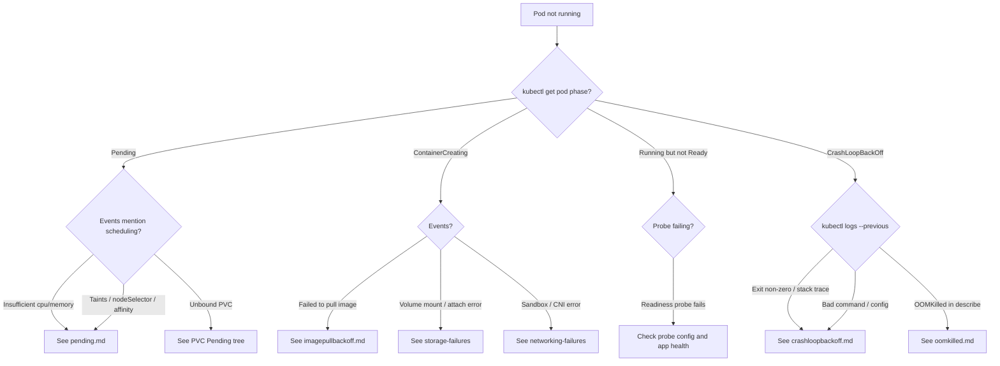
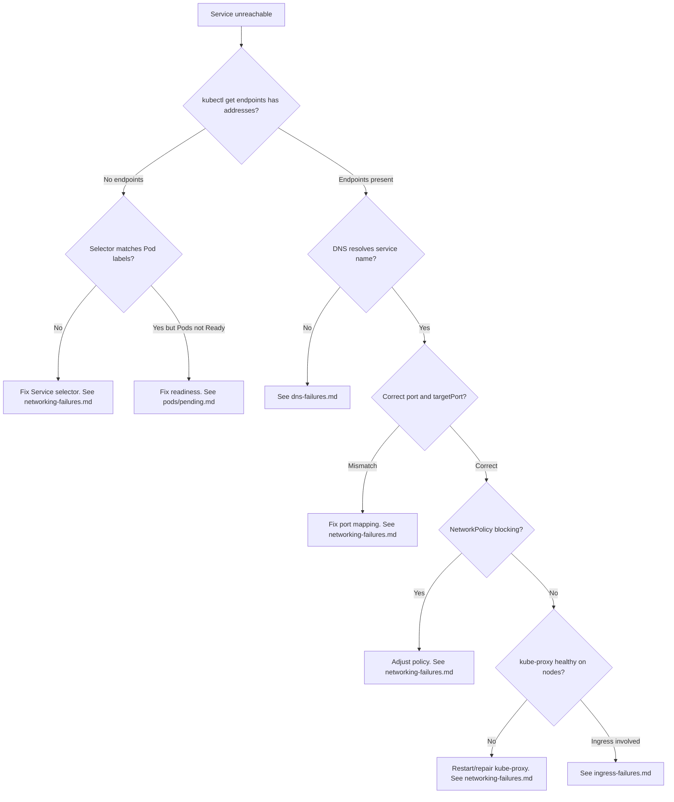
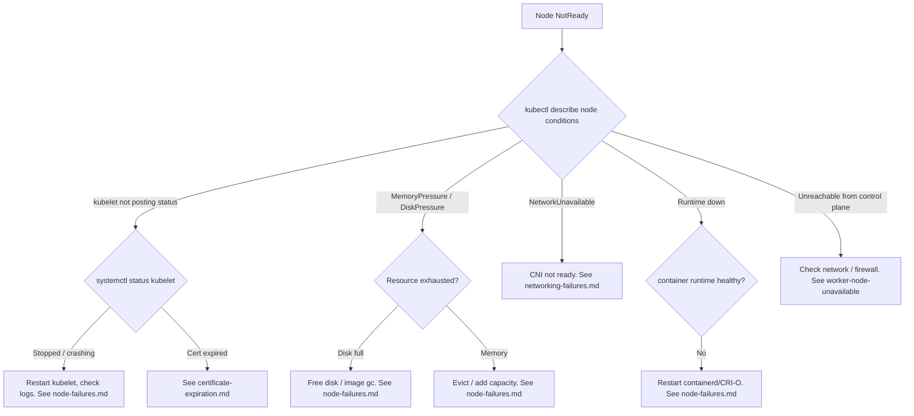
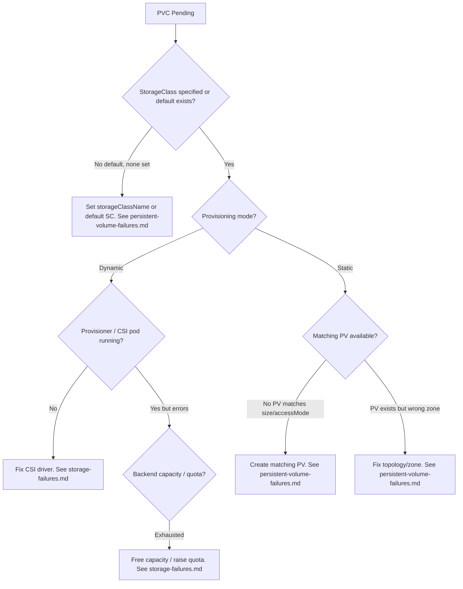

# Troubleshooting Decision Trees

These decision trees turn vague symptoms ("my app is down") into a concrete
next command and, ultimately, a specific error page. Start at the top of the
tree that matches your symptom, answer each question with `kubectl`, and follow
the branch. Every leaf links to the error page with the detailed fix.

> Tip: the three commands that drive almost every branch below are
> `kubectl get pods -o wide`, `kubectl describe pod <name>`, and
> `kubectl get events --sort-by=.lastTimestamp`.

## Pod not running

**How to read it.** A Pod that never leaves `Pending` is the scheduler's
domain — it found no node, usually for resources, taints, or an unbound volume.
`ContainerCreating` means a node was chosen but the kubelet cannot bring the
container up: image, volume, or network. `CrashLoopBackOff` means the container
started and then exited repeatedly; the logs (especially `--previous`) and the
`Last State` in `kubectl describe` tell you whether it was an OOM kill, a bad
command, or an application error.

Leaf links: [`pending.md`](../errors/pods/pending.md),
[`imagepullbackoff.md`](../errors/pods/imagepullbackoff.md),
[`crashloopbackoff.md`](../errors/pods/crashloopbackoff.md),
[`oomkilled.md`](../errors/pods/oomkilled.md).

## Service unreachable

**How to read it.** Work from the inside out. First confirm the Service has
endpoints — no endpoints almost always means the **selector** does not match
the Pods, or the Pods are not `Ready`. If endpoints exist, the problem is in
the path: DNS resolution, port/targetPort mapping, NetworkPolicy, or the
kube-proxy data plane. If an Ingress fronts the Service, jump to the ingress
page once the Service itself is proven healthy.

Leaf links: [`networking-failures.md`](../playbooks/networking-failures.md),
[`dns-failures.md`](../playbooks/dns-failures.md),
[`ingress-failures.md`](../playbooks/ingress-failures.md).

## Node NotReady

**How to read it.** `NotReady` is a kubelet status, so start by asking why the
kubelet stopped reporting healthy: the kubelet process itself, an expired
client certificate, resource pressure (disk or memory), a missing CNI, or a
dead container runtime. `kubectl describe node` lists the conditions that point
to the right branch.

Leaf links: [`node-failures.md`](../playbooks/node-failures.md),
[`certificate-expiration.md`](../playbooks/certificate-expiration.md),
[`networking-failures.md`](../playbooks/networking-failures.md).

## PVC Pending

**How to read it.** A `Pending` PVC means no PV is bound to it. For **dynamic**
provisioning, the StorageClass and its CSI provisioner must be healthy and the
backend must have capacity. For **static** provisioning, a pre-created PV must
match the claim's size, access mode, and topology. `kubectl describe pvc` shows
the provisioner's events and the exact reason.

Leaf links: [`persistent-volume-failures.md`](../playbooks/persistent-volume-failures.md),
[`storage-failures.md`](../playbooks/storage-failures.md).

## Putting it together

The four trees above cover the overwhelming majority of cluster incidents. The
shared discipline is: **read status, read events, follow the handoff that
failed.** When a leaf points to an error page, that page contains the exact
commands, root-cause explanation, and remediation steps. When two trees overlap
(for example a `Pending` Pod caused by a `Pending` PVC) follow the cross-link
rather than guessing — the storage tree will get you to the real root cause.
