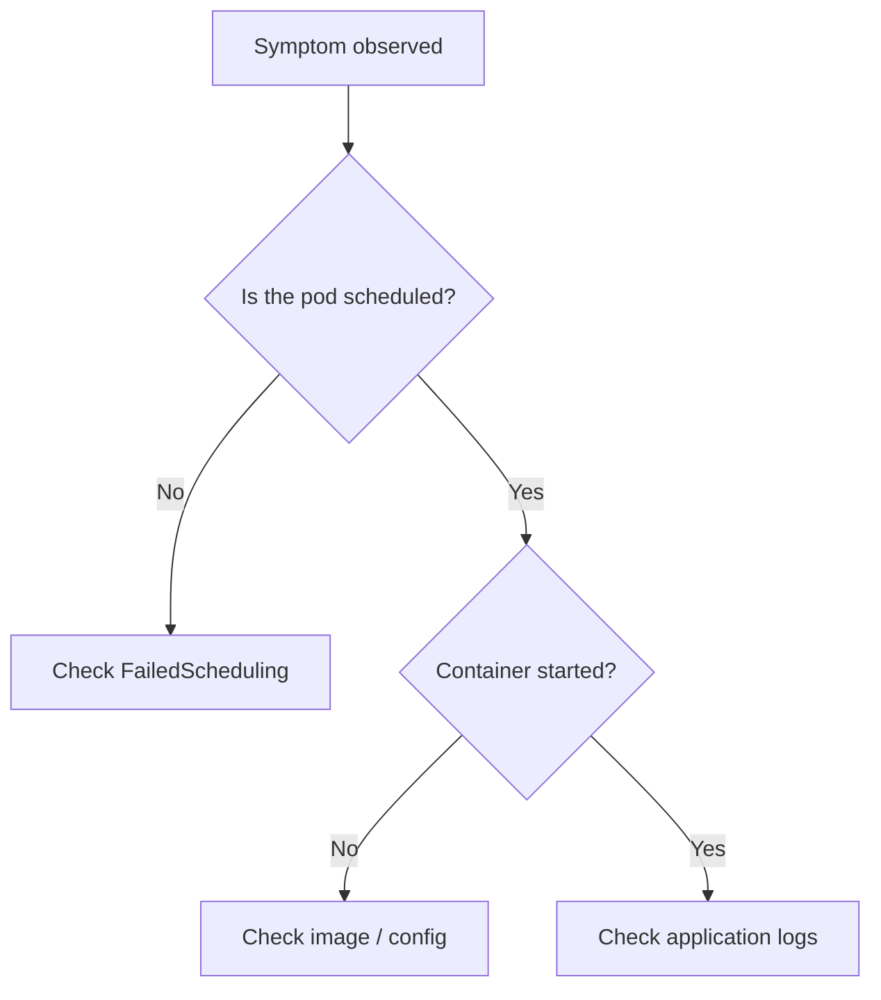

# Human-Readable Error Name

> **Severity:** High · **Typical recovery time:** 5–30 min · **Affected versions:** 1.20+

## Error Message

```text
The exact error string, copied verbatim from `kubectl describe`, an event,
or a container log, so search engines and humans match it precisely.
```

## Description

One or two paragraphs, written from a production SRE's perspective: what this
state actually means, what Kubernetes is doing when it reports it, and why it
matters during an incident.

## Affected Kubernetes Versions

State the versions this behaviour applies to and note any version-specific
differences (renamed fields, changed defaults, deprecated flags).

## Likely Root Causes

- Most common cause first
- Second cause
- Less common but important cause

## Diagnostic Flow



## Verification Steps

Confirm you are actually looking at this error and not a look-alike.

## kubectl Commands

```bash
kubectl describe pod <pod> -n <namespace>
kubectl get events -n <namespace> --sort-by=.lastTimestamp
kubectl logs <pod> -n <namespace> --previous
```

## Expected Output

```text
Show a representative, realistic snippet of what the commands above print
when this error is present.
```

## Common Fixes

1. The fix that resolves the majority of cases
2. Alternative fix
3. Edge-case fix

## Recovery Procedures

Ordered, production-safe steps to restore service. Clearly mark any step that
is disruptive (restart, rollout, delete) and explain the blast radius before
recommending it.

## Validation

How to confirm the fix worked (healthy status, passing probes, traffic served).

## Prevention

Configuration, limits, probes, policies, or CI checks that stop this recurring.

## Related Errors

- [ImagePullBackOff](pods/imagepullbackoff.md)
- [OOMKilled](pods/oomkilled.md)

## References

- [Kubernetes documentation](https://kubernetes.io/docs/)

## Further Reading

These free resources go deeper on AI-assisted Kubernetes troubleshooting:

- [DevOps AI ToolKit — Kubernetes guides](https://devopsaitoolkit.com/blog/)
- [Free Kubernetes config validators](https://devopsaitoolkit.com/validators/)
