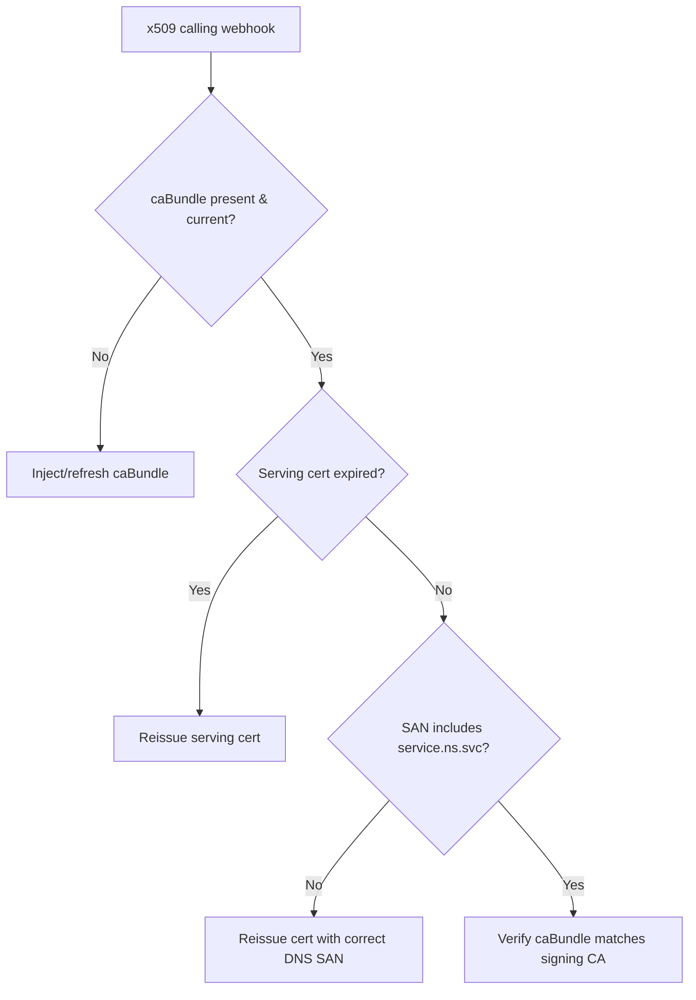

# Admission Webhook Certificate Error

> **Severity:** High · **Typical recovery time:** 10–30 min · **Affected versions:** 1.16+

## Error Message

```text
Error from server (InternalError): Internal error occurred: failed calling
    webhook "validate.policy.example.com": failed to call webhook: Post
    "https://policy.webhook-system.svc:443/validate?timeout=10s":
    x509: certificate signed by unknown authority
# or:
    x509: certificate is valid for policy.svc, not policy.webhook-system.svc
```

## Description

Admission webhooks must be served over TLS, and the apiserver verifies the
server certificate against the `caBundle` embedded in the
`Validating`/`MutatingWebhookConfiguration`. An x509 error means that trust chain
is broken: the serving cert is signed by a CA the `caBundle` does not contain,
the `caBundle` is stale/empty, or the cert's SANs do not include the Service DNS
name the apiserver dials. Because verification happens on every matching
request, a cert mismatch behaves like an outage — with `failurePolicy: Fail`
all matching writes are rejected until trust is restored.

## Affected Kubernetes Versions

Applies to 1.16+ (`admissionregistration.k8s.io/v1`). The cert must be valid for
the `<service>.<namespace>.svc` DNS name. cert-manager's `ca-injector` or the
provider's own controller typically keeps `caBundle` in sync; manual or expired
certs are the usual failure.

## Likely Root Causes

- `caBundle` does not match the CA that signed the serving certificate
- Serving certificate expired or was rotated without updating `caBundle`
- Cert SAN missing the `<service>.<namespace>.svc` name the apiserver uses
- cert-manager `ca-injector` not running, so `caBundle` is empty/stale
- Wrong base64 encoding or truncated `caBundle` in the webhook config

## Diagnostic Flow



## Verification Steps

Compare the CA in the webhook's `caBundle` against the CA that signed the cert
the backend currently serves, and check the cert's expiry and SANs.

## kubectl Commands

```bash
kubectl get validatingwebhookconfiguration policy -o jsonpath='{.webhooks[0].clientConfig.caBundle}' | base64 -d | openssl x509 -noout -subject -enddate
kubectl get secret -n webhook-system policy-serving-cert -o jsonpath='{.data.tls\.crt}' | base64 -d | openssl x509 -noout -subject -issuer -enddate -ext subjectAltName
kubectl get pods -n cert-manager -l app=cainjector
kubectl get validatingwebhookconfiguration policy -o yaml | grep -A4 clientConfig
kubectl get events -n webhook-system --sort-by=.lastTimestamp
```

## Expected Output

```text
$ kubectl get secret ... policy-serving-cert ... | openssl x509 -noout -ext subjectAltName -enddate
X509v3 Subject Alternative Name:
    DNS:policy.webhook-system.svc, DNS:policy.webhook-system.svc.cluster.local
notAfter=Jun 20 09:00:00 2026 GMT          # expired before today

$ kubectl ... caBundle ... | openssl x509 -noout -subject
subject=CN = webhook-ca-OLD                 # does not match current signing CA
```

## Common Fixes

1. Refresh the `caBundle` to the CA that signs the current serving cert (let
   cert-manager `ca-injector` populate it, or update it explicitly).
2. Reissue an expired serving certificate.
3. Reissue the cert with a SAN covering `<service>.<namespace>.svc`.
4. Restart/repair the cert-manager `cainjector` so it reconciles `caBundle`.

## Recovery Procedures

1. Confirm whether the break is a stale `caBundle`, an expired cert, or a SAN
   mismatch — the three need different fixes.
2. Restore trust by reissuing the cert and/or syncing `caBundle`. **Disruptive:**
   if a broad `failurePolicy: Fail` webhook is blocking critical writes while you
   fix certs, temporarily narrow its `namespaceSelector` or set `Ignore`; blast
   radius is unenforced policy for matching objects until restored.
3. Verify cert-manager (or your cert tooling) is healthy so this auto-heals on
   the next rotation.

## Validation

`openssl verify` (or `s_client`) against the backend succeeds with the
`caBundle` CA, re-applying a matching object is admitted, and no x509 errors
remain in apiserver/webhook events.

## Prevention

Automate cert issuance and `caBundle` injection (cert-manager), alert before
serving certs expire, always include the Service DNS SAN, and keep the
`cainjector` healthy and monitored.

## Related Errors

- [Admission Webhook Connection Refused](./admission-webhook-connection-refused.md)
- [Admission Webhook Timeout](./admission-webhook-timeout.md)
- [x509 Certificate Signed By Unknown Authority](../api-server/api-server-x509-unknown-authority.md)

## References

- [Kubernetes: Webhook configuration & TLS](https://kubernetes.io/docs/reference/access-authn-authz/extensible-admission-controllers/#webhook-configuration)
- [Kubernetes: Manage TLS certificates in a cluster](https://kubernetes.io/docs/tasks/tls/managing-tls-in-a-cluster/)

## Further Reading

- [DevOps AI ToolKit — Kubernetes guides](https://devopsaitoolkit.com/blog/)
