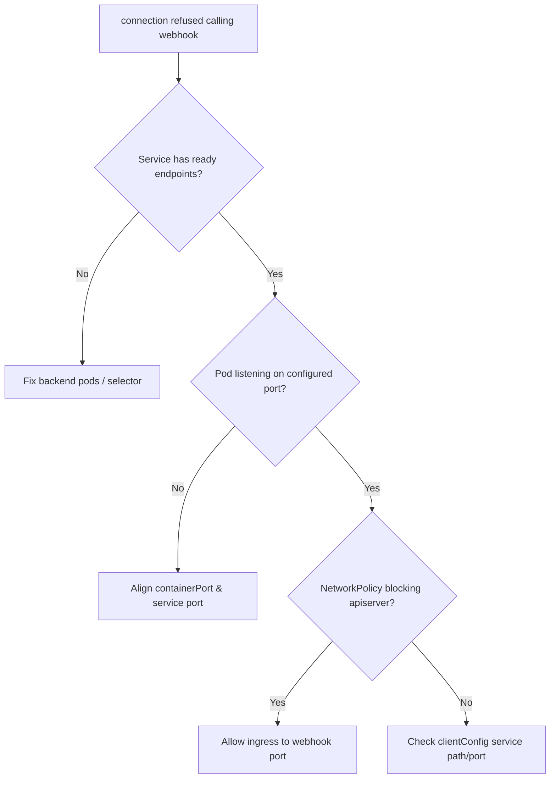

# Admission Webhook Connection Refused

> **Severity:** High · **Typical recovery time:** 5–25 min · **Affected versions:** 1.16+

## Error Message

```text
Error from server (InternalError): Internal error occurred: failed calling
    webhook "mutate.sidecar.example.com": failed to call webhook: Post
    "https://sidecar-injector.webhook-system.svc:443/mutate?timeout=10s":
    dial tcp 10.96.42.7:443: connect: connection refused
```

## Description

The apiserver reached the webhook's Service ClusterIP/endpoint but nothing
accepted the TCP connection — the backing pods are down, not ready, or listening
on a different port. What happens next depends on `failurePolicy`: with `Fail`
(the safe default for security gates) every matching create/update is rejected,
so the webhook outage becomes a workload outage; with `Ignore` the requests are
admitted unchecked, silently bypassing the policy. A webhook that matches
broadly with `failurePolicy: Fail` and no healthy backend can wedge a large part
of the cluster, including its own deployment.

## Affected Kubernetes Versions

Applies to 1.16+ with `admissionregistration.k8s.io/v1`. The reconnect/retry and
`failurePolicy` semantics are stable. `timeoutSeconds` defaults to 10 and is
capped at 30; connection-refused fails fast rather than waiting for the timeout.

## Likely Root Causes

- Webhook backend pods are crash-looping, scaled to zero, or NotReady
- Service selector/port does not match the running pods (no endpoints)
- NetworkPolicy or CNI blocking apiserver-to-pod traffic on the webhook port
- Wrong `clientConfig.service` port/path in the webhook configuration
- The webhook deleted its own backend yet still has `failurePolicy: Fail`

## Diagnostic Flow



## Verification Steps

Confirm the webhook Service has ready endpoints and that the backend pods are
healthy and listening on the expected port.

## kubectl Commands

```bash
kubectl get mutatingwebhookconfigurations,validatingwebhookconfigurations
kubectl get endpoints -n webhook-system sidecar-injector
kubectl get pods -n webhook-system -l app=sidecar-injector -o wide
kubectl describe svc -n webhook-system sidecar-injector
kubectl get mutatingwebhookconfiguration sidecar-injector -o yaml | grep -A6 clientConfig
kubectl get networkpolicy -n webhook-system
```

## Expected Output

```text
$ kubectl get endpoints -n webhook-system sidecar-injector
NAME               ENDPOINTS   AGE
sidecar-injector   <none>      30d        # no ready backends → refused

$ kubectl get pods -n webhook-system -l app=sidecar-injector
NAME                                READY   STATUS             RESTARTS
sidecar-injector-7c9b...            0/1     CrashLoopBackOff   9
```

## Common Fixes

1. Restore the webhook backend (fix the crashloop, scale up from zero, fix
   readiness) so the Service gets endpoints.
2. Correct a Service selector/port mismatch so traffic reaches the pods.
3. Add a NetworkPolicy rule allowing the apiserver to reach the webhook port.
4. Fix `clientConfig.service.port`/`path` in the webhook configuration.

## Recovery Procedures

1. Check endpoints first — an empty endpoint list explains the refusal.
2. Bring the backend healthy. **Disruptive:** if the webhook is wedging the whole
   cluster (cannot even create its own pods) you may need to temporarily delete
   or scope-down the `MutatingWebhookConfiguration`. Blast radius: while removed,
   that policy is not enforced cluster-wide — restore it immediately after the
   backend recovers.
3. Prefer narrowing `namespaceSelector` to exclude the webhook's own namespace
   over fully deleting the config.

## Validation

The Service shows ready endpoints, re-creating a matching object succeeds, and
the webhook pod logs record incoming admission reviews.

## Prevention

Run the webhook backend HA with PodDisruptionBudgets and readiness probes,
exclude `kube-system` and the webhook's own namespace via `namespaceSelector`,
choose `failurePolicy` deliberately, and alert on empty webhook endpoints.

## Related Errors

- [Admission Webhook Timeout](./admission-webhook-timeout.md)
- [Admission Webhook Certificate Error](./admission-webhook-certificate-error.md)
- [Admission Webhook Denied The Request](./admission-webhook-denied.md)

## References

- [Kubernetes: Dynamic Admission Control](https://kubernetes.io/docs/reference/access-authn-authz/extensible-admission-controllers/)
- [Kubernetes: Admission webhook good practices](https://kubernetes.io/docs/concepts/cluster-administration/admission-webhooks-good-practices/)

## Further Reading

- [DevOps AI ToolKit — Kubernetes guides](https://devopsaitoolkit.com/blog/)
