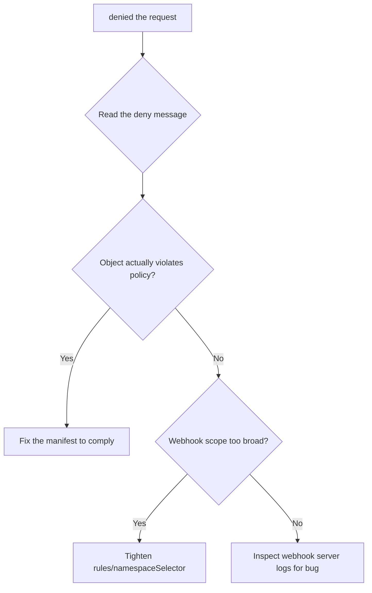

# Admission Webhook Denied The Request

> **Severity:** Medium · **Typical recovery time:** 5–20 min · **Affected versions:** 1.16+

## Error Message

```text
Error from server: error when creating "deploy.yaml": admission webhook
    "validate.pod-policy.example.com" denied the request: containers must set
    resources.limits.memory; pod "web" in namespace "shop" rejected
```

## Description

A `ValidatingWebhookConfiguration` registers an external HTTPS endpoint that the
apiserver calls during the admission phase, after authentication/authorization
but before an object is persisted. When the webhook returns
`allowed: false`, the apiserver rejects the create/update and surfaces the
webhook's `status.message` verbatim. This is the intended behaviour of a policy
gate (security, resource hygiene, naming) — the request was deliberately
blocked, not broken. The job during an incident is to determine whether the
object genuinely violates policy or the webhook's rule is too strict / buggy.

## Affected Kubernetes Versions

`admissionregistration.k8s.io/v1` is GA since 1.16 and the default since 1.22
(v1beta1 removed in 1.22). The `failurePolicy`, `matchPolicy`, and
`namespaceSelector`/`objectSelector` fields behave consistently across 1.16+.

## Likely Root Causes

- The object legitimately violates the policy the webhook enforces
- An overly broad `rules`/selector scope catching resources it should not
- A recently tightened policy now rejecting previously valid manifests
- A bug in the webhook returning deny on valid input
- Missing required labels/annotations the webhook mandates

## Diagnostic Flow



## Verification Steps

Read the deny message — it names the webhook and the rule. Identify which
`ValidatingWebhookConfiguration` owns that name and what it matches.

## kubectl Commands

```bash
kubectl get validatingwebhookconfigurations
kubectl get validatingwebhookconfiguration validate-pod-policy -o yaml
kubectl describe deployment web -n shop
kubectl get events -n shop --sort-by=.lastTimestamp
kubectl logs -n webhook-system deploy/pod-policy-webhook --tail=100
kubectl auth can-i create pods -n shop
```

## Expected Output

```text
$ kubectl get validatingwebhookconfiguration validate-pod-policy -o yaml
webhooks:
- name: validate.pod-policy.example.com
  rules:
  - apiGroups: [""]
    apiVersions: ["v1"]
    operations: ["CREATE","UPDATE"]
    resources: ["pods"]
  failurePolicy: Fail
  namespaceSelector: {}        # matches every namespace
```

## Common Fixes

1. Update the rejected manifest to satisfy the policy (add the limits, labels, or
   field the message demands).
2. Narrow the webhook's `rules`, `namespaceSelector`, or `objectSelector` if it
   is catching workloads outside its intended scope.
3. Add an exemption label/namespace if the resource is a legitimate exception.
4. Fix or roll back the webhook's policy logic if it denies valid objects.

## Recovery Procedures

1. Decide intent: is the deny correct? If yes, fix the workload and re-apply.
2. If the policy is wrong, the webhook owner updates the
   `ValidatingWebhookConfiguration` or the policy server. **Disruptive:** editing
   a webhook config's scope affects every matching request cluster-wide; a
   too-broad change can suddenly block or unblock many teams — review the
   selector diff before applying.
3. For an outage where a buggy webhook blocks critical objects, scope it down or
   remove the offending rule rather than disabling all policy.

## Validation

Re-apply the object; it is admitted (`created`/`configured`), and the webhook
server logs show an `allowed` decision for the request UID.

## Prevention

Test policies in `Warn`/dry-run/audit mode before enforcing, scope webhooks
tightly with selectors, version-control policy bundles, and give clear,
actionable deny messages so users can self-correct.

## Related Errors

- [Admission Webhook Timeout](./admission-webhook-timeout.md)
- [OPA Gatekeeper Constraint Violation](./gatekeeper-constraint-violation.md)
- [Kyverno Policy Blocked Resource](./kyverno-policy-blocked.md)

## References

- [Kubernetes: Dynamic Admission Control](https://kubernetes.io/docs/reference/access-authn-authz/extensible-admission-controllers/)
- [Kubernetes: Admission webhook good practices](https://kubernetes.io/docs/concepts/cluster-administration/admission-webhooks-good-practices/)

## Further Reading

- [DevOps AI ToolKit — Kubernetes guides](https://devopsaitoolkit.com/blog/)
