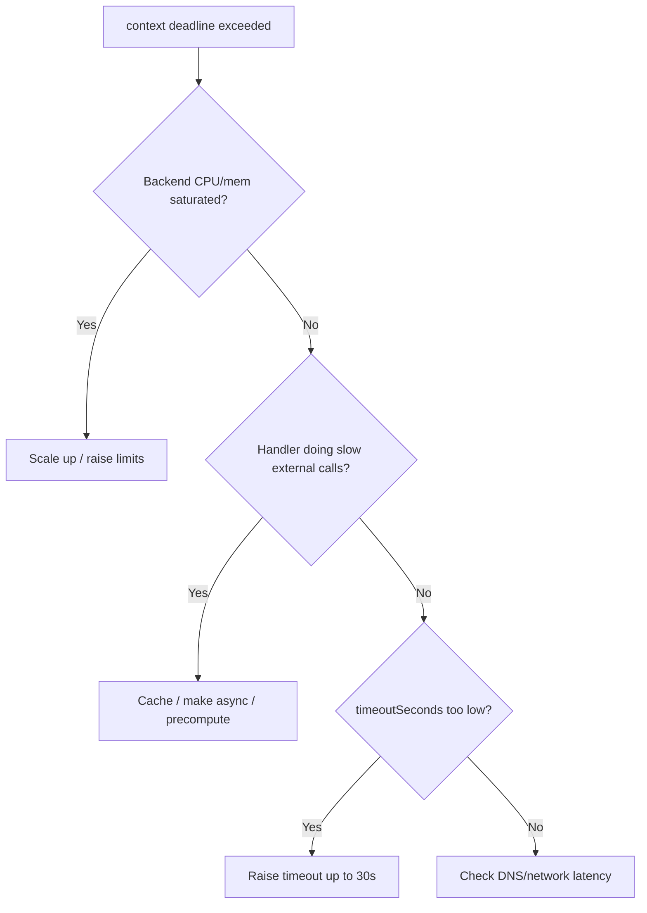

# Admission Webhook Timeout

> **Severity:** High · **Typical recovery time:** 5–25 min · **Affected versions:** 1.16+

## Error Message

```text
Error from server (InternalError): Internal error occurred: failed calling
    webhook "validate.image-policy.example.com": failed to call webhook: Post
    "https://image-policy.webhook-system.svc:443/validate?timeout=10s":
    context deadline exceeded
```

## Description

The apiserver connected to the webhook but the webhook did not respond within
its `timeoutSeconds`. The apiserver enforces this deadline strictly because
every admission call sits in the critical path of an API write — a slow webhook
slows down (or, with `failurePolicy: Fail`, blocks) all matching creates and
updates. Timeouts usually mean the webhook backend is overloaded, doing slow
work (external API calls, DNS, database lookups) inside the admission handler,
or under-provisioned. Unlike connection-refused, the backend is up but too slow.

## Affected Kubernetes Versions

Applies to 1.16+. `timeoutSeconds` defaults to 10 and is capped at 30 in
`admissionregistration.k8s.io/v1`. The apiserver does not retry a timed-out
webhook within the same request; behaviour on timeout follows `failurePolicy`.

## Likely Root Causes

- Webhook handler performs slow synchronous work (external API/DB/DNS) per call
- Backend under-resourced or saturated (CPU throttling, GC pauses)
- `timeoutSeconds` set too low for the work the webhook does
- Network latency or DNS resolution delays between apiserver and webhook
- Webhook matches far more requests than it can handle (scope too broad)

## Diagnostic Flow



## Verification Steps

Confirm the backend is up (not refused) but slow, and measure its admission
latency and resource saturation.

## kubectl Commands

```bash
kubectl get validatingwebhookconfiguration image-policy -o yaml | grep -i timeout
kubectl get pods -n webhook-system -l app=image-policy -o wide
kubectl top pods -n webhook-system -l app=image-policy
kubectl logs -n webhook-system deploy/image-policy --tail=200
kubectl describe pod -n webhook-system -l app=image-policy
kubectl get events -A --sort-by=.lastTimestamp | grep -i webhook
```

## Expected Output

```text
$ kubectl get validatingwebhookconfiguration image-policy -o yaml | grep timeout
  timeoutSeconds: 5

$ kubectl top pods -n webhook-system -l app=image-policy
NAME                  CPU(cores)   MEMORY(bytes)
image-policy-6d...    998m         210Mi          # pinned at its CPU limit

$ kubectl logs -n webhook-system deploy/image-policy | tail
WARN admission handler took 7.8s (registry lookup) for review uid=abc...
```

## Common Fixes

1. Scale out the webhook backend and raise CPU limits so it stops throttling.
2. Remove slow synchronous work from the handler — cache registry/DB lookups or
   move them out of the admission path.
3. Increase `timeoutSeconds` (up to 30) if the work is genuinely needed.
4. Narrow the webhook scope so it only intercepts the resources it must.

## Recovery Procedures

1. Determine whether the backend is slow or just under-scaled.
2. Scale the deployment and/or raise `timeoutSeconds`. **Disruptive:** if a
   broad `failurePolicy: Fail` webhook is timing out and blocking critical
   writes, temporarily set `failurePolicy: Ignore` or narrow its selector. Blast
   radius: with `Ignore`, the policy is not enforced for matching objects until
   restored — treat as a short, deliberate bypass.
3. After fixing the backend, restore the original `failurePolicy`/scope.

## Validation

Re-applying a matching object succeeds promptly, webhook latency drops below
`timeoutSeconds`, and no further `context deadline exceeded` events appear.

## Prevention

Keep admission handlers fast and side-effect-light, precompute or cache external
data, size the backend for peak request rate, scope webhooks narrowly, and alert
on p99 admission latency approaching `timeoutSeconds`.

## Related Errors

- [Admission Webhook Connection Refused](./admission-webhook-connection-refused.md)
- [Admission Webhook Denied The Request](./admission-webhook-denied.md)
- [Webhook Intercepting kube-system Deadlock](./webhook-namespaceselector-deadlock.md)

## References

- [Kubernetes: Dynamic Admission Control — timeouts](https://kubernetes.io/docs/reference/access-authn-authz/extensible-admission-controllers/#timeouts)
- [Kubernetes: Admission webhook good practices](https://kubernetes.io/docs/concepts/cluster-administration/admission-webhooks-good-practices/)

## Further Reading

- [DevOps AI ToolKit — Kubernetes guides](https://devopsaitoolkit.com/blog/)
