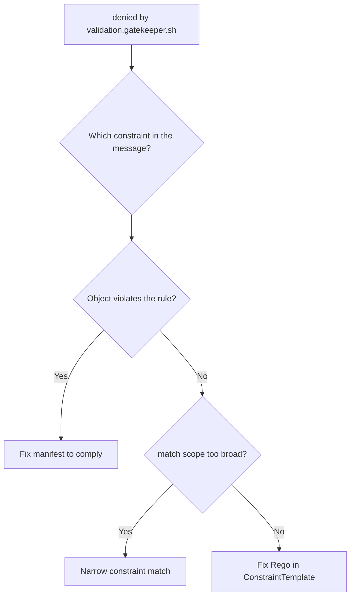

# OPA Gatekeeper Constraint Violation

> **Severity:** Medium · **Typical recovery time:** 5–20 min · **Affected versions:** 1.16+

## Error Message

```text
Error from server ([denied by require-team-label] you must provide labels:
    {"team"}): error when creating "deploy.yaml": admission webhook
    "validation.gatekeeper.sh" denied the request: [require-team-label]
    you must provide labels: {"team"}
```

## Description

OPA Gatekeeper installs a single validating webhook
(`validation.gatekeeper.sh`) backed by the gatekeeper-controller. Policies are
authored as `ConstraintTemplates` (Rego logic) that generate custom Constraint
CRDs; each Constraint targets specific kinds and namespaces. When an object
matches a Constraint and fails its Rego rule, Gatekeeper returns deny with the
constraint name and its `violation` message. This is enforcement working as
designed — the task is to find the offending Constraint, read its message, and
either bring the object into compliance or adjust/exempt the policy.

## Affected Kubernetes Versions

Works on any 1.16+ cluster (`admissionregistration.k8s.io/v1`). Constraint
`enforcementAction` can be `deny`, `warn`, or `dryrun`; only `deny` blocks
admission. Gatekeeper 3.x supports referential constraints via its sync config.

## Likely Root Causes

- The object genuinely violates an enforced (`enforcementAction: deny`) Constraint
- A Constraint's `match` scope is broader than intended
- A newly applied/tightened ConstraintTemplate now rejects existing manifests
- Missing required labels/annotations/registry the Constraint mandates
- A bug in the Rego logic of the ConstraintTemplate

## Diagnostic Flow



## Verification Steps

Read the bracketed constraint name in the deny message, then inspect that
Constraint's `match`, `enforcementAction`, and reported `violations`.

## kubectl Commands

```bash
kubectl get constrainttemplates
kubectl get constraints -A
kubectl get k8srequiredlabels require-team-label -o yaml
kubectl describe k8srequiredlabels require-team-label
kubectl get constraint require-team-label -o jsonpath='{.status.violations}'
kubectl logs -n gatekeeper-system -l control-plane=controller-manager --tail=100
```

## Expected Output

```text
$ kubectl get k8srequiredlabels require-team-label -o yaml
spec:
  enforcementAction: deny
  match:
    kinds:
    - apiGroups: ["apps"]
      kinds: ["Deployment"]
    namespaces: ["shop"]
  parameters:
    labels: ["team"]

$ kubectl describe k8srequiredlabels require-team-label | grep -A2 Violations
  Total Violations: 4
  Violations:  Deployment shop/web missing labels: {"team"}
```

## Common Fixes

1. Add the required field (label, registry prefix, resource limits) to the
   object so it satisfies the Constraint.
2. Narrow the Constraint's `match` (kinds/namespaces/labelSelector) if it is
   over-broad.
3. Add an exemption via `excludedNamespaces` (Gatekeeper config) or a match
   `excludedNamespaces` for legitimate exceptions.
4. Switch the Constraint to `enforcementAction: warn`/`dryrun` while iterating on
   policy, or fix the ConstraintTemplate Rego.

## Recovery Procedures

1. Identify the Constraint and decide whether the deny is correct.
2. If the policy is wrong, the policy owner edits the Constraint or
   ConstraintTemplate. **Disruptive:** changing `match` scope or
   `enforcementAction` affects every matching resource cluster-wide; widening or
   relaxing a Constraint can unblock/expose many workloads — review before apply.
3. For an emergency where Gatekeeper blocks critical objects, set the specific
   Constraint to `dryrun` rather than uninstalling Gatekeeper entirely.

## Validation

`kubectl get constraint <name> -o jsonpath='{.status.totalViolations}'` trends to
zero for fixed objects, and re-applying the manifest is admitted.

## Prevention

Roll out Constraints in `dryrun`/`warn` first and watch `status.violations`,
scope `match` precisely, keep ConstraintTemplates in version control with tests
(gator), and document required labels so teams comply up front.

## Related Errors

- [Admission Webhook Denied The Request](./admission-webhook-denied.md)
- [Kyverno Policy Blocked Resource](./kyverno-policy-blocked.md)
- [Admission Webhook Timeout](./admission-webhook-timeout.md)

## References

- [Kubernetes: Dynamic Admission Control](https://kubernetes.io/docs/reference/access-authn-authz/extensible-admission-controllers/)
- [Kubernetes: Policies](https://kubernetes.io/docs/concepts/policy/)

## Further Reading

- [DevOps AI ToolKit — Kubernetes guides](https://devopsaitoolkit.com/blog/)
