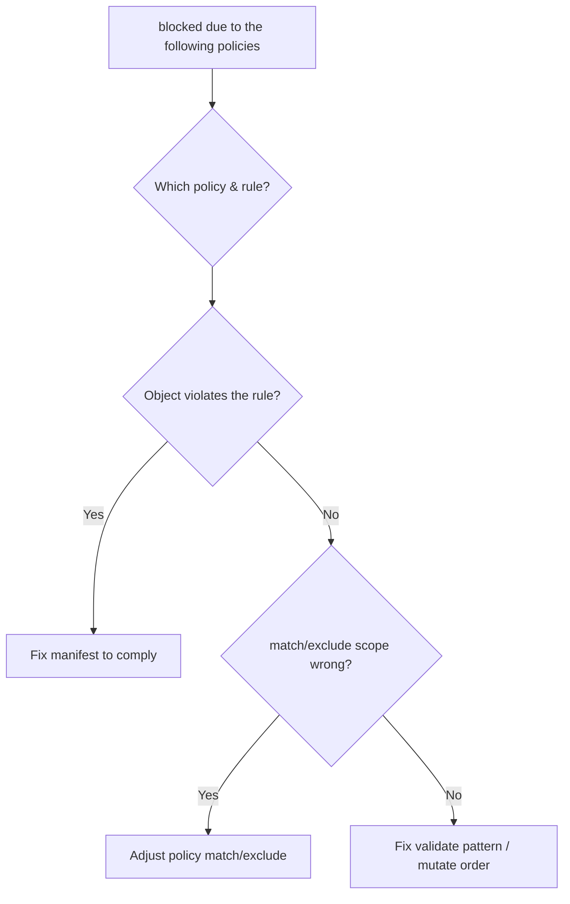

# Kyverno Policy Blocked Resource

> **Severity:** Medium · **Typical recovery time:** 5–20 min · **Affected versions:** 1.16+

## Error Message

```text
Error from server: admission webhook "validate.kyverno.svc-fail" denied the
    request: resource Pod/shop/web was blocked due to the following policies:

    require-requests-limits:
      autogen-validate-resources: 'validation error: CPU and memory
      resources are required. rule autogen-validate-resources failed at path
      /spec/containers/0/resources/limits/'
```

## Description

Kyverno registers validating (and mutating) webhooks and evaluates
`ClusterPolicy`/`Policy` resources written in YAML rather than Rego. A policy
rule with `validationFailureAction: Enforce` rejects any matching object that
fails its `validate` block, and the deny message lists the policy, the rule, and
the failing path. With `Audit` the violation is only recorded as a
PolicyReport, not blocked. As with other admission gates, the block is
intentional policy enforcement — resolve it by complying with the rule, scoping
the policy, exempting the resource, or switching to Audit while iterating.

## Affected Kubernetes Versions

Runs on 1.16+ (`admissionregistration.k8s.io/v1`). In Kyverno 1.10+ the field is
`validationFailureAction` with values `Enforce`/`Audit` (older releases used
`enforce`/`audit`). PolicyReports surface Audit-mode violations.

## Likely Root Causes

- The object violates an `Enforce` validate rule (missing limits, labels, etc.)
- Policy `match`/`exclude` scope catches resources it should not
- A newly applied or tightened policy rejecting existing manifests
- A mutate rule expected to add fields did not run before validation
- A pattern/anchor mistake in the policy's `validate` block

## Diagnostic Flow



## Verification Steps

Read the policy and rule names from the message, then inspect that policy's
action and match scope and any PolicyReport entries.

## kubectl Commands

```bash
kubectl get clusterpolicies
kubectl get clusterpolicy require-requests-limits -o yaml
kubectl describe clusterpolicy require-requests-limits
kubectl get policyreports -A
kubectl get clusterpolicyreport -o wide
kubectl logs -n kyverno -l app.kubernetes.io/component=admission-controller --tail=100
```

## Expected Output

```text
$ kubectl get clusterpolicy require-requests-limits -o yaml
spec:
  validationFailureAction: Enforce
  rules:
  - name: validate-resources
    match:
      any:
      - resources:
          kinds: ["Pod"]
    validate:
      message: "CPU and memory resources are required."
      pattern:
        spec:
          containers:
          - resources:
              limits:
                memory: "?*"
```

## Common Fixes

1. Update the resource to satisfy the rule (add the required limits, labels, or
   securityContext the message names).
2. Refine the policy `match`/`exclude` so it only targets intended resources.
3. Exclude a namespace/resource (`exclude` block or Kyverno resourceFilters) for
   legitimate exceptions.
4. Set `validationFailureAction: Audit` while iterating, or fix the
   pattern/anchors or the ordering of a prerequisite mutate rule.

## Recovery Procedures

1. Identify the policy/rule and decide whether the block is correct.
2. If the policy is wrong, the owner edits the `ClusterPolicy`/`Policy`.
   **Disruptive:** changing `match`/`exclude` or `validationFailureAction`
   applies cluster-wide on the next admission; flipping a broad policy to
   Enforce/Audit can block or expose many workloads — review the diff first.
3. In an emergency where Kyverno blocks critical objects, switch the specific
   policy to `Audit` rather than removing Kyverno's webhooks wholesale.

## Validation

Re-applying the resource succeeds, and the corresponding PolicyReport shows
`pass` instead of `fail` for that policy/rule.

## Prevention

Introduce policies in `Audit` and watch PolicyReports before enforcing, scope
`match`/`exclude` tightly, keep policies in Git with `kyverno test` CI, and pair
validate rules with mutate rules so common omissions auto-correct.

## Related Errors

- [OPA Gatekeeper Constraint Violation](./gatekeeper-constraint-violation.md)
- [Admission Webhook Denied The Request](./admission-webhook-denied.md)
- [Mutating Webhook Side Effects](./mutating-webhook-reinvocation-side-effects.md)

## References

- [Kubernetes: Dynamic Admission Control](https://kubernetes.io/docs/reference/access-authn-authz/extensible-admission-controllers/)
- [Kubernetes: Policies](https://kubernetes.io/docs/concepts/policy/)

## Further Reading

- [DevOps AI ToolKit — Kubernetes guides](https://devopsaitoolkit.com/blog/)
