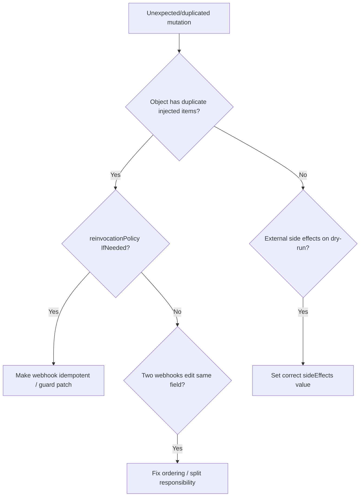

# Mutating Webhook Side Effects

> **Severity:** Medium · **Typical recovery time:** 15–45 min · **Affected versions:** 1.16+

## Error Message

```text
# No single hard error — symptoms surface as duplicated/inconsistent patches:
$ kubectl get pod web -n shop -o jsonpath='{.spec.containers[*].name}'
app istio-proxy istio-proxy        # sidecar injected twice after reinvocation

# or apiserver-side, an out-of-band change during apply:
Warning  FailedCreate  ...  Pod "web" is invalid: spec.containers[2].name:
    Duplicate value: "istio-proxy"
```

## Description

Mutating webhooks run in sequence, and with
`reinvocationPolicy: IfNeeded` a webhook may be called a second time if a later
webhook in the chain changed the object. A non-idempotent webhook that blindly
appends (a sidecar, env var, volume, or label) without checking whether it
already applied its patch will then duplicate its mutation on reinvocation —
producing duplicate containers, repeated env entries, or conflicting patches.
The apiserver also requires webhooks to declare `sideEffects`; a webhook that
mutates external state and is run during a dry-run can cause real, unintended
changes. These are correctness bugs, not deny errors, so they are easy to miss.

## Affected Kubernetes Versions

Applies to 1.16+. `reinvocationPolicy` (`Never`|`IfNeeded`) and the `sideEffects`
field (`None`|`NoneOnDryRun`|`Some`|`Unknown`) are part of
`admissionregistration.k8s.io/v1`. Webhooks declaring `Some`/`Unknown` side
effects are skipped on dry-run requests.

## Likely Root Causes

- Non-idempotent mutation: appends without checking if its patch already exists
- `reinvocationPolicy: IfNeeded` re-runs the webhook after another mutates
- Two webhooks fighting over the same field (ordering-dependent result)
- Webhook performs external side effects but declares `sideEffects: None`
- Mutation reads a field a later webhook overwrites

## Diagnostic Flow



## Verification Steps

Compare the object the user submitted with the persisted result to see which
mutation was applied twice or overwritten, and check the webhook's
`reinvocationPolicy` and `sideEffects`.

## kubectl Commands

```bash
kubectl get mutatingwebhookconfigurations
kubectl get mutatingwebhookconfiguration sidecar-injector -o yaml | grep -A3 -i "reinvocationPolicy\|sideEffects\|reinvoke"
kubectl get pod web -n shop -o yaml | grep -A2 -i "name:\|env:"
kubectl get pod web -n shop -o jsonpath='{range .spec.containers[*]}{.name}{"\n"}{end}'
kubectl logs -n webhook-system deploy/sidecar-injector --tail=200
kubectl get events -n shop --sort-by=.lastTimestamp
```

## Expected Output

```text
$ kubectl get mutatingwebhookconfiguration sidecar-injector -o yaml | grep -i reinvoc
  reinvocationPolicy: IfNeeded

$ kubectl get pod web -n shop -o jsonpath='{range .spec.containers[*]}{.name}{"\n"}{end}'
app
istio-proxy
istio-proxy            # injected on first pass and again on reinvocation
```

## Common Fixes

1. Make the webhook idempotent — check for its marker label/container before
   patching, so reinvocation is a no-op.
2. Set `reinvocationPolicy: Never` if a second invocation is not actually needed.
3. Resolve two webhooks contending on the same field by splitting ownership or
   fixing alphabetical/ordering assumptions.
4. Declare accurate `sideEffects` (`None`/`NoneOnDryRun`) so dry-run requests do
   not trigger real external changes.

## Recovery Procedures

1. Reproduce with a single object and diff submitted vs. stored to pinpoint the
   duplicated/overwritten field.
2. Patch the webhook server to be idempotent and redeploy it. **Disruptive:**
   rolling the webhook deployment briefly affects injection for new pods; existing
   pods are unchanged. Recreate affected pods only deliberately — recreating a
   workload to clear a duplicate sidecar restarts those pods (blast radius = that
   workload's availability).
3. Correct existing malformed objects by re-applying the clean spec once the
   webhook is fixed.

## Validation

Newly created matching pods show exactly one injected sidecar/env/volume,
dry-run requests cause no external side effects, and the webhook is verifiably
idempotent across repeated admission.

## Prevention

Write mutations to be idempotent and guarded by a marker, choose
`reinvocationPolicy` consciously, declare correct `sideEffects`, avoid multiple
webhooks editing the same field, and add e2e tests that submit and re-submit the
same object.

## Related Errors

- [Admission Webhook Denied The Request](./admission-webhook-denied.md)
- [Kyverno Policy Blocked Resource](./kyverno-policy-blocked.md)
- [Admission Webhook Timeout](./admission-webhook-timeout.md)

## References

- [Kubernetes: Reinvocation policy](https://kubernetes.io/docs/reference/access-authn-authz/extensible-admission-controllers/#reinvocation-policy)
- [Kubernetes: Side effects](https://kubernetes.io/docs/reference/access-authn-authz/extensible-admission-controllers/#side-effects)

## Further Reading

- [DevOps AI ToolKit — Kubernetes guides](https://devopsaitoolkit.com/blog/)
