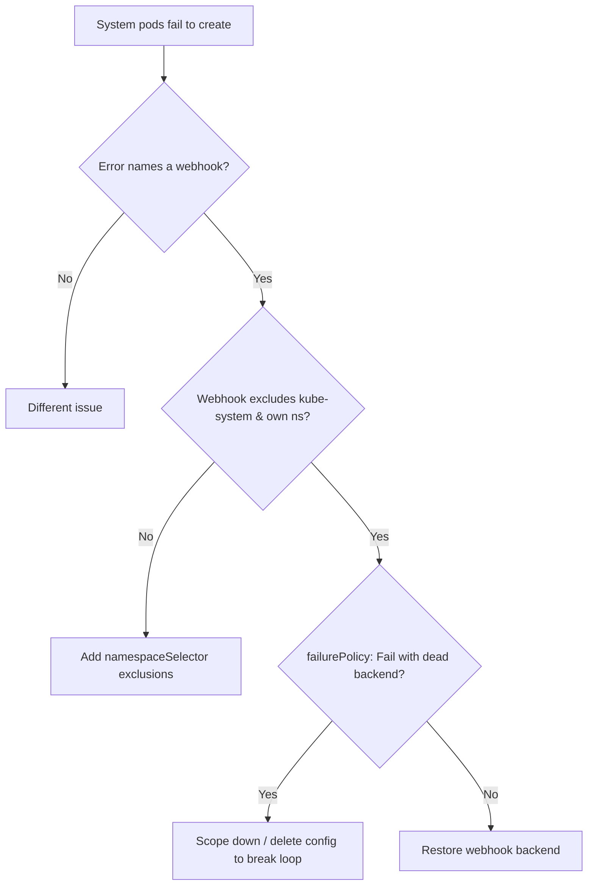

# Webhook Intercepting kube-system Deadlock

> **Severity:** Critical · **Typical recovery time:** 10–40 min · **Affected versions:** 1.16+

## Error Message

```text
Internal error occurred: failed calling webhook "mutate.sidecar.example.com":
    failed to call webhook: Post "https://sidecar-injector.webhook-system.svc:443/
    mutate?timeout=10s": dial tcp 10.96.42.7:443: connect: connection refused
# ...while the failing object IS the webhook's own backend (or core kube-system
# components / CNI / CoreDNS), so it can never become healthy:
Warning  FailedCreate  replicaset/sidecar-injector-7c9b  Error creating: Internal
    error occurred: failed calling webhook "mutate.sidecar.example.com" ...
```

## Description

A webhook with a broad scope and `failurePolicy: Fail` that has no
`namespaceSelector` excluding control-plane namespaces creates a circular
dependency: the webhook must be called to admit pods, but the very pods that back
the webhook (or core components like CoreDNS, CNI, metrics-server) live in
namespaces the webhook intercepts. If the backend is down, the apiserver cannot
create the backend (or other system pods) because admission to the webhook
fails — a self-inflicted deadlock. This commonly bites after a node reboot,
cluster bootstrap, or webhook outage and can prevent the control plane and CNI
from recovering, making it a critical, cluster-wide incident.

## Affected Kubernetes Versions

Applies to 1.16+. The apiserver labels system namespaces with the immutable
`kubernetes.io/metadata.name` label (auto-set since 1.21), and `kube-system`
carries `control-plane: ...` style labels, both useful for exclusion via
`namespaceSelector`. Kubernetes documentation explicitly recommends excluding
`kube-system` and the webhook's own namespace.

## Likely Root Causes

- Webhook has empty `namespaceSelector` (matches all namespaces incl. kube-system)
- `failurePolicy: Fail` plus no healthy backend during bootstrap/reboot
- Webhook intercepts its own backend namespace, so it cannot self-heal
- Broad `rules` capturing pods/CNI/CoreDNS the cluster needs to start
- objectSelector missing, so system components are not exempt

## Diagnostic Flow



## Verification Steps

Confirm the failing objects are in control-plane/system namespaces and that the
webhook configuration lacks an exclusion for `kube-system` and its own namespace.

## kubectl Commands

```bash
kubectl get mutatingwebhookconfigurations,validatingwebhookconfigurations
kubectl get mutatingwebhookconfiguration sidecar-injector -o yaml | grep -A8 -i "namespaceSelector\|failurePolicy\|rules"
kubectl get ns kube-system --show-labels
kubectl get events -n kube-system --sort-by=.lastTimestamp | grep -i webhook
kubectl get pods -n webhook-system -o wide
kubectl get endpoints -n webhook-system sidecar-injector
```

## Expected Output

```text
$ kubectl get mutatingwebhookconfiguration sidecar-injector -o yaml | grep -A6 namespaceSelector
  namespaceSelector: {}          # empty → intercepts kube-system & own ns
  failurePolicy: Fail

$ kubectl get events -n kube-system | grep -i webhook
FailedCreate  replicaset/coredns-...  failed calling webhook
    "mutate.sidecar.example.com": ... connection refused
```

## Common Fixes

1. Add a `namespaceSelector` that excludes `kube-system` and the webhook's own
   namespace (e.g. match-expressions on `kubernetes.io/metadata.name`).
2. Use a control-plane exclusion label and apply it to system namespaces.
3. Choose `failurePolicy: Ignore` for non-security webhooks so an outage cannot
   deadlock the cluster.
4. Narrow `rules`/`objectSelector` so core components are never intercepted.

## Recovery Procedures

1. Confirm the deadlock: the webhook's own backend (or CoreDNS/CNI) cannot be
   created because admission to that webhook fails.
2. Break the loop by removing or scoping down the webhook configuration.
   **Disruptive:** deleting the `Mutating`/`ValidatingWebhookConfiguration`
   stops enforcement of that policy cluster-wide while it is gone — blast radius
   is unprotected admission for all matching objects. Do it only to recover, then
   reapply a corrected config with proper exclusions.
3. Once the backend pods schedule and become Ready, reapply the webhook with
   `namespaceSelector` excluding system namespaces.

## Validation

System pods (backend, CoreDNS, CNI) schedule and become Ready, the webhook is
reapplied with kube-system/own-namespace exclusions, and creating objects in
application namespaces still triggers the webhook normally.

## Prevention

Always exclude `kube-system` and the webhook's own namespace via
`namespaceSelector`, prefer `failurePolicy: Ignore` for non-critical webhooks,
run the backend HA, and test webhook behaviour during a simulated node reboot.

## Related Errors

- [Admission Webhook Connection Refused](./admission-webhook-connection-refused.md)
- [Admission Webhook Timeout](./admission-webhook-timeout.md)
- [Mutating Webhook Side Effects](./mutating-webhook-reinvocation-side-effects.md)

## References

- [Kubernetes: Admission webhook good practices — avoiding deadlocks](https://kubernetes.io/docs/concepts/cluster-administration/admission-webhooks-good-practices/)
- [Kubernetes: Matching requests — namespaceSelector](https://kubernetes.io/docs/reference/access-authn-authz/extensible-admission-controllers/#matching-requests-namespaceselector)

## Further Reading

- [DevOps AI ToolKit — Kubernetes guides](https://devopsaitoolkit.com/blog/)
