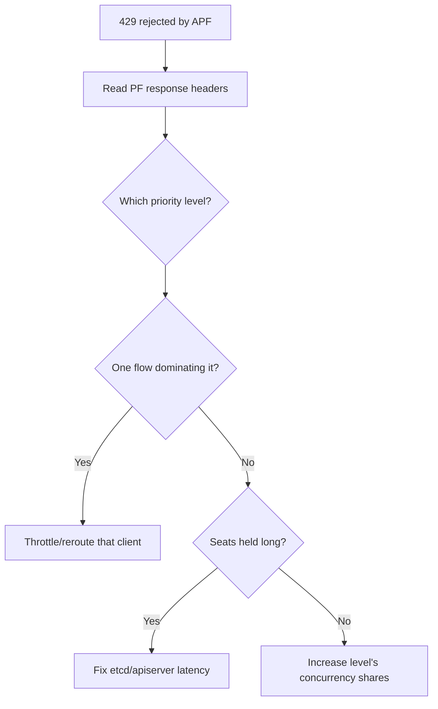

# APF Request Rejected (429)

> **Severity:** Medium · **Typical recovery time:** 5–30 min · **Affected versions:** 1.20+

## Error Message

```text
Error from server (TooManyRequests): too many requests, please try again later
(request rejected by API Priority and Fairness, priority level "workload-low" is exhausted)
```

## Description

API Priority and Fairness (APF) classifies incoming requests into FlowSchemas,
maps them to PriorityLevelConfigurations, and limits concurrency ("seats") per
level. When a priority level's queue is full, APF rejects further requests with
429 instead of letting them overwhelm the apiserver/etcd. This protects the
control plane, but a misconfigured or saturated level means legitimate clients
get throttled while the apiserver itself may look healthy.

## Affected Kubernetes Versions

Applies to 1.20+. APF was beta and on by default from 1.20
(`flowcontrol.apiserver.k8s.io/v1beta1/2/3`) and GA (`v1`) in 1.29. Built-in
FlowSchemas/PriorityLevels differ slightly by version, but the rejection
mechanics are the same.

## Likely Root Causes

- A noisy client/flow consuming all seats in its priority level
- Concurrency shares for a level set too low for real demand
- A custom FlowSchema mis-routing many clients into one level
- etcd/apiserver slowness holding seats longer, exhausting queues
- Retry storms refilling the queue faster than it drains

## Diagnostic Flow



## Verification Steps

Identify the saturated priority level and the FlowSchema routing the offending
traffic using APF response headers and the debug endpoints.

## kubectl Commands

```bash
kubectl get flowschemas
kubectl get prioritylevelconfigurations
kubectl get --raw='/debug/api_priority_and_fairness/dump_priority_levels'
kubectl get --raw='/debug/api_priority_and_fairness/dump_queues'
kubectl get --raw='/metrics' | grep apiserver_flowcontrol_rejected_requests_total
kubectl get --raw='/metrics' | grep apiserver_flowcontrol_current_inqueue_requests
kubectl get --raw='/metrics' | grep apiserver_flowcontrol_request_concurrency_limit
```

## Expected Output

```text
# response headers on the rejected request
X-Kubernetes-PF-FlowSchema-UID: 7c2f...
X-Kubernetes-PF-PriorityLevel-UID: 9a1b...

apiserver_flowcontrol_rejected_requests_total{
  flow_schema="service-accounts", priority_level="workload-low",
  reason="queue-full"} 8841
```

## Common Fixes

1. Identify and fix the noisy client (use informers/watches, add caching, back
   off) so it stops saturating its level.
2. Increase the PriorityLevelConfiguration's `nominalConcurrencyShares` (or
   queues) for the affected level.
3. Add a dedicated FlowSchema to isolate critical controllers into a protected
   priority level.
4. Resolve upstream etcd/apiserver latency so seats free up faster.

## Recovery Procedures

1. Use the `dump_priority_levels` / `dump_queues` endpoints to see which level is
   exhausted and which flow is responsible.
2. Apply an edited FlowSchema/PriorityLevelConfiguration to rebalance shares —
   this is a non-disruptive API object change that APF picks up live.
3. **Disruptive (rare):** if you must disable APF entirely via
   `--enable-priority-and-fairness=false`, it requires restarting the apiserver
   static pod and removes all flow protection — blast radius is the whole control
   plane's overload behaviour; avoid except as a last resort.

## Validation

`apiserver_flowcontrol_rejected_requests_total` stops climbing for the level and
clients succeed without 429s.

## Prevention

Tune APF shares for real workloads, give system/critical controllers a protected
priority level, build clients on shared informers with backoff, and alert on APF
rejected-requests and seat/queue saturation metrics.

## Related Errors

- [API Server 429 Too Many Requests](./api-server-too-many-requests-429.md)
- [API Server Context Deadline Exceeded](./api-server-context-deadline-exceeded.md)
- [API Server etcd Request Timed Out](./api-server-etcd-request-timed-out.md)

## References

- [Kubernetes: API Priority and Fairness](https://kubernetes.io/docs/concepts/cluster-administration/flow-control/)
- [Kubernetes: kube-apiserver reference](https://kubernetes.io/docs/reference/command-line-tools-reference/kube-apiserver/)
