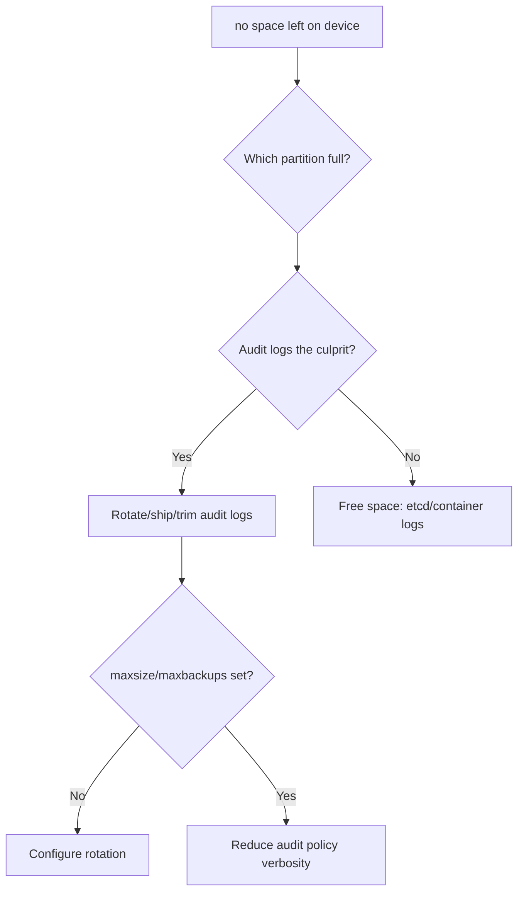

# Audit Log Disk Full

> **Severity:** High · **Typical recovery time:** 15–45 min · **Affected versions:** 1.20+

## Error Message

```text
E... audit.go] Unable to write audit log:
write /var/log/kubernetes/audit/audit.log: no space left on device
```

## Description

When the apiserver is configured with audit logging to a host file, a full
control-plane disk stops audit writes. Depending on the audit backend's blocking
behaviour this can slow or stall request handling, and a full root/`/var`
partition also threatens the kubelet, etcd, and container runtime. In
security-regulated clusters, audit write failures can additionally violate
compliance requirements that mandate complete audit trails.

## Affected Kubernetes Versions

Applies to 1.20+ clusters using the log audit backend
(`--audit-log-path`). The audit policy/log flags are stable across these
versions; the webhook audit backend behaves differently (network, not disk).

## Likely Root Causes

- `--audit-log-maxsize` / `--audit-log-maxbackups` not set, so logs grow forever
- Verbose audit policy logging at `RequestResponse` for high-volume resources
- Audit logs sharing a partition with etcd/container logs that filled the disk
- Log rotation/shipping (Fluent Bit/Vector) broken, so files accumulate
- A request storm generating excessive audit volume

## Diagnostic Flow



## Verification Steps

Confirm the disk is full and that audit logs (not etcd data or container logs)
are the dominant consumer.

## kubectl Commands

```bash
df -h /var/log /var/lib/etcd /
du -sh /var/log/kubernetes/audit/* 2>/dev/null | sort -h | tail
ls -lh /var/log/kubernetes/audit/
crictl ps | grep kube-apiserver
crictl logs $(crictl ps -q --name kube-apiserver) 2>&1 | grep -i audit | tail
journalctl -u kubelet --no-pager -n 100 | grep -i 'no space'
curl -k https://localhost:6443/healthz
```

## Expected Output

```text
$ df -h /var/log
Filesystem  Size  Used Avail Use% Mounted on
/dev/sda3    40G   40G     0 100% /var/log

$ du -sh /var/log/kubernetes/audit/*
38G  /var/log/kubernetes/audit/audit.log
```

## Common Fixes

1. Free space immediately by rotating/compressing and shipping old audit logs
   off the node (do not blindly truncate an active audit file in regulated envs).
2. Set `--audit-log-maxsize`, `--audit-log-maxbackups`, and `--audit-log-maxage`
   so the apiserver self-rotates.
3. Reduce audit policy verbosity (drop `RequestResponse` for chatty resources).
4. Put audit logs on a dedicated volume separate from etcd.

## Recovery Procedures

1. Identify and clear the largest consumers to restore free space so the
   apiserver/kubelet recover.
2. Fix the log rotation/shipping pipeline.
3. **Disruptive:** applying new audit-log flags requires editing
   `/etc/kubernetes/manifests/kube-apiserver.yaml`, which restarts the static
   pod — blast radius is one control-plane node; stagger across HA members and
   verify each comes back healthy before the next.

## Validation

`df -h` shows healthy free space, the apiserver logs no further audit write
errors, and `/healthz` returns ok.

## Prevention

Always set audit log rotation limits, ship audit logs to durable storage,
isolate audit/etcd/container-log volumes, alert on control-plane disk usage, and
keep audit policy scoped to what compliance actually requires.

## Related Errors

- [API Server Connection Refused](./api-server-connection-refused.md)
- [API Server etcd Request Timed Out](./api-server-etcd-request-timed-out.md)
- [API Server Context Deadline Exceeded](./api-server-context-deadline-exceeded.md)

## References

- [Kubernetes: Auditing](https://kubernetes.io/docs/tasks/debug/debug-cluster/audit/)
- [Kubernetes: kube-apiserver reference](https://kubernetes.io/docs/reference/command-line-tools-reference/kube-apiserver/)
