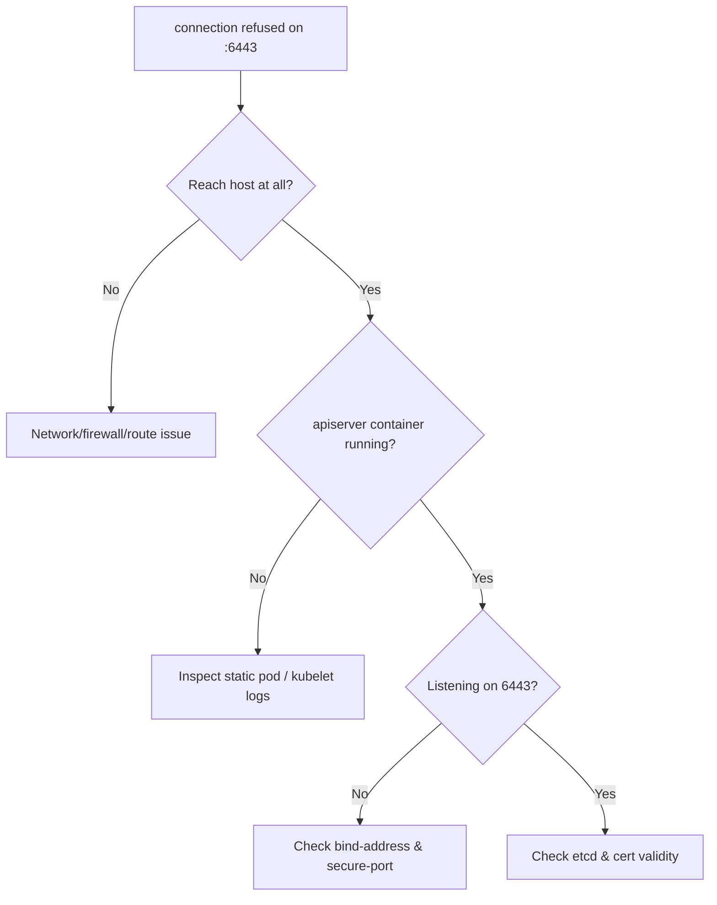

# API Server Connection Refused

> **Severity:** Critical · **Typical recovery time:** 5–30 min · **Affected versions:** 1.20+

## Error Message

```text
The connection to the server 10.0.0.10:6443 was refused - did you specify the right host or port?
```

## Description

Every `kubectl` and controller call terminates against the kube-apiserver on
port 6443. A "connection refused" means the TCP handshake reached the host but
nothing is listening on that port: the apiserver process is down, crash-looping,
or bound to a different address. During an incident this is a full control-plane
outage — workloads keep running, but no scheduling, scaling, or config changes
can happen until the apiserver is back.

## Affected Kubernetes Versions

Applies to all kubeadm and self-managed clusters on 1.20+. The default secure
port has been 6443 for many releases. Managed control planes (EKS/GKE/AKS) hide
the static pod, so you debug via cloud status rather than the host.

## Likely Root Causes

- kube-apiserver static pod failed to start (bad flag, missing cert, etcd down)
- Wrong server URL/port in kubeconfig, or stale context after a rebuild
- apiserver bound to a different `--bind-address`/`--secure-port`
- Host firewall / security group blocking 6443
- etcd unavailable, causing the apiserver to exit on startup

## Diagnostic Flow



## Verification Steps

Confirm the failure is a refused TCP connection (not a timeout or TLS error) and
that you are pointing at the correct control-plane endpoint.

## kubectl Commands

```bash
kubectl cluster-info
kubectl config view --minify
crictl ps -a | grep kube-apiserver
journalctl -u kubelet --no-pager -n 200
systemctl status kubelet
curl -k https://localhost:6443/healthz
ss -tlnp | grep 6443
```

## Expected Output

```text
$ curl -k https://localhost:6443/healthz
curl: (7) Failed to connect to localhost port 6443: Connection refused

$ crictl ps -a | grep kube-apiserver
3f2a...   kube-apiserver   Exited (1)   2 minutes ago

$ journalctl -u kubelet | tail
kubelet: "Failed to start container" err="..." pod="kube-system/kube-apiserver-cp01"
```

## Common Fixes

1. Fix the apiserver startup error shown in its container logs (cert path, flag,
   or etcd endpoint), then let the kubelet restart the static pod.
2. Correct the `server:` field/port in your kubeconfig or switch contexts.
3. Open port 6443 in the host firewall / cloud security group.
4. Restore etcd health so the apiserver can complete startup.

## Recovery Procedures

1. Read `crictl logs <apiserver-id>` to find the exit reason.
2. If a manifest edit is required, fix
   `/etc/kubernetes/manifests/kube-apiserver.yaml`. **Disruptive:** the kubelet
   recreates the static pod on save — blast radius is the entire control plane on
   that node; in single-master clusters this is a full outage window.
3. Verify etcd first if the logs show dial timeouts to 2379.
4. For HA clusters, drain traffic from the failed apiserver at the load balancer
   before restarting so clients fail over cleanly.

## Validation

`kubectl get --raw='/healthz'` returns `ok` and `kubectl get nodes` succeeds
against the recovered endpoint.

## Prevention

Run an HA control plane behind a load balancer, monitor `/healthz` and 6443
reachability, validate manifest changes in staging, and keep certificate
rotation automated so the apiserver never exits on an expired cert.

## Related Errors

- [API Server TLS Handshake Timeout](./api-server-tls-handshake-timeout.md)
- [API Server etcd Request Timed Out](./api-server-etcd-request-timed-out.md)
- [x509 Certificate Signed By Unknown Authority](./api-server-x509-unknown-authority.md)

## References

- [Kubernetes: kube-apiserver reference](https://kubernetes.io/docs/reference/command-line-tools-reference/kube-apiserver/)
- [Kubernetes: Troubleshooting clusters](https://kubernetes.io/docs/tasks/debug/debug-cluster/)

## Further Reading

- [DevOps AI ToolKit — Kubernetes guides](https://devopsaitoolkit.com/blog/)
