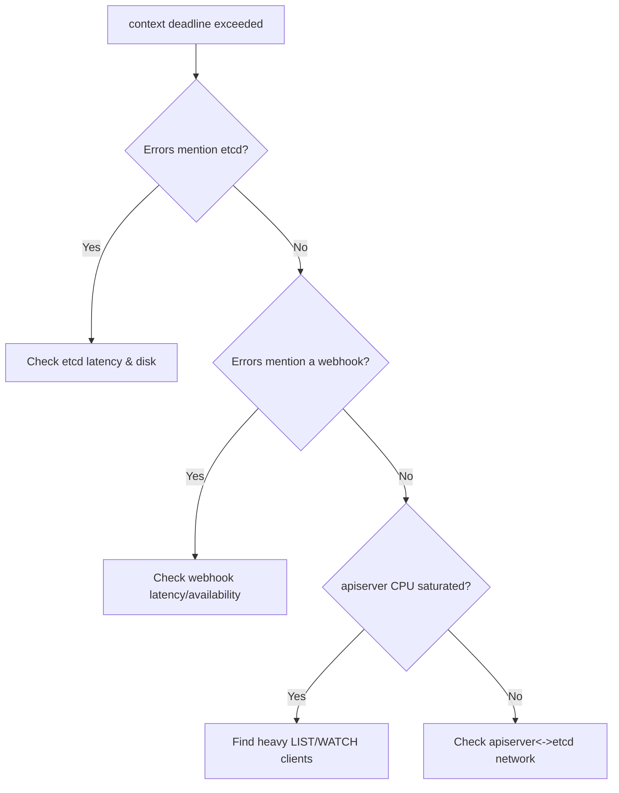

# API Server Context Deadline Exceeded

> **Severity:** High · **Typical recovery time:** 10–45 min · **Affected versions:** 1.20+

## Error Message

```text
Error from server: etcdserver: request timed out
... context deadline exceeded
```

## Description

`context deadline exceeded` means a request did not complete before its timeout
(the client's `--request-timeout`, or the apiserver's internal deadline talking
to etcd or a webhook). It is a latency symptom, not a hard outage: the
control plane is reachable but too slow. During incidents it shows up as
intermittent kubectl hangs, failing controllers, and probe flaps.

## Affected Kubernetes Versions

Applies to 1.20+. The apiserver's default request timeout is governed by
`--request-timeout` (60s) and per-call deadlines; etcd round-trip latency is the
most common upstream contributor across all versions.

## Likely Root Causes

- Slow or overloaded etcd (disk fsync latency, compaction, large DB)
- Apiserver CPU saturation or excessive expensive LIST/WATCH calls
- A slow admission/validating webhook adding to the request budget
- Network latency or packet loss between apiserver and etcd
- Undersized control-plane nodes under client storms

## Diagnostic Flow



## Verification Steps

Confirm the timeout is server-side by reproducing with a longer
`--request-timeout` and checking apiserver/etcd latency metrics, not just the
client error.

## kubectl Commands

```bash
kubectl get --raw='/healthz?verbose'
kubectl get --raw='/metrics' | grep apiserver_request_duration_seconds
kubectl get --raw='/metrics' | grep etcd_request_duration_seconds
kubectl get apiservices
crictl ps | grep -E 'kube-apiserver|etcd'
journalctl -u kubelet --no-pager -n 100
curl -k https://localhost:6443/healthz
```

## Expected Output

```text
$ kubectl get pods -A
Error from server: etcdserver: request timed out

$ kubectl get --raw='/healthz?verbose' | tail
[+]etcd ok
healthz check passed   # but p99 latency high

etcd_disk_wal_fsync_duration_seconds p99 = 0.9s   # should be < 10ms
```

## Common Fixes

1. Move etcd to faster (local NVMe/SSD) storage and isolate its disk.
2. Defragment/compact etcd if the DB has grown large.
3. Throttle or fix abusive clients issuing unbounded LISTs; add APF flow control.
4. Repair or temporarily disable a slow webhook (see related errors).
5. Scale up control-plane node CPU/memory.

## Recovery Procedures

1. Identify the bottleneck via the metrics above (etcd vs webhook vs apiserver).
2. If etcd is the cause, address disk/compaction before touching the apiserver.
3. **Disruptive:** restarting the kube-apiserver static pod (editing
   `/etc/kubernetes/manifests/kube-apiserver.yaml`) clears stuck watches but
   drops all in-flight connections on that node — blast radius is one
   control-plane node; do it last and one node at a time in HA.

## Validation

`apiserver_request_duration_seconds` p99 returns to normal and `kubectl` calls
complete well within the default timeout.

## Prevention

Provision low-latency etcd disks, alert on etcd fsync and apiserver latency,
enforce API Priority and Fairness, set webhook `timeoutSeconds` low with
`failurePolicy` considered, and audit controllers for unbounded LIST/WATCH.

## Related Errors

- [API Server etcd Request Timed Out](./api-server-etcd-request-timed-out.md)
- [API Server TLS Handshake Timeout](./api-server-tls-handshake-timeout.md)
- [API Server 429 Too Many Requests](./api-server-too-many-requests-429.md)

## References

- [Kubernetes: Operating etcd clusters](https://kubernetes.io/docs/tasks/administer-cluster/configure-upgrade-etcd/)
- [Kubernetes: API Priority and Fairness](https://kubernetes.io/docs/concepts/cluster-administration/flow-control/)
