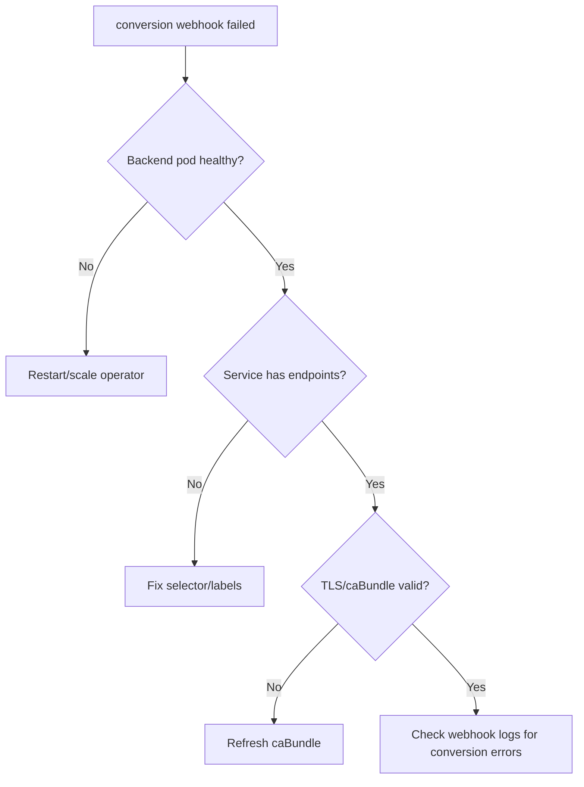

# Conversion Webhook Failed

> **Severity:** High · **Typical recovery time:** 10–40 min · **Affected versions:** 1.20+

## Error Message

```text
Internal error occurred: conversion webhook for example.com/v1beta1, Kind=Widget
failed: Post "https://conv-svc.ns.svc:443/convert?timeout=30s":
dial tcp 10.96.0.7:443: connect: connection refused
```

## Description

CRDs with multiple stored/served versions can use a conversion webhook to
translate objects between versions on read/write. When that webhook is
unreachable or errors, the apiserver cannot serve or persist affected custom
resources — `kubectl get`/`apply` on the CRD fails, and controllers reconciling
those resources stall. Because conversion runs on every access (including LISTs),
a broken conversion webhook can wedge an entire operator.

## Affected Kubernetes Versions

Applies to 1.20+ where `apiextensions.k8s.io/v1` CRDs use
`spec.conversion.strategy: Webhook`. The conversion review API
(`apiextensions.k8s.io/v1`) is stable across these versions.

## Likely Root Causes

- Conversion webhook backend (often the operator) is down or crash-looping
- Service has no ready endpoints (selector/label mismatch)
- Stale or wrong `conversion.webhook.clientConfig.caBundle` (TLS rejection)
- Webhook timeout exceeded under large LISTs
- Webhook returns malformed/incomplete `ConversionReview` responses

## Diagnostic Flow



## Verification Steps

Confirm which CRD's conversion is failing, that its strategy is `Webhook`, and
whether the backing Service is reachable with a valid CA bundle.

## kubectl Commands

```bash
kubectl get crd <crd> -o jsonpath='{.spec.conversion.strategy}'
kubectl get crd <crd> -o yaml | grep -A15 conversion:
kubectl get endpoints -n <ns> <conversion-svc>
kubectl get pods -n <ns> -l <operator-selector>
kubectl logs -n <ns> deploy/<operator> --tail=80
kubectl get apiservices | grep <group>
kubectl get events -A --sort-by=.lastTimestamp | grep -i conversion
```

## Expected Output

```text
$ kubectl get widgets -A
Error from server: conversion webhook for example.com/v1beta1, Kind=Widget failed:
... connect: connection refused

$ kubectl get endpoints -n ns conv-svc
NAME       ENDPOINTS   AGE
conv-svc   <none>      3d
```

## Common Fixes

1. Restore the operator/webhook backend that serves `/convert`.
2. Fix the Service selector so endpoints populate.
3. Refresh the CRD's `conversion...caBundle` to the current signing CA
   (cert-manager CA injection commonly automates this).
4. Increase the conversion `timeoutSeconds` if large LISTs time out.

## Recovery Procedures

1. Check operator logs for conversion errors and the Service endpoints.
2. Roll the operator Deployment if it is the webhook backend.
3. **Disruptive (last resort):** if the conversion webhook is permanently broken
   and you must regain access, switching the CRD `conversion.strategy` to `None`
   stops conversion. Blast radius: objects are served only in their stored
   version and may be returned incorrectly — data-integrity risk; use only with a
   recovery plan and revert once the webhook is fixed.

## Validation

`kubectl get <cr>` returns objects without error and the operator resumes
reconciliation cleanly.

## Prevention

Run the operator HA with a PDB, automate caBundle injection, set generous
conversion timeouts, test version conversions in CI, and alert on the conversion
webhook Service's endpoint readiness.

## Related Errors

- [Failed Calling Webhook](./api-server-failed-calling-webhook.md)
- [x509 Certificate Signed By Unknown Authority](./api-server-x509-unknown-authority.md)
- [API Server Context Deadline Exceeded](./api-server-context-deadline-exceeded.md)

## References

- [Kubernetes: Versions in CustomResourceDefinitions](https://kubernetes.io/docs/tasks/extend-kubernetes/custom-resources/custom-resource-definition-versioning/)
- [Kubernetes: Extend with CustomResourceDefinitions](https://kubernetes.io/docs/tasks/extend-kubernetes/custom-resources/custom-resource-definitions/)
