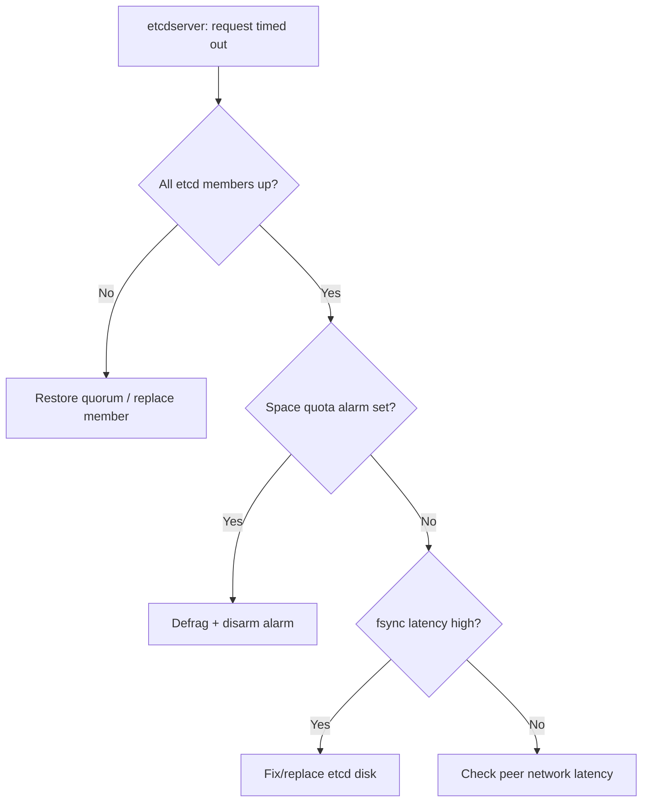

# API Server etcd Request Timed Out

> **Severity:** Critical · **Typical recovery time:** 15–60 min · **Affected versions:** 1.20+

## Error Message

```text
Error from server: etcdserver: request timed out
```

## Description

The kube-apiserver stores all cluster state in etcd. When etcd cannot commit a
read or write within its deadline, the apiserver surfaces
`etcdserver: request timed out` to callers. This is a backing-store incident:
writes (create/update/delete) fail, reads may be stale or fail, and controllers
back off. It is one of the most serious control-plane conditions because it can
precede quorum loss and data unavailability.

## Affected Kubernetes Versions

Applies to all clusters on 1.20+ using etcd (the default). Symptoms are
identical across versions; etcd 3.4/3.5 differ in defrag and learner behaviour
but the apiserver-facing error string is the same.

## Likely Root Causes

- Slow disk: high WAL fsync / backend commit latency
- Lost or degraded quorum (a member down in a 3-node cluster)
- etcd database near the space quota (default 2 GiB) triggering alarms
- Network partition or latency between etcd peers
- Large objects / high write volume overwhelming etcd

## Diagnostic Flow



## Verification Steps

Confirm the timeout originates in etcd (not a webhook or client deadline) by
inspecting etcd health, member list, and latency metrics.

## kubectl Commands

```bash
kubectl get --raw='/healthz/etcd'
kubectl get --raw='/metrics' | grep etcd_disk_wal_fsync_duration_seconds
kubectl get --raw='/metrics' | grep etcd_server_has_leader
crictl ps | grep etcd
crictl logs $(crictl ps -q --name etcd) 2>&1 | tail -n 50
journalctl -u kubelet --no-pager -n 100
curl -k https://localhost:6443/healthz/etcd
```

## Expected Output

```text
$ kubectl get --raw='/healthz/etcd'
[-]etcd failed: etcd cluster is unavailable or misconfigured

$ crictl logs <etcd> | tail
etcdserver: request timed out, possibly due to previous leader failure
mvcc: database space exceeded
etcdserver: rafthttp: lost the TCP streaming connection with peer
```

## Common Fixes

1. Restore quorum: bring failed members back or replace them so a majority is
   healthy.
2. If the space quota alarm fired, compact and defragment etcd, then disarm the
   alarm.
3. Move etcd onto dedicated low-latency SSD/NVMe and isolate noisy neighbours.
4. Reduce write pressure (oversized objects, churny controllers).

## Recovery Procedures

1. Check `etcdctl endpoint health` / member list via the etcd pod to find the
   failed member.
2. **Disruptive:** defragmentation locks each etcd member briefly — run it one
   member at a time so quorum is never lost; blast radius is brief write stalls.
3. **Disruptive:** replacing an etcd member or restoring from snapshot affects
   the whole cluster's state store — follow the official add/remove-member
   procedure and take a snapshot first.
4. For total quorum loss, restore from the latest etcd snapshot.

## Validation

`/healthz/etcd` returns ok, `etcd_server_has_leader` is 1 on all members, and
fsync p99 is back under ~10 ms.

## Prevention

Run 3 or 5 etcd members on dedicated SSDs, take regular snapshots, alert on
fsync latency, leader changes, and DB size, and schedule periodic defrag well
before the space quota is reached.

## Related Errors

- [API Server Context Deadline Exceeded](./api-server-context-deadline-exceeded.md)
- [API Server Connection Refused](./api-server-connection-refused.md)
- [Request Entity Too Large](./api-server-request-entity-too-large.md)

## References

- [Kubernetes: Operating etcd clusters](https://kubernetes.io/docs/tasks/administer-cluster/configure-upgrade-etcd/)
- [Kubernetes: Backing up an etcd cluster](https://kubernetes.io/docs/tasks/administer-cluster/configure-upgrade-etcd/#backing-up-an-etcd-cluster)
