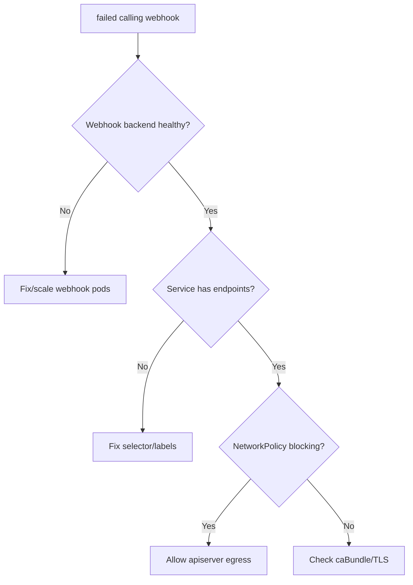

# Failed Calling Webhook

> **Severity:** High · **Typical recovery time:** 5–30 min · **Affected versions:** 1.20+

## Error Message

```text
Internal error occurred: failed calling webhook "vpod.example.com":
failed to call webhook: Post "https://webhook-svc.ns.svc:443/validate":
dial tcp 10.96.0.5:443: connect: connection refused
```

## Description

Admission webhooks (validating/mutating) intercept API requests before they are
persisted. When the apiserver cannot reach the webhook endpoint, requests for the
objects that webhook matches fail. With `failurePolicy: Fail` (the safe default
for security webhooks) this blocks creates/updates cluster-wide for the matched
resources — a classic self-inflicted outage when the webhook backend is down or
its Service/network is broken.

## Affected Kubernetes Versions

Applies to 1.20+. `admissionregistration.k8s.io/v1` is stable across these
versions; behaviour depends on `failurePolicy`, `timeoutSeconds`, and
`namespaceSelector`/`objectSelector` scoping.

## Likely Root Causes

- Webhook backend pods are down, crash-looping, or scaled to zero
- Service selector/endpoints don't match the webhook pods (no endpoints)
- NetworkPolicy or CNI blocking apiserver-to-webhook traffic
- Webhook scoped too broadly so it intercepts its own dependencies
- TLS cert/`caBundle` mismatch causing the call to be rejected

## Diagnostic Flow



## Verification Steps

Confirm which webhook is failing, its `failurePolicy`, and whether its backing
Service has ready endpoints.

## kubectl Commands

```bash
kubectl get validatingwebhookconfigurations
kubectl get mutatingwebhookconfigurations
kubectl get validatingwebhookconfiguration <name> -o yaml | grep -E 'failurePolicy|service:|namespace:|name:|timeoutSeconds'
kubectl get endpoints -n <ns> <webhook-svc>
kubectl get pods -n <ns> -l <webhook-selector>
kubectl logs -n <ns> deploy/<webhook> --tail=50
kubectl get events -A --sort-by=.lastTimestamp | grep -i webhook
```

## Expected Output

```text
$ kubectl get endpoints -n ns webhook-svc
NAME          ENDPOINTS   AGE
webhook-svc   <none>      6d     # no ready backends

$ kubectl apply -f deploy.yaml
Error from server: failed calling webhook "vpod.example.com": connection refused
```

## Common Fixes

1. Restore the webhook backend (scale up, fix crash loop, repair the Deployment).
2. Fix the Service selector/labels so endpoints populate.
3. Add a NetworkPolicy rule allowing apiserver traffic to the webhook port.
4. Correct the `caBundle`/serving cert if the failure is a TLS rejection.

## Recovery Procedures

1. Identify the offending webhook from the error and its `failurePolicy`.
2. **Disruptive (emergency):** if a `failurePolicy: Fail` webhook is wedging the
   cluster and its backend cannot be restored, temporarily delete or scope down
   the `ValidatingWebhookConfiguration`/`MutatingWebhookConfiguration`. Blast
   radius: admission checks for those resources are skipped until restored — a
   security/policy gap, so re-enable as soon as the backend is healthy.
3. Scope future webhooks with `namespaceSelector` excluding `kube-system`.

## Validation

The previously failing `kubectl apply`/`create` succeeds and the webhook Service
shows ready endpoints again.

## Prevention

Run webhook backends HA with PodDisruptionBudgets, set sensible `timeoutSeconds`,
exclude system namespaces, monitor endpoint readiness, and reserve
`failurePolicy: Ignore` for non-critical webhooks.

## Related Errors

- [Conversion Webhook Failed](./api-server-conversion-webhook-failed.md)
- [API Server Context Deadline Exceeded](./api-server-context-deadline-exceeded.md)
- [API Server Connection Refused](./api-server-connection-refused.md)

## References

- [Kubernetes: Dynamic Admission Control](https://kubernetes.io/docs/reference/access-authn-authz/extensible-admission-controllers/)
- [Kubernetes: Admission webhook good practices](https://kubernetes.io/docs/concepts/cluster-administration/admission-webhooks-good-practices/)
