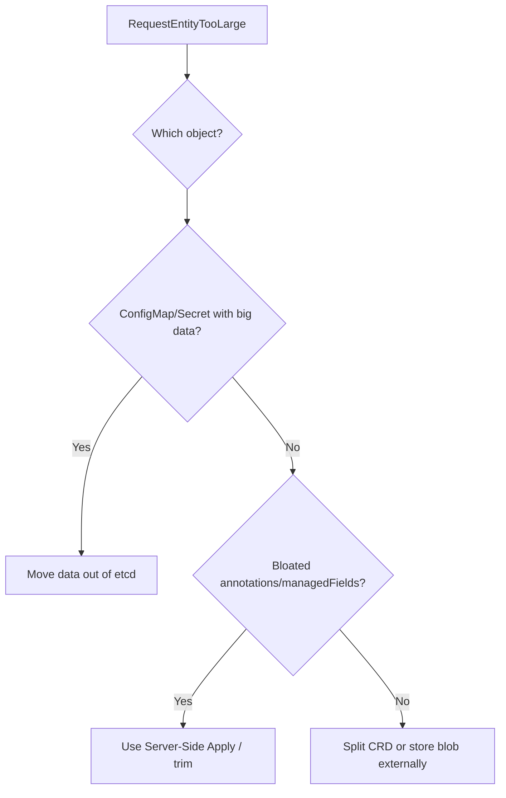

# Request Entity Too Large

> **Severity:** Medium · **Typical recovery time:** 10–40 min · **Affected versions:** 1.20+

## Error Message

```text
Error from server (RequestEntityTooLarge): request is too large:
etcd request value exceeds the maximum limit of 1.5MB
```

## Description

etcd enforces a maximum value size (default ~1.5 MiB per object) and the
apiserver enforces request body limits. When an object — typically a ConfigMap,
Secret, large CRD, or a resource with a bloated `managed-fields`/annotations —
exceeds that, writes are rejected with `RequestEntityTooLarge`. It is usually a
data-modeling problem: storing files, certs, or generated blobs in etcd instead
of object storage.

## Affected Kubernetes Versions

Applies to 1.20+. etcd's per-value limit (`--max-request-bytes`, default ~1.5 MiB
effective) and the apiserver's `--max-request-bytes` are stable across these
versions. The classic offender, large `kubectl apply` last-applied annotations,
is reduced by Server-Side Apply (GA 1.22).

## Likely Root Causes

- A ConfigMap/Secret holding large files, certs, or binaries
- A CRD object that has grown huge (embedded data, big status)
- Bloated `kubectl.kubernetes.io/last-applied-configuration` annotation
- Excessive `managedFields` growth from many controllers
- Helm release secrets storing large rendered manifests

## Diagnostic Flow



## Verification Steps

Identify the specific object and what is consuming its size (data keys,
annotations, or managedFields) before changing anything.

## kubectl Commands

```bash
kubectl get configmap <name> -n <ns> -o json | wc -c
kubectl get <resource> <name> -n <ns> -o json | jq '.metadata.annotations | to_entries | map({k:.key, bytes:(.value|length)}) | sort_by(.bytes)'
kubectl get <resource> <name> -n <ns> -o json | jq '.metadata.managedFields | length'
kubectl get events -A --sort-by=.lastTimestamp | grep -i 'too large'
kubectl api-resources --verbs=list -o name | head
```

## Expected Output

```text
$ kubectl create configmap big --from-file=./model.bin
The ConfigMap "big" is invalid: []: Too long: must have at most 1048576 bytes

$ kubectl get cm big -o json | wc -c
2231041   # ~2.1 MB, over the etcd value limit
```

## Common Fixes

1. Move large payloads out of etcd: use a PVC, object storage (S3/GCS), or an
   init-container that fetches the data at runtime.
2. Split one oversized ConfigMap/Secret into several smaller ones.
3. Use Server-Side Apply (`kubectl apply --server-side`) to avoid the
   last-applied annotation bloat.
4. Trim `managedFields`/annotations and reduce CRD `status` size.

## Recovery Procedures

1. Confirm the object and the source of bloat with the commands above.
2. Recreate the data in a smaller/externalized form and update referencing
   workloads to the new source.
3. **Disruptive:** raising etcd/apiserver `--max-request-bytes` is possible but
   discouraged — it increases memory pressure and latency cluster-wide and
   requires restarting the apiserver static pod (blast radius: one control-plane
   node, staggered in HA). Prefer fixing the data model.

## Validation

The previously failing create/update succeeds and the object size is comfortably
under the limit.

## Prevention

Keep large/binary data out of etcd, adopt Server-Side Apply, lint object sizes in
CI, set ResourceQuota where appropriate, and alert on etcd DB growth so bloat is
caught early.

## Related Errors

- [API Server etcd Request Timed Out](./api-server-etcd-request-timed-out.md)
- [API Server Context Deadline Exceeded](./api-server-context-deadline-exceeded.md)
- [API Server 429 Too Many Requests](./api-server-too-many-requests-429.md)

## References

- [Kubernetes: Server-Side Apply](https://kubernetes.io/docs/reference/using-api/server-side-apply/)
- [Kubernetes: ConfigMaps](https://kubernetes.io/docs/concepts/configuration/configmap/)
