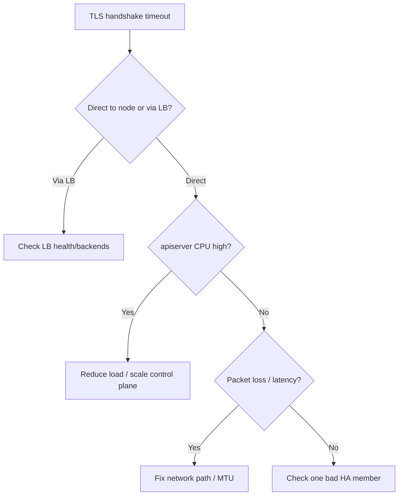

# API Server TLS Handshake Timeout

> **Severity:** High · **Typical recovery time:** 10–45 min · **Affected versions:** 1.20+

## Error Message

```text
Unable to connect to the server: net/http: TLS handshake timeout
```

## Description

The TCP connection to the apiserver succeeded, but the TLS negotiation did not
finish before the client's deadline. Unlike "connection refused", something *is*
listening — it is just too slow or unable to complete the handshake. In practice
this points at an overloaded apiserver, a misbehaving load balancer in front of
6443, or network packet loss. It manifests as intermittent kubectl failures and
flapping kubelet/controller connections.

## Affected Kubernetes Versions

Applies to 1.20+. The behaviour is independent of Kubernetes version; it depends
on apiserver load, the proxy/LB layer, and network quality between client and
control plane.

## Likely Root Causes

- Apiserver CPU saturation (can't service the handshake in time)
- A load balancer or proxy in front of 6443 dropping/delaying connections
- Packet loss, MTU mismatch, or latency on the path to the control plane
- Too many simultaneous new connections (no keep-alive / connection storms)
- A half-broken apiserver instance behind an HA VIP

## Diagnostic Flow



## Verification Steps

Confirm it is a handshake timeout (not a cert error or refusal) by testing TLS
directly against the apiserver and checking apiserver CPU and LB backend health.

## kubectl Commands

```bash
kubectl get --raw='/healthz?verbose'
kubectl get --raw='/metrics' | grep apiserver_current_inflight_requests
crictl ps | grep kube-apiserver
crictl stats $(crictl ps -q --name kube-apiserver)
journalctl -u kubelet --no-pager -n 100
curl -k -v https://localhost:6443/healthz
ss -s
```

## Expected Output

```text
$ curl -k -v https://localhost:6443/healthz
* TLSv1.3 (OUT), TLS handshake, Client hello (1):
* (no response — hangs, then times out)

$ crictl stats <apiserver>
CPU 198%   MEM 6.1GB   # pegged

apiserver_current_inflight_requests{request_kind="readOnly"} 400  # at cap
```

## Common Fixes

1. Reduce apiserver load (throttle abusive clients, enable APF) and/or scale up
   control-plane node CPU.
2. Repair the load balancer in front of 6443: fix health checks, idle timeouts,
   and remove unhealthy backends.
3. Fix the network path — packet loss, MTU, or a saturated link.
4. Encourage clients to reuse connections (keep-alive, shared transports).

## Recovery Procedures

1. Test the handshake directly on the node (`curl -k -v https://localhost:6443`)
   to isolate apiserver vs LB.
2. If one HA apiserver is sick, pull it from the LB pool so clients fail over.
3. **Disruptive:** restarting the kube-apiserver static pod (via its manifest)
   resets stuck connections but drops all live sessions on that node — blast
   radius is one control-plane node; do it last and one at a time in HA.

## Validation

`curl -k https://localhost:6443/healthz` completes the handshake quickly and
returns `ok`; apiserver CPU and inflight metrics return to normal.

## Prevention

Right-size control-plane nodes, enable APF, tune LB idle/health-check settings,
monitor apiserver CPU and inflight requests, and run HA so a single slow member
does not block all clients.

## Related Errors

- [API Server Connection Refused](./api-server-connection-refused.md)
- [x509 Certificate Signed By Unknown Authority](./api-server-x509-unknown-authority.md)
- [API Server Context Deadline Exceeded](./api-server-context-deadline-exceeded.md)

## References

- [Kubernetes: Troubleshooting clusters](https://kubernetes.io/docs/tasks/debug/debug-cluster/)
- [Kubernetes: kube-apiserver reference](https://kubernetes.io/docs/reference/command-line-tools-reference/kube-apiserver/)
