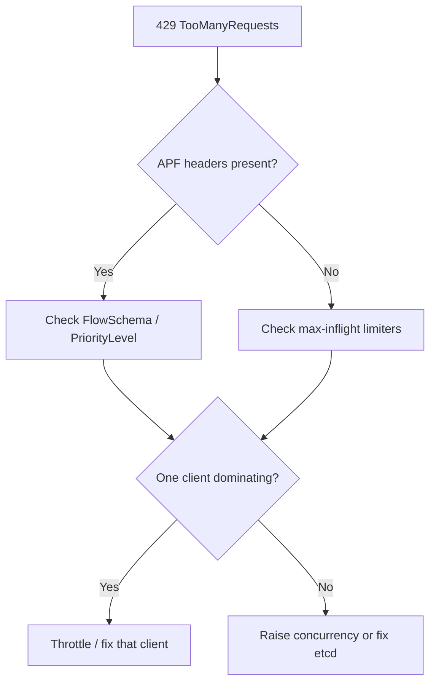

# API Server 429 Too Many Requests

> **Severity:** Medium · **Typical recovery time:** 5–30 min · **Affected versions:** 1.20+

## Error Message

```text
Error from server (TooManyRequests): the server has received too many requests
and has asked us to try again later
```

## Description

HTTP 429 is the apiserver telling clients to back off. It is returned either by
legacy max-inflight limiters (`--max-requests-inflight`,
`--max-mutating-requests-inflight`) or by API Priority and Fairness (APF) when a
priority level's concurrency is exhausted. It is usually a protective response to
overload rather than a crash — but sustained 429s mean controllers fall behind
and reconciliation slows across the cluster.

## Affected Kubernetes Versions

Applies to 1.20+. APF became the default flow-control mechanism (beta on by
default in 1.20, GA in 1.29). On APF clusters most 429s carry APF response
headers; on older/disabled-APF clusters they come from the inflight limiters.

## Likely Root Causes

- A hot client (operator, controller, CI job) hammering the apiserver
- Concurrency limits too low for the cluster's real load
- etcd slowness causing requests to pile up and hit inflight caps
- A single FlowSchema/PriorityLevel starving others under APF
- Retry storms amplifying a transient blip

## Diagnostic Flow



## Verification Steps

Confirm the 429 source (APF vs inflight) from response headers and metrics, and
identify which client/user-agent is generating the load.

## kubectl Commands

```bash
kubectl get --raw='/metrics' | grep apiserver_flowcontrol_rejected_requests_total
kubectl get --raw='/metrics' | grep apiserver_current_inflight_requests
kubectl get flowschemas
kubectl get prioritylevelconfigurations
kubectl get --raw='/debug/api_priority_and_fairness/dump_priority_levels'
kubectl get --raw='/metrics' | grep apiserver_request_total | grep 429
```

## Expected Output

```text
$ kubectl get nodes
Error from server (TooManyRequests): the server has received too many requests...

# response headers on a throttled call
X-Kubernetes-PF-FlowSchema-UID: ...
X-Kubernetes-PF-PriorityLevel-UID: ...

apiserver_flowcontrol_rejected_requests_total{priority_level="workload-low"} 4213
```

## Common Fixes

1. Identify and throttle the noisy client (fix tight reconcile loops, add caches,
   use informers/watches instead of polling LISTs).
2. Tune APF: raise the offending PriorityLevel's concurrency shares or move the
   client to a dedicated FlowSchema.
3. On non-APF clusters, raise `--max-requests-inflight` /
   `--max-mutating-requests-inflight` to match capacity.
4. Resolve upstream etcd latency so requests drain faster.

## Recovery Procedures

1. Use the APF dump endpoints to see which priority level is saturated and which
   flow is consuming it.
2. Apply or edit a FlowSchema/PriorityLevelConfiguration to rebalance shares.
3. **Disruptive:** changing apiserver inflight flags requires editing
   `/etc/kubernetes/manifests/kube-apiserver.yaml`, which restarts the static
   pod — blast radius is one control-plane node; stagger across HA nodes.

## Validation

`apiserver_flowcontrol_rejected_requests_total` stops increasing and client
calls succeed without backoff.

## Prevention

Right-size APF for your workload, give critical controllers a protected priority
level, build clients on shared informers, add exponential backoff with jitter,
and alert on rejected-request and seat-usage metrics.

## Related Errors

- [APF Request Rejected (429)](./api-server-apf-request-rejected.md)
- [API Server Context Deadline Exceeded](./api-server-context-deadline-exceeded.md)
- [API Server etcd Request Timed Out](./api-server-etcd-request-timed-out.md)

## References

- [Kubernetes: API Priority and Fairness](https://kubernetes.io/docs/concepts/cluster-administration/flow-control/)
- [Kubernetes: kube-apiserver reference](https://kubernetes.io/docs/reference/command-line-tools-reference/kube-apiserver/)
