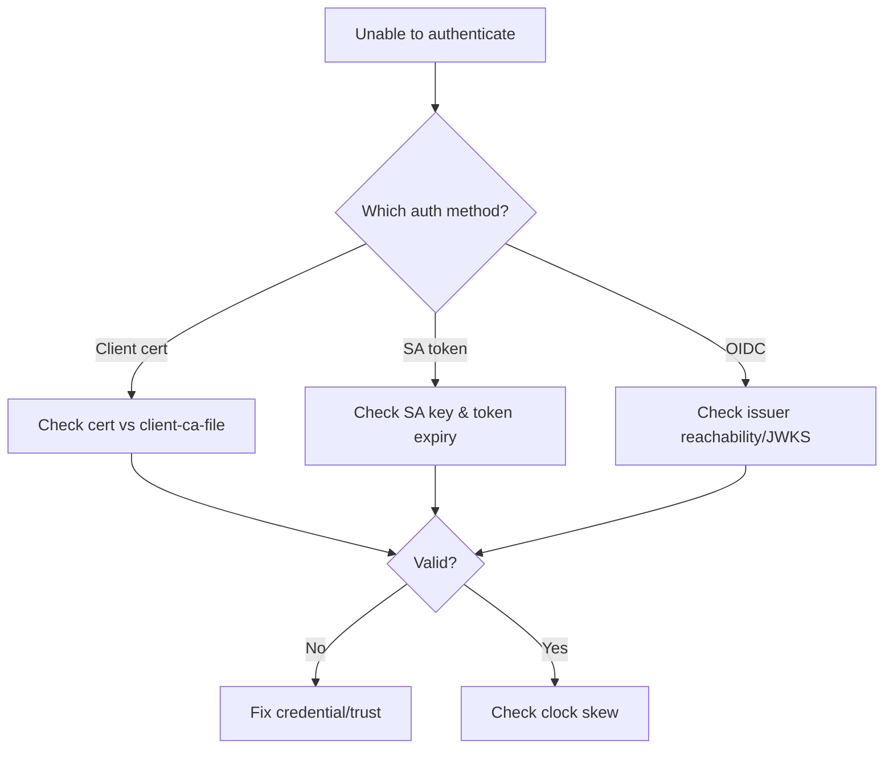

# Unable To Authenticate The Request

> **Severity:** High · **Typical recovery time:** 10–45 min · **Affected versions:** 1.20+

## Error Message

```text
error: You must be logged in to the server
(Unable to authenticate the request due to an error: [invalid bearer token, ...])
```

## Description

The apiserver could not establish *who* the caller is. Authentication runs before
authorization: every configured authenticator (client certs, bearer/service
account tokens, OIDC, webhook) rejected or errored on the credential. Unlike a
`Forbidden` (authz) error, this is an identity failure. It commonly hits whole
groups of clients at once after a CA rotation, OIDC outage, or service-account
key change.

## Affected Kubernetes Versions

Applies to 1.20+. Note 1.21+ bound service-account tokens (projected, expiring)
by default and 1.24 removed auto-generated legacy SA token Secrets — stale
long-lived tokens are a frequent cause on upgraded clusters.

## Likely Root Causes

- Expired/rotated service-account signing key vs `--service-account-key-file`
- OIDC issuer unreachable or its signing keys (JWKS) rotated/unavailable
- Client certificate not signed by the apiserver's `--client-ca-file`
- Expired or revoked bearer token / stale legacy SA token after 1.24
- Clock skew making token `iat`/`exp` validation fail

## Diagnostic Flow



## Verification Steps

Confirm it is authentication (not authorization) and identify which credential
type is failing from the apiserver logs.

## kubectl Commands

```bash
kubectl get --raw='/healthz' 
crictl logs $(crictl ps -q --name kube-apiserver) 2>&1 | grep -i 'authenticat' | tail
crictl ps | grep kube-apiserver
crictl inspect $(crictl ps -q --name kube-apiserver) | grep -E 'service-account-key-file|client-ca-file|oidc-issuer-url'
openssl x509 -in /etc/kubernetes/pki/sa.pub -noout 2>/dev/null; ls -l /etc/kubernetes/pki/sa.*
date -u
curl -k https://localhost:6443/healthz
```

## Expected Output

```text
$ kubectl get pods
error: You must be logged in to the server (Unable to authenticate the request...)

$ crictl logs <apiserver> | grep authenticat | tail
authentication.go] Unable to authenticate the request due to an error:
[invalid bearer token, oidc: verify token: fetching keys: ... connection refused]
```

## Common Fixes

1. Reissue/refresh the failing credential (rotate kubeconfig, mint a fresh SA
   token via TokenRequest, renew client cert).
2. Restore the OIDC issuer's availability so JWKS can be fetched.
3. Ensure `--service-account-key-file` includes the current public key(s).
4. Align trust: client certs must be signed by `--client-ca-file`'s CA.
5. Fix node clock skew (NTP) breaking token validity windows.

## Recovery Procedures

1. Read apiserver logs to pinpoint the specific authenticator error.
2. For an admin lockout, use a still-valid credential (e.g. the kubeadm
   `/etc/kubernetes/admin.conf` client cert) from a control-plane node.
3. **Disruptive:** changing auth flags (SA keys, OIDC, client-ca) requires
   editing the apiserver manifest and restarting the static pod — blast radius is
   one control-plane node and can briefly affect all authentication; stagger in
   HA and keep a break-glass cert handy.

## Validation

Affected clients authenticate successfully (`kubectl auth whoami` /
`kubectl get nodes`) and apiserver logs show no further auth errors.

## Prevention

Automate cert/token/key rotation, monitor OIDC issuer health and JWKS, keep NTP
synced on all nodes, migrate off legacy SA token Secrets, and maintain a tested
break-glass admin credential.

## Related Errors

- [x509 Certificate Signed By Unknown Authority](./api-server-x509-unknown-authority.md)
- [API Server Connection Refused](./api-server-connection-refused.md)
- [APF Request Rejected (429)](./api-server-apf-request-rejected.md)

## References

- [Kubernetes: Authenticating](https://kubernetes.io/docs/reference/access-authn-authz/authentication/)
- [Kubernetes: Service Account tokens](https://kubernetes.io/docs/reference/access-authn-authz/service-accounts-admin/)
