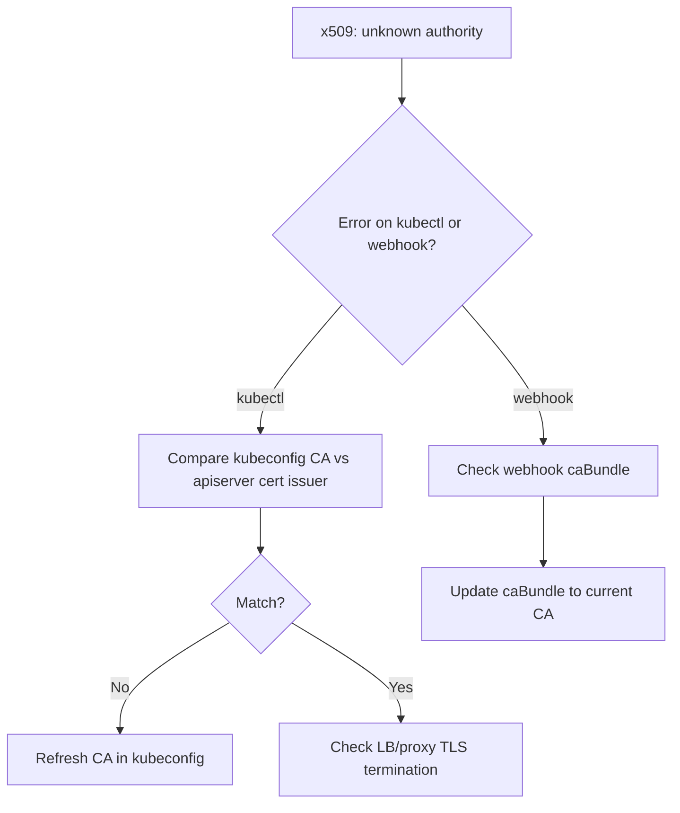

# x509 Certificate Signed By Unknown Authority

> **Severity:** High · **Typical recovery time:** 10–60 min · **Affected versions:** 1.20+

## Error Message

```text
Unable to connect to the server: x509: certificate signed by unknown authority
```

## Description

The client completed the TLS handshake but rejected the apiserver's certificate
because it was not signed by a CA the client trusts. This is a trust-chain
mismatch: the `certificate-authority-data` in the kubeconfig (or a webhook's CA
bundle) does not match the CA that issued the apiserver's serving cert. It blocks
authenticated access entirely until trust is realigned, and frequently appears
after a cluster rebuild, CA rotation, or restore from snapshot.

## Affected Kubernetes Versions

Applies to 1.20+. The trust model is unchanged across versions; what differs is
tooling — kubeadm's `certs` subcommands and cert rotation defaults have evolved,
but the x509 verification failure is identical.

## Likely Root Causes

- kubeconfig CA data is stale after the cluster CA was regenerated/rebuilt
- Apiserver serving cert reissued by a different CA than clients trust
- A webhook/aggregated apiserver presenting a cert with a wrong/missing CA bundle
- Connecting through an LB/proxy that terminates TLS with a different cert
- Mismatched `--client-ca-file` vs the CA that signed client certs

## Diagnostic Flow



## Verification Steps

Confirm which CA signed the apiserver's serving certificate and compare it to the
CA your client (or webhook) trusts.

## kubectl Commands

```bash
kubectl config view --raw -o jsonpath='{.clusters[0].cluster.certificate-authority-data}' | base64 -d | openssl x509 -noout -issuer -subject
openssl s_client -connect localhost:6443 -showcerts </dev/null 2>/dev/null | openssl x509 -noout -issuer -subject
openssl x509 -in /etc/kubernetes/pki/apiserver.crt -noout -issuer -dates
openssl x509 -in /etc/kubernetes/pki/ca.crt -noout -subject -dates
kubectl get validatingwebhookconfigurations -o yaml | grep -i caBundle
```

## Expected Output

```text
$ openssl x509 -in /etc/kubernetes/pki/apiserver.crt -noout -issuer
issuer=CN = kubernetes   # new CA after rebuild

$ kubectl ... certificate-authority-data ... -issuer
issuer=CN = kubernetes   # OLD CA fingerprint -> mismatch
```

## Common Fixes

1. Replace the stale `certificate-authority-data` in your kubeconfig with the
   current cluster CA (e.g. from `/etc/kubernetes/pki/ca.crt`).
2. Reissue the apiserver serving cert from the trusted CA if it was signed by the
   wrong one.
3. Update a webhook/APIService `caBundle` to the current signing CA.
4. Fix LB/proxy TLS termination so it presents the trusted apiserver cert.

## Recovery Procedures

1. Determine the source of truth: the live cluster CA on the control-plane node.
2. Distribute the correct CA to clients (regenerate admin kubeconfig with
   kubeadm if appropriate).
3. **Disruptive:** rotating the cluster CA invalidates every existing client and
   component cert — blast radius is the whole cluster; plan a maintenance window,
   rotate all dependent certs, and restart components in order.

## Validation

`kubectl get nodes` succeeds without TLS errors and `openssl s_client` shows the
apiserver cert chaining to the trusted CA.

## Prevention

Automate cert/CA rotation, version-control kubeconfig generation, keep webhook
caBundles in sync (e.g. via cert-manager CA injection), and alert on cert expiry
well ahead of time.

## Related Errors

- [API Server TLS Handshake Timeout](./api-server-tls-handshake-timeout.md)
- [Unable To Authenticate The Request](./api-server-unable-to-authenticate.md)
- [API Server Connection Refused](./api-server-connection-refused.md)

## References

- [Kubernetes: PKI certificates and requirements](https://kubernetes.io/docs/setup/best-practices/certificates/)
- [Kubernetes: Certificate management with kubeadm](https://kubernetes.io/docs/tasks/administer-cluster/kubeadm/kubeadm-certs/)
