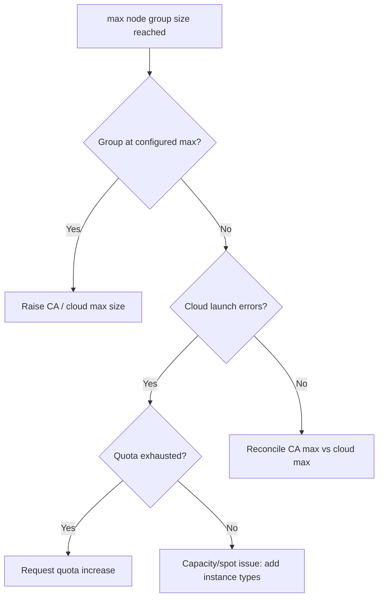

# Cluster Autoscaler Max Nodes Reached

> **Severity:** High · **Typical recovery time:** 10–30 min · **Affected versions:** 1.20+

## Error Message

```text
Warning  NotTriggerScaleUp  pod didn't trigger scale-up:
  1 max node group size reached
ScaleUp: NoActivity
node group eks-workers is at maximum size (10/10)
```

## Description

Every Cluster Autoscaler-managed node group has a maximum size. When all eligible
groups are at their maximum, CA cannot add nodes even though pods are `Pending`
and would otherwise schedule. The event reads `max node group size reached` and
scale-up stalls. Capacity is effectively frozen at the ceiling.

A related trap: the node group may be *below* its configured maximum yet still
fail to grow because the cloud provider rejects new instances (account/region
quota, no capacity for the instance type, exhausted spot pool). CA reports the
group as max-reached or shows backoff in logs. Distinguishing a config ceiling
from a cloud-side limit decides the fix.

## Affected Kubernetes Versions

Applies to clusters running Cluster Autoscaler (1.20+). Maximums come from CA's
`--nodes=min:max:name` flags or auto-discovery tags on the cloud node group
(ASG/MIG/node pool). Cloud quota behaviour is provider-specific.

## Likely Root Causes

- Node group at its configured maximum size
- Cloud account/region vCPU or instance quota exhausted (cannot launch more)
- No capacity for the requested instance type (spot interruption / capacity error)
- CA `--nodes` max flag lower than the actual cloud ASG maximum

## Diagnostic Flow



## Verification Steps

Compare CA's configured max (status ConfigMap/flags) with the cloud group max
and current size. If both equal the ceiling, raise the limit; if the group is
below max but not launching, inspect cloud-side errors in CA logs.

## kubectl Commands

```bash
kubectl -n kube-system describe configmap cluster-autoscaler-status
kubectl logs -n kube-system -l app=cluster-autoscaler --tail=100
kubectl get nodes -o wide
kubectl get pods -A --field-selector status.phase=Pending
kubectl describe pod <pending-pod> -n <namespace>
kubectl get events -A --sort-by=.lastTimestamp | grep -i scaleup
```

## Expected Output

```text
Health:   Healthy
ScaleUp:  NoActivity
NodeGroups:
  Name: eks-workers  MinSize: 2  MaxSize: 10  TargetSize: 10  (at max)
NotTriggerScaleUp  pod didn't trigger scale-up: 1 max node group size reached
```

## Common Fixes

1. Increase the node group maximum (CA `--nodes` flag and cloud ASG/MIG/pool max)
2. Request a cloud quota increase for vCPUs/instances in the region
3. Add additional node groups / instance types to spread capacity demand

## Recovery Procedures

1. Confirm whether the limit is config or cloud quota.
2. Raise the node group max in both CA config and the cloud provider; non-disruptive — only allows new nodes.
3. For quota, open a provider quota request; capacity returns once approved.
4. As an interim measure, lower pod resource requests or reduce `maxReplicas` so demand fits current capacity. **Disruptive — reducing replicas removes serving capacity; blast radius = potential saturation.**

## Validation

After raising limits, `kubectl get nodes` shows new nodes and the `Pending` pods
schedule; the CA status ConfigMap reports `ScaleUp: InProgress` then settles
with `TargetSize` below the new max.

## Prevention

Set node group maximums and cloud quotas with headroom above peak, monitor
quota utilisation, diversify instance types to survive capacity shortfalls, and
alert when any group sits at max size for a sustained period.

## Related Errors

- [Cluster Autoscaler Not Scaling Up](cluster-autoscaler-not-scaling-up.md)
- [Cluster Autoscaler Scale-Down Blocked](cluster-autoscaler-scale-down-blocked.md)
- [HPA Not Scaling Up](hpa-not-scaling-up.md)

## References

- [Cluster Autoscaling concepts](https://kubernetes.io/docs/concepts/cluster-administration/cluster-autoscaling/)
- [Resource quotas](https://kubernetes.io/docs/concepts/policy/resource-quotas/)

## Further Reading

- [DevOps AI ToolKit — Kubernetes guides](https://devopsaitoolkit.com/blog/)
