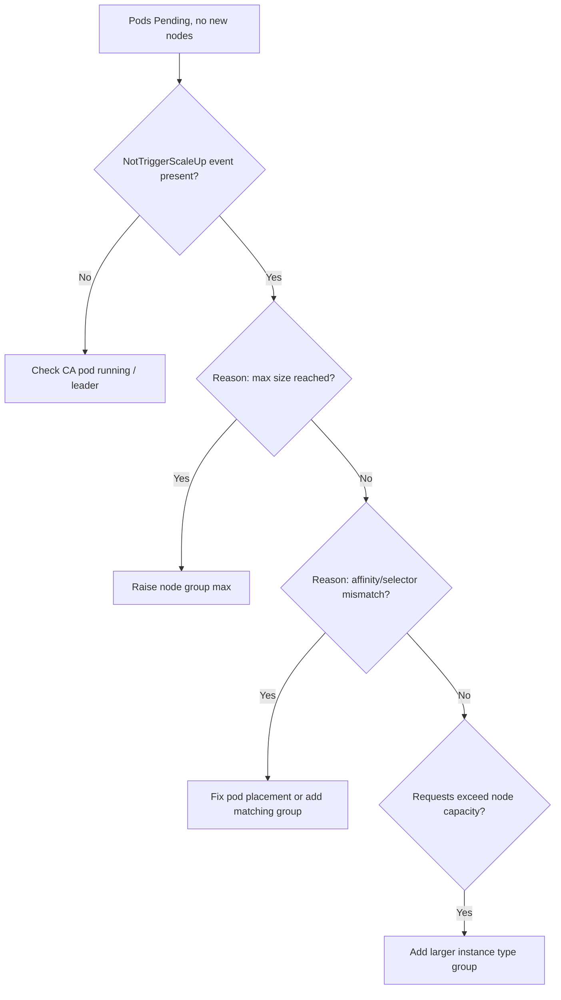

# Cluster Autoscaler Not Scaling Up

> **Severity:** High · **Typical recovery time:** 15–45 min · **Affected versions:** 1.20+

## Error Message

```text
Warning  NotTriggerScaleUp  pod didn't trigger scale-up:
  1 max node group size reached,
  2 node(s) didn't match Pod's node affinity/selector,
  1 Insufficient cpu
pod is unschedulable and cluster-autoscaler did not add a node
```

## Description

Cluster Autoscaler adds nodes only when it finds `Pending` pods that *would*
schedule onto a new node from some node group. The `NotTriggerScaleUp` event
lists, per node group, why it was rejected as a candidate. Common reasons: the
group is already at `--nodes` maximum, the pod's affinity/nodeSelector/taints
match no group, or the requested resources exceed any single node's capacity.

This is frequently confused with an HPA problem. The HPA may be correctly trying
to add replicas; the new pods are `Pending` because the *cluster* cannot grow.
Reading the per-group reasons in the event is the fastest path to the cause.

## Affected Kubernetes Versions

Applies to clusters running Cluster Autoscaler (1.20+). The CA version should
match the cluster minor version. Behaviour differs slightly across cloud
providers (ASG/MIG/node pool naming) but the event reasons are common.

## Likely Root Causes

- Node group already at its maximum size (`--max-nodes` / ASG max)
- Pod affinity, nodeSelector, or taints/tolerations match no node group
- Pod resource requests larger than the largest instance type in any group
- Node group not tagged/auto-discovered, so CA cannot manage it

## Diagnostic Flow



## Verification Steps

Read the pod's `NotTriggerScaleUp` / `FailedScheduling` events and the CA
status ConfigMap. They state exactly which groups were considered and why each
was rejected.

## kubectl Commands

```bash
kubectl get pods -n <namespace> --field-selector status.phase=Pending
kubectl describe pod <pod> -n <namespace>
kubectl get events -n <namespace> --sort-by=.lastTimestamp | grep -i scaleup
kubectl -n kube-system describe configmap cluster-autoscaler-status
kubectl logs -n kube-system -l app=cluster-autoscaler --tail=80
kubectl get nodes -o wide
```

## Expected Output

```text
ScaleUp:     NoActivity (no candidate groups)
Health:      Healthy

NotTriggerScaleUp  pod didn't trigger scale-up: 1 max node group size reached,
  2 node(s) didn't match Pod's node affinity/selector
```

## Common Fixes

1. Increase the node group maximum so CA can add nodes
2. Fix the pod's affinity/nodeSelector/tolerations to match an existing group, or add a group that matches
3. Add a node group with a large enough instance type for the pod's requests

## Recovery Procedures

1. Read the per-group rejection reasons from the event/status ConfigMap.
2. For a size ceiling, raise the node group max in the cloud provider; non-disruptive — only permits new nodes.
3. For placement mismatch, adjust pod scheduling constraints. **Disruptive — editing nodeSelector/affinity rolls the workload; blast radius = pods recreated.**
4. For oversized requests, lower requests or add a bigger instance group; new nodes appear within a few minutes.

## Validation

`kubectl get nodes` shows new nodes `Ready`, the previously `Pending` pods
schedule, and the CA status ConfigMap reports `ScaleUp: InProgress` then back to
`NoActivity` with no pending pods.

## Prevention

Right-size node group maximums for peak, keep instance types large enough for
your biggest pod, tag groups for auto-discovery, and alert on `Pending` pods
older than a few minutes so capacity gaps surface before users do.

## Related Errors

- [Cluster Autoscaler Max Nodes Reached](cluster-autoscaler-max-nodes-reached.md)
- [Karpenter Not Provisioning](karpenter-not-provisioning.md)
- [HPA Not Scaling Up](hpa-not-scaling-up.md)

## References

- [Cluster Autoscaling concepts](https://kubernetes.io/docs/concepts/cluster-administration/cluster-autoscaling/)
- [Scheduling: affinity and anti-affinity](https://kubernetes.io/docs/concepts/scheduling-eviction/assign-pod-node/)

## Further Reading

- [DevOps AI ToolKit — Kubernetes guides](https://devopsaitoolkit.com/blog/)
