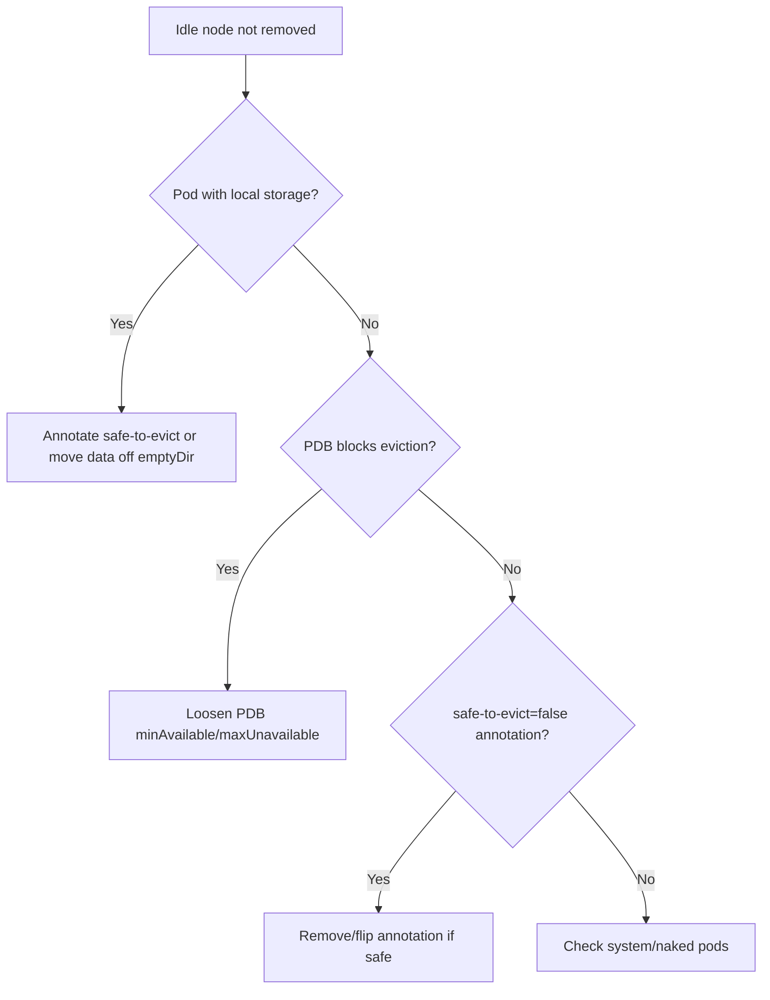

# Cluster Autoscaler Scale-Down Blocked

> **Severity:** Medium · **Typical recovery time:** 10–30 min · **Affected versions:** 1.20+

## Error Message

```text
node ip-10-0-3-21 is not removed:
  pod kube-system/metrics-store has local storage and cannot be drained
  pod default/web-7c9 cannot be moved: no PodDisruptionBudget allows eviction
  pod default/batch-1 has annotation "cluster-autoscaler.kubernetes.io/safe-to-evict": "false"
ScaleDown: NoCandidates
```

## Description

Under-utilised nodes cost money, so Cluster Autoscaler tries to remove them by
draining their pods onto other nodes. It will *not* remove a node if any pod on
it is unsafe to evict. The usual blockers are: pods using node-local storage
(`emptyDir`/hostPath) whose data cannot be moved, pods whose
PodDisruptionBudget would be violated by eviction, pods explicitly annotated
`safe-to-evict: false`, kube-system pods without a controller, or mirror/static
pods.

This is correct, protective behaviour — but it can pin large idle nodes for a
long time and inflate spend. The fix is to make the blocking pods evictable, not
to force-remove nodes.

## Affected Kubernetes Versions

Applies to clusters running Cluster Autoscaler (1.20+). The
`cluster-autoscaler.kubernetes.io/safe-to-evict` annotation and
`--skip-nodes-with-local-storage` / `--skip-nodes-with-system-pods` flags are
long-standing CA options.

## Likely Root Causes

- Pod uses `emptyDir`/hostPath local storage (and `--skip-nodes-with-local-storage=true`)
- PodDisruptionBudget allows zero additional disruptions (`minAvailable` too high)
- Pod annotated `safe-to-evict: "false"`
- kube-system or naked pods with no owning controller on the node

## Diagnostic Flow



## Verification Steps

Read the CA status ConfigMap and logs; they name the exact node and the exact
pod blocking its removal, plus the reason (local storage, PDB, annotation).

## kubectl Commands

```bash
kubectl -n kube-system describe configmap cluster-autoscaler-status
kubectl logs -n kube-system -l app=cluster-autoscaler --tail=80
kubectl get pdb -A
kubectl get pod <pod> -n <namespace> -o jsonpath='{.metadata.annotations}'
kubectl get pod <pod> -n <namespace> -o jsonpath='{.spec.volumes}'
kubectl get nodes --sort-by=.status.allocatable.cpu
```

## Expected Output

```text
ScaleDown: NoCandidates
  node ...3-21: pod default/web cannot be moved:
  no PodDisruptionBudget allows eviction (maxUnavailable=0)

PDB  web-pdb  minAvailable=3  currentHealthy=3  allowedDisruptions=0
```

## Common Fixes

1. Loosen the PDB (allow at least one disruption) so pods can be evicted
2. Add `cluster-autoscaler.kubernetes.io/safe-to-evict: "true"` to safely-movable pods
3. Replace `emptyDir`/hostPath with a PVC, or accept the data loss and mark evictable

## Recovery Procedures

1. Identify the exact blocking pod from the CA status/logs.
2. **Disruptive — loosening a PDB or adding `safe-to-evict: true` permits eviction; the next scale-down will move those pods.** Blast radius: affected pods are drained and rescheduled when CA removes the node.
3. For local-storage pods that must not move, leave them — accept the node cost, or migrate to a PVC.
4. CA re-evaluates each scan (~10s) and removes the node once no blocker remains.

## Validation

The CA status ConfigMap shows `ScaleDown: InProgress` then the node count drops;
`kubectl get nodes` confirms the idle node is gone and its pods rescheduled
elsewhere with PDBs still satisfied.

## Prevention

Define realistic PDBs (never `maxUnavailable: 0` for routine workloads), avoid
node-local storage for stateless apps, and reserve the `safe-to-evict: false`
annotation for genuinely immovable pods. Review CA scale-down logs in cost
reviews.

## Related Errors

- [Cluster Autoscaler Not Scaling Up](cluster-autoscaler-not-scaling-up.md)
- [Cluster Autoscaler Max Nodes Reached](cluster-autoscaler-max-nodes-reached.md)
- [Karpenter Not Provisioning](karpenter-not-provisioning.md)

## References

- [Cluster Autoscaling concepts](https://kubernetes.io/docs/concepts/cluster-administration/cluster-autoscaling/)
- [Specifying a Disruption Budget](https://kubernetes.io/docs/tasks/run-application/configure-pdb/)

## Further Reading

- [DevOps AI ToolKit — Kubernetes guides](https://devopsaitoolkit.com/blog/)
