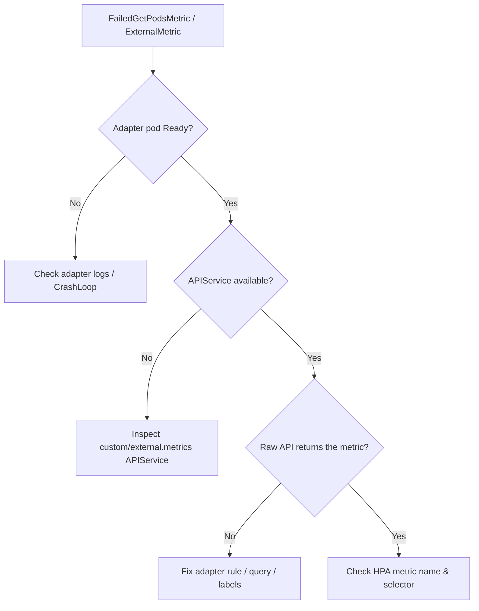

# HPA Custom Metrics Unavailable

> **Severity:** High · **Typical recovery time:** 15–45 min · **Affected versions:** 1.20+

## Error Message

```text
Warning  FailedGetExternalMetric  horizontal-pod-autoscaler
  unable to get external metric default/sqs_queue_length/...: no metrics returned
Warning  FailedGetPodsMetric      horizontal-pod-autoscaler
  unable to get metric http_requests: no custom.metrics.k8s.io API available
the server could not find the metric http_requests for pods
```

## Description

HPAs that scale on `Pods`, `Object`, or `External` metric types depend on a
custom metrics adapter (prometheus-adapter, KEDA, or a cloud provider adapter)
serving the `custom.metrics.k8s.io` / `external.metrics.k8s.io` aggregated APIs.
When that adapter is down, misconfigured, or its query returns nothing, the HPA
cannot evaluate the metric and stops scaling on it — even if CPU metrics are
perfectly healthy.

Because these APIs are registered as APIServices, a single broken adapter takes
out every HPA that uses custom or external metrics cluster-wide. The error text
distinguishes the cause: "no ... API available" means the APIService is gone,
while "no metrics returned" means the adapter is up but the query is empty.

## Affected Kubernetes Versions

Applies to 1.20+. `custom.metrics.k8s.io/v1beta2` and `external.metrics.k8s.io`
are consumed by `autoscaling/v2` (GA 1.23) and `v2beta2`. KEDA installs its own
external metrics adapter and must not collide with another one.

## Likely Root Causes

- The metrics adapter (prometheus-adapter/KEDA) is not running or crash-looping
- The `custom.metrics.k8s.io`/`external.metrics.k8s.io` APIService is unavailable
- Adapter `rules`/`ScaledObject` query matches no series (label mismatch, typo)
- The backing data source (Prometheus, cloud API) is unreachable or empty

## Diagnostic Flow



## Verification Steps

Query the aggregated API directly with `kubectl get --raw`. If it lists no
metrics, the adapter or its query is at fault; if it returns the metric but the
HPA still fails, the HPA's metric name or selector is wrong.

## kubectl Commands

```bash
kubectl describe hpa <hpa> -n <namespace>
kubectl get apiservices | grep metrics.k8s.io
kubectl get --raw "/apis/custom.metrics.k8s.io/v1beta1" | head -c 400
kubectl get --raw "/apis/external.metrics.k8s.io/v1beta1" | head -c 400
kubectl logs -n <adapter-ns> -l app=prometheus-adapter --tail=50
kubectl get pods -n <adapter-ns>
```

## Expected Output

```text
v1beta1.custom.metrics.k8s.io     False (ServiceNotFound)

Error from server (NotFound): the server could not find the requested resource
# adapter rule produced an empty resource list -> HPA sees no metric
```

## Common Fixes

1. Restart/repair the metrics adapter and confirm it becomes Ready
2. Fix the adapter `rules` or KEDA `ScaledObject` query so it returns series
3. Align the HPA `metric.name`/selector with what the adapter actually exposes

## Recovery Procedures

1. Determine cause from the wording ("no API available" vs "no metrics returned").
2. **Disruptive — restart the adapter (`kubectl rollout restart deployment prometheus-adapter -n monitoring`).** Blast radius: all custom/external-metric HPAs pause for ~1–2 min; no workload pods affected.
3. If the APIService is wedged, reinstall the adapter release; affects only metric-driven HPAs.
4. Validate the query against the data source, then confirm the HPA reads values.

## Validation

`kubectl get hpa` shows a numeric `TARGETS` value for the custom/external
metric, `kubectl get --raw` on the metrics API returns the series, and
`FailedGetPodsMetric`/`FailedGetExternalMetric` clears.

## Prevention

Monitor the metrics APIServices and adapter pod health, version-control adapter
rules with tests, and run KEDA or prometheus-adapter with a PDB. Avoid running
two external-metrics adapters at once — only one can own the APIService.

## Related Errors

- [HPA Unable To Get Metrics](hpa-unable-to-get-metrics.md)
- [HPA Not Scaling Up](hpa-not-scaling-up.md)
- [HPA Missing Resource Requests](hpa-missing-resource-requests.md)

## References

- [Support for metrics APIs](https://kubernetes.io/docs/tasks/run-application/horizontal-pod-autoscale/#support-for-metrics-apis)
- [Autoscaling on custom/external metrics](https://kubernetes.io/docs/tasks/run-application/horizontal-pod-autoscale-walkthrough/#autoscaling-on-multiple-metrics-and-custom-metrics)

## Further Reading

- [DevOps AI ToolKit — Kubernetes guides](https://devopsaitoolkit.com/blog/)
