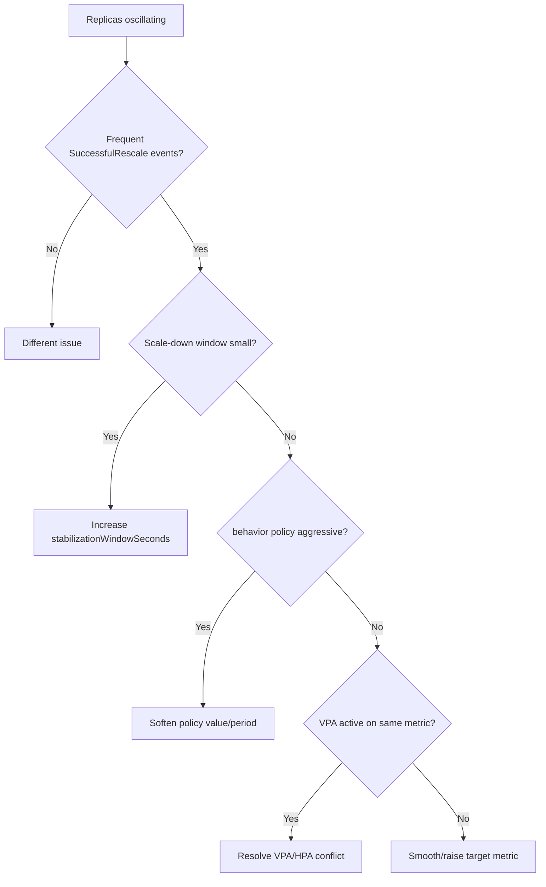

# HPA Thrashing / Flapping

> **Severity:** Medium · **Typical recovery time:** 15–45 min · **Affected versions:** 1.20+

## Error Message

```text
replica count oscillating

Normal  SuccessfulRescale  2m  New size: 8; reason: cpu above target
Normal  SuccessfulRescale  1m  New size: 4; reason: cpu below target
Normal  SuccessfulRescale  30s New size: 9; reason: cpu above target
# replicas bouncing up and down every sync
```

## Description

Flapping (thrashing) is when the HPA repeatedly scales a workload up and down in
quick succession. Each scaling event causes pod churn — new pods start cold,
load redistributes, the metric swings, and the controller over-corrects the
other way. The result is unstable capacity, cache cold-starts, noisy events, and
sometimes a feedback loop with cluster scaling.

The usual culprits are a too-tight target with spiky metrics, a scale-down
stabilization window set too low, aggressive `behavior` policies that add/remove
large percentages instantly, or a metric that itself oscillates (e.g. a queue
depth that empties and refills). A VPA changing CPU requests under an HPA can
also drive flapping (see related error).

## Affected Kubernetes Versions

Applies to 1.20+. Per-direction `behavior` with stabilization windows and
policies is in `autoscaling/v2` (GA 1.23) and `v2beta2`. Pre-`v2` clusters only
have the cluster-wide downscale-stabilization flag, making flapping harder to
tame per workload.

## Likely Root Causes

- Scale-down `stabilizationWindowSeconds` too small for a spiky metric
- Aggressive scale `behavior` policies (large percent/value, short period)
- Metric is inherently bursty (queue depth, RPS spikes) near a tight target
- VPA adjusting requests under the HPA, moving the utilisation denominator

## Diagnostic Flow



## Verification Steps

Plot the `SuccessfulRescale` events over time. Rapid alternating up/down events
confirm flapping rather than normal tracking. Note the interval — sub-minute
flips point at stabilization/behavior tuning.

## kubectl Commands

```bash
kubectl describe hpa <hpa> -n <namespace>
kubectl get events -n <namespace> --field-selector reason=SuccessfulRescale --sort-by=.lastTimestamp
kubectl get hpa <hpa> -n <namespace> -o jsonpath='{.spec.behavior}'
kubectl top pods -n <namespace>
kubectl get hpa <hpa> -n <namespace> -o yaml
```

## Expected Output

```text
behavior:
  scaleDown:
    stabilizationWindowSeconds: 0     <-- too low, drives flapping
    policies: [{type: Percent, value: 100, periodSeconds: 15}]

Events: SuccessfulRescale up/down alternating every ~30s
```

## Common Fixes

1. Increase `behavior.scaleDown.stabilizationWindowSeconds` (e.g. 300s)
2. Soften scale policies (smaller `value`, longer `periodSeconds`)
3. Raise the target or smooth the metric (averaged/rate metric instead of instantaneous)

## Recovery Procedures

1. Confirm flapping via alternating rescale events.
2. Increase the downscale stabilization window and soften policies; non-disruptive — it only dampens scaling decisions.
3. If a VPA is editing requests on the same workload, resolve the conflict (set VPA `Off` or split signals). **Disruptive — changing VPA mode may evict pods; blast radius = pods recreated.**
4. Observe several sync cycles; replica count should settle and track load smoothly.

## Validation

`SuccessfulRescale` events become infrequent and monotonic per trend, replica
count tracks load without bouncing, and `kubectl top pods` shows steady
utilisation near target.

## Prevention

Set a generous downscale stabilization window, prefer averaged/rate metrics over
instantaneous ones, choose realistic targets with headroom, and never run a
utilization HPA against a VPA in `Auto` mode on the same resource.

## Related Errors

- [HPA Not Scaling Down](hpa-not-scaling-down.md)
- [HPA Not Scaling Up](hpa-not-scaling-up.md)
- [VPA / HPA Conflict](vpa-hpa-conflict.md)

## References

- [Configurable scaling behavior](https://kubernetes.io/docs/tasks/run-application/horizontal-pod-autoscale/#configurable-scaling-behavior)
- [HPA algorithm details](https://kubernetes.io/docs/tasks/run-application/horizontal-pod-autoscale/#algorithm-details)

## Further Reading

- [DevOps AI ToolKit — Kubernetes guides](https://devopsaitoolkit.com/blog/)
