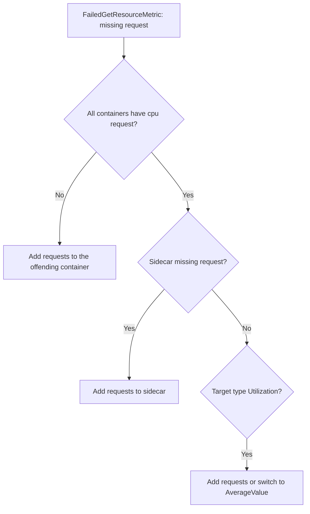

# HPA Missing Resource Requests

> **Severity:** High · **Typical recovery time:** 5–15 min · **Affected versions:** 1.20+

## Error Message

```text
Warning  FailedGetResourceMetric       horizontal-pod-autoscaler
  failed to get cpu utilization: missing request for cpu in container app of Pod web-xxxx
Warning  FailedComputeMetricsReplicas  horizontal-pod-autoscaler
  invalid metrics (1 invalid out of 1), first error is: failed to get cpu utilization
```

## Description

A `Utilization`-based HPA target works as a percentage of a container's
resource **request**. If any container in the targeted pods has no `cpu` (or
`memory`) request set, the controller has no denominator to compute a
percentage from, so it reports `missing request for cpu` and refuses to scale
that metric. Even one container without a request — a sidecar, an init pattern
mistake, or a stripped-down manifest — breaks the calculation for the whole pod.

This is one of the most common reasons a freshly created HPA shows
`<unknown>/80%` and never moves. The metrics pipeline is healthy; the workload
spec is incomplete.

## Affected Kubernetes Versions

Applies to 1.20+. The requirement holds for `autoscaling/v2` (GA 1.23) and
`v2beta2`. Using `AverageValue` targets (absolute, e.g. `500m`) instead of
`Utilization` avoids the request dependency entirely.

## Likely Root Causes

- Target container has no `resources.requests.cpu`/`memory` defined
- A sidecar container in the pod lacks requests, breaking the per-pod metric
- HPA uses `Utilization` (percentage) where requests are mandatory
- LimitRange not applied, so no default request was injected

## Diagnostic Flow



## Verification Steps

List every container in the targeted pods and confirm each has a matching
request for the resource the HPA scales on. The error names the exact container
and pod — start there.

## kubectl Commands

```bash
kubectl describe hpa <hpa> -n <namespace>
kubectl get pod <pod> -n <namespace> -o jsonpath='{range .spec.containers[*]}{.name}{": "}{.resources.requests}{"\n"}{end}'
kubectl get deployment <deploy> -n <namespace> -o yaml | grep -A4 resources
kubectl get limitrange -n <namespace>
kubectl top pods -n <namespace>
```

## Expected Output

```text
app: map[cpu:250m memory:256Mi]
istio-proxy:            <-- empty: no requests, breaks HPA metric

# describe hpa:
unable to get cpu utilization: missing request for cpu in container istio-proxy
```

## Common Fixes

1. Add `resources.requests.cpu`/`memory` to every container in the pod template
2. Set requests on sidecars (service mesh, logging) too
3. Switch the HPA target from `Utilization` to an absolute `AverageValue`

## Recovery Procedures

1. Identify the container named in the error.
2. **Disruptive — adding requests changes the pod template and triggers a rolling update of the Deployment.** Blast radius: pods are recreated per the rollout strategy; with sane `maxUnavailable` there is no downtime, but expect churn.
3. Apply a `LimitRange` so future pods get default requests automatically.
4. Wait for the new pods to report metrics on the next HPA sync.

## Validation

`kubectl get hpa` shows a real `TARGETS` percentage instead of `<unknown>`, and
`FailedGetResourceMetric` no longer appears in `describe`. `ScalingActive`
becomes `True`.

## Prevention

Enforce resource requests with a `LimitRange` per namespace and an admission
policy (Kyverno/Gatekeeper/VAP) that rejects containers without requests. Add a
CI lint that fails manifests with HPA targets but no matching requests.

## Related Errors

- [HPA Unable To Get Metrics](hpa-unable-to-get-metrics.md)
- [HPA Not Scaling Up](hpa-not-scaling-up.md)
- [VPA / HPA Conflict](vpa-hpa-conflict.md)

## References

- [HPA algorithm details](https://kubernetes.io/docs/tasks/run-application/horizontal-pod-autoscale/#algorithm-details)
- [Managing resources for containers](https://kubernetes.io/docs/concepts/configuration/manage-resources-containers/)

## Further Reading

- [Free Kubernetes config validators](https://devopsaitoolkit.com/validators/)
