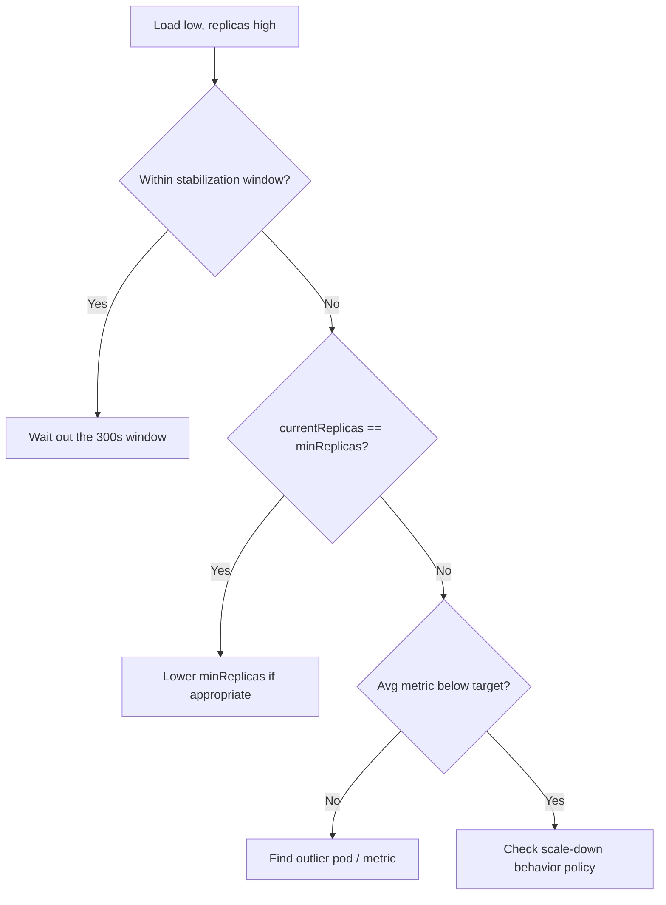

# HPA Not Scaling Down

> **Severity:** Medium · **Typical recovery time:** 5–20 min · **Affected versions:** 1.20+

## Error Message

```text
HPA not decreasing replicas (stabilization window)

NAME      REFERENCE        TARGETS      MINPODS  MAXPODS  REPLICAS
web-hpa   Deployment/web   12%/80%      2        10       8
# Load dropped, but replicas stay high
```

## Description

After a traffic spike subsides, operators expect the HPA to shed replicas and
recover capacity (and cloud cost). When it does not, the usual cause is the
**scale-down stabilization window** — by default the controller looks back over
the last 300 seconds and uses the *highest* recommendation in that window,
deliberately delaying scale-down to avoid flapping. This is working as designed,
just slower than people expect.

Genuine stuck states do exist: one pod with persistently high utilisation keeps
the average above target, `minReplicas` is set too high, or a misbehaving custom
metric never drops. The distinction matters because the "fix" for designed
behaviour is patience, not configuration changes.

## Affected Kubernetes Versions

Applies to 1.20+. The default 300s downscale stabilization and per-direction
`behavior` controls are part of `autoscaling/v2` (GA 1.23) and `v2beta2`. Older
versions used the cluster-wide `--horizontal-pod-autoscaler-downscale-stabilization`
controller flag.

## Likely Root Causes

- Scale-down stabilization window still holding a recent high recommendation
- `minReplicas` set at or above current count
- One outlier pod keeping the average utilisation above target
- A custom/external metric that does not actually fall when load drops

## Diagnostic Flow



## Verification Steps

Check `kubectl describe hpa` for a recent `ScalingActive`/recommendation and
note the timestamp of the last scale event. If it is under 5 minutes ago, the
stabilization window explains the delay.

## kubectl Commands

```bash
kubectl describe hpa <hpa> -n <namespace>
kubectl get hpa <hpa> -n <namespace> -o yaml
kubectl top pods -n <namespace>
kubectl get events -n <namespace> --field-selector involvedObject.kind=HorizontalPodAutoscaler
kubectl get hpa <hpa> -n <namespace> -o jsonpath='{.spec.behavior}'
```

## Expected Output

```text
Normal  SuccessfulRescale  6m   horizontal-pod-autoscaler
  New size: 8; reason: cpu resource utilization above target
# No newer downscale event yet — stabilization window holding previous high
```

## Common Fixes

1. Wait for the 300s downscale stabilization window to elapse
2. Lower `minReplicas` if it is higher than required steady-state capacity
3. Tune `behavior.scaleDown.stabilizationWindowSeconds` and policy values

## Recovery Procedures

1. Confirm whether the delay is the stabilization window or a real floor.
2. If cost is urgent, reduce `behavior.scaleDown.stabilizationWindowSeconds`; non-disruptive, simply lets scale-down happen sooner.
3. If `minReplicas` is the floor, lower it deliberately. **Disruptive in the sense that fewer replicas reduce headroom; blast radius = a sudden spike may briefly saturate before scale-up reacts.**
4. Identify and fix any outlier pod skewing the average (hot shard, stuck request).

## Validation

`kubectl get hpa` shows `REPLICAS` decreasing toward `minReplicas` once
utilisation stays below target past the window, with `SuccessfulRescale`
downscale events appearing.

## Prevention

Set the stabilization window to match real traffic shape, keep `minReplicas`
at true baseline, and load-balance so no single pod skews the average. Alert on
replicas pinned high while utilisation is low to catch stuck metrics.

## Related Errors

- [HPA Thrashing / Flapping](hpa-flapping.md)
- [HPA Not Scaling Up](hpa-not-scaling-up.md)
- [HPA Unable To Get Metrics](hpa-unable-to-get-metrics.md)

## References

- [Configurable scaling behavior](https://kubernetes.io/docs/tasks/run-application/horizontal-pod-autoscale/#configurable-scaling-behavior)
- [HPA algorithm details](https://kubernetes.io/docs/tasks/run-application/horizontal-pod-autoscale/#algorithm-details)

## Further Reading

- [DevOps AI ToolKit — Kubernetes guides](https://devopsaitoolkit.com/blog/)
