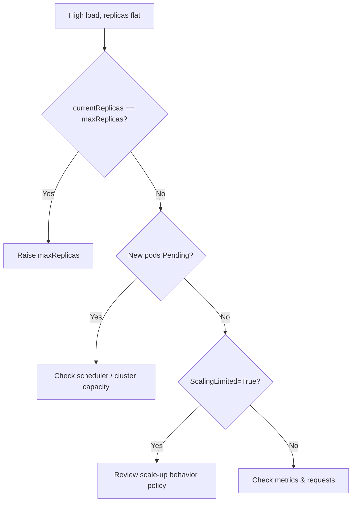

# HPA Not Scaling Up

> **Severity:** High · **Typical recovery time:** 10–30 min · **Affected versions:** 1.20+

## Error Message

```text
HPA not increasing replicas despite high load

NAME      REFERENCE          TARGETS         MINPODS  MAXPODS  REPLICAS
web-hpa   Deployment/web     250%/80%        2        4        4
# CurrentReplicas already equals MaxReplicas — desired is capped
```

## Description

The HPA reports utilisation well above target, yet replica count is stuck. In
practice this is rarely a controller bug — it is the autoscaler doing exactly
what its configuration allows. The most common reason is that the deployment is
already at `maxReplicas`, so even though the desired count is higher, the HPA
clamps it. Other causes are metrics that read low because requests are wrong, a
scale-up policy that rate-limits how fast replicas can be added, or new pods
that cannot schedule because the cluster is out of capacity.

Under sustained traffic this manifests as rising latency and saturation while
`kubectl get hpa` looks "busy but pinned."

## Affected Kubernetes Versions

Applies to 1.20+. Configurable scale-up `behavior` (rate limits, stabilization)
is available in `autoscaling/v2` (GA 1.23) and `v2beta2`. Older clusters scale
up immediately with no per-direction policy controls.

## Likely Root Causes

- `currentReplicas` already at `maxReplicas` (ceiling reached)
- New replicas stuck `Pending` — cluster has no schedulable capacity
- Conservative scale-up `behavior` policy throttling the rate of increase
- Tolerance/utilisation maths: requests set too high, so % stays just under target

## Diagnostic Flow



## Verification Steps

Read the HPA conditions: `ScalingLimited=True` with reason `TooManyReplicas`
confirms the ceiling. If desired exceeds current but pods are `Pending`, the
bottleneck is scheduling, not the HPA.

## kubectl Commands

```bash
kubectl get hpa <hpa> -n <namespace>
kubectl describe hpa <hpa> -n <namespace>
kubectl get pods -n <namespace> -o wide
kubectl get events -n <namespace> --sort-by=.lastTimestamp
kubectl top pods -n <namespace>
kubectl get deployment <deploy> -n <namespace> -o wide
```

## Expected Output

```text
Conditions:
  Type            Status  Reason            Message
  AbleToScale     True    ReadyForNewScale
  ScalingActive   True    ValidMetricFound
  ScalingLimited  True    TooManyReplicas   the desired replica count is more
                                            than the maximum replica count
```

## Common Fixes

1. Raise `maxReplicas` to a value that fits real peak demand
2. Add cluster capacity (cluster-autoscaler/Karpenter) so new pods schedule
3. Loosen the scale-up `behavior` policy (higher `value`, shorter `periodSeconds`)

## Recovery Procedures

1. Confirm the ceiling via `ScalingLimited=True`.
2. Increase `maxReplicas` on the HPA to relieve immediate saturation; non-disruptive — only adds pods.
3. If new pods are `Pending`, ensure nodes can be added. **Disruptive — manually cordoning/draining to rebalance affects running pods; blast radius = any pod on the drained node is evicted.** Prefer adding capacity instead.
4. Watch `REPLICAS` climb toward the new ceiling as load is absorbed.

## Validation

`kubectl get hpa` shows `REPLICAS` rising and `TARGETS` falling toward the
target percentage; latency/error rates recover and no pods remain `Pending`.

## Prevention

Size `maxReplicas` from load tests, keep cluster autoscaling enabled with
headroom, alert on `ScalingLimited=True` sustained for minutes, and review
scale-up `behavior` policies so they are not the bottleneck during spikes.

## Related Errors

- [HPA Unable To Get Metrics](hpa-unable-to-get-metrics.md)
- [HPA Missing Resource Requests](hpa-missing-resource-requests.md)
- [Cluster Autoscaler Not Scaling Up](cluster-autoscaler-not-scaling-up.md)

## References

- [HorizontalPodAutoscaler concepts](https://kubernetes.io/docs/tasks/run-application/horizontal-pod-autoscale/)
- [Scaling policies / behavior](https://kubernetes.io/docs/tasks/run-application/horizontal-pod-autoscale/#configurable-scaling-behavior)

## Further Reading

- [DevOps AI ToolKit — Kubernetes guides](https://devopsaitoolkit.com/blog/)
