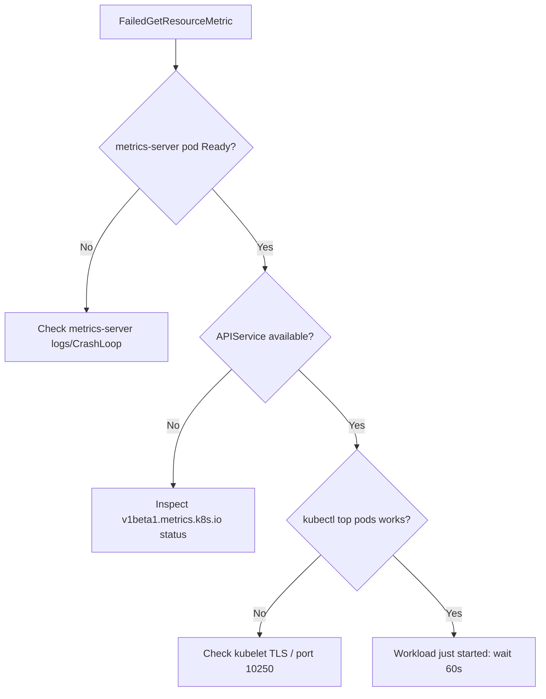

# HPA Unable To Get Metrics

> **Severity:** High · **Typical recovery time:** 10–30 min · **Affected versions:** 1.20+

## Error Message

```text
Warning  FailedGetResourceMetric       horizontal-pod-autoscaler
  unable to get metrics for resource cpu: no metrics returned from resource metrics API
Warning  FailedComputeMetricsReplicas  horizontal-pod-autoscaler
  invalid metrics (1 invalid out of 1), first error is: failed to get cpu utilization:
  unable to get metrics for resource cpu
```

## Description

The HorizontalPodAutoscaler reads pod resource utilisation through the
`metrics.k8s.io` API, which is served by metrics-server (or an equivalent
adapter). When that API returns no data, the controller cannot compute a
desired replica count, so it freezes the workload at its current scale and
emits `FailedGetResourceMetric`. During an incident this is dangerous: the HPA
silently stops reacting to load while everything else looks healthy.

The root issue is almost always the metrics pipeline, not the workload. If
metrics-server is missing, crash-looping, or cannot reach kubelets, every HPA
in the cluster degrades at once.

## Affected Kubernetes Versions

Applies to 1.20+. The stable `autoscaling/v2` API ships in 1.23+; earlier
clusters use `autoscaling/v2beta2`. metrics-server 0.5+ requires either valid
kubelet serving certificates or the `--kubelet-insecure-tls` flag on test
clusters.

## Likely Root Causes

- metrics-server not installed, not Ready, or crash-looping
- metrics-server cannot scrape kubelets (TLS handshake, port 10250 blocked)
- The `v1beta1.metrics.k8s.io` APIService is `False`/unavailable
- Pods are too new — no metrics collected within the first ~60 seconds

## Diagnostic Flow



## Verification Steps

Confirm the metrics API itself is broken rather than a single HPA. If
`kubectl top pods` fails cluster-wide, the problem is metrics-server, not your
HPA definition.

## kubectl Commands

```bash
kubectl describe hpa <hpa> -n <namespace>
kubectl top pods -n <namespace>
kubectl get apiservices v1beta1.metrics.k8s.io
kubectl get deployment metrics-server -n kube-system
kubectl logs -n kube-system -l k8s-app=metrics-server --tail=50
kubectl get --raw "/apis/metrics.k8s.io/v1beta1/pods" | head -c 300
```

## Expected Output

```text
NAME                                   STATUS      MESSAGE
v1beta1.metrics.k8s.io                 False       FailedDiscoveryCheck

Error from server (ServiceUnavailable): the server is currently unable to
handle the request (get pods.metrics.k8s.io)
```

## Common Fixes

1. Install or restart metrics-server and wait for it to become Ready
2. Fix kubelet scraping (correct serving certs, or `--kubelet-insecure-tls` in labs)
3. Open node port 10250 between metrics-server and kubelets in network policy/SG

## Recovery Procedures

1. Confirm scope with `kubectl top nodes`/`top pods`.
2. **Disruptive — restart metrics-server (`kubectl rollout restart deployment metrics-server -n kube-system`).** Blast radius: brief gap in metrics for the whole cluster; all HPAs pause for ~1–2 minutes, no pod impact.
3. If the APIService is wedged, recreate the metrics-server release; affects only metrics, not running workloads.
4. Once `kubectl top pods` returns values, the HPA recomputes on its next sync (~15s).

## Validation

`kubectl get hpa` shows real `TARGETS` percentages instead of `<unknown>`, and
`kubectl describe hpa` no longer lists `FailedGetResourceMetric`. The
`ScalingActive` condition flips to `True`.

## Prevention

Run metrics-server with a PodDisruptionBudget and resource requests, alert on
the `v1beta1.metrics.k8s.io` APIService availability, and add a CI check that
every HPA target has metrics-server reachable in that environment.

## Related Errors

- [HPA Missing Resource Requests](hpa-missing-resource-requests.md)
- [HPA Not Scaling Up](hpa-not-scaling-up.md)
- [HPA Custom Metrics Unavailable](hpa-custom-metrics-unavailable.md)

## References

- [HorizontalPodAutoscaler walkthrough](https://kubernetes.io/docs/tasks/run-application/horizontal-pod-autoscale-walkthrough/)
- [Resource metrics pipeline](https://kubernetes.io/docs/tasks/debug/debug-cluster/resource-metrics-pipeline/)

## Further Reading

- [DevOps AI ToolKit — Kubernetes guides](https://devopsaitoolkit.com/blog/)
