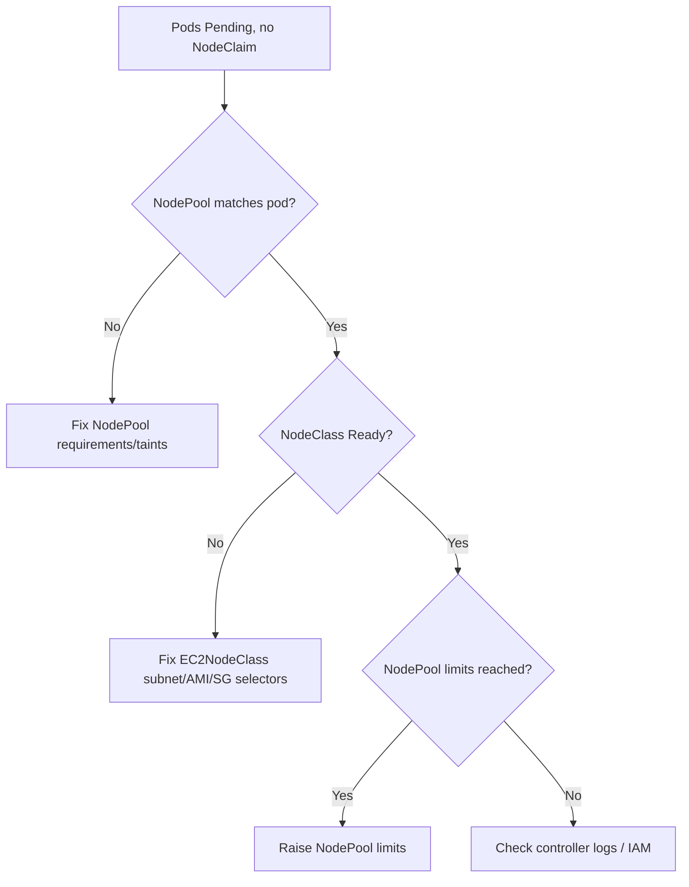

# Karpenter Not Provisioning

> **Severity:** High · **Typical recovery time:** 15–45 min · **Affected versions:** 1.23+

## Error Message

```text
Normal  Nominate  pod did not match any NodePool
Warning Failed    no instance type satisfied resources and requirements; incompatible with nodepool
controller error: NodeClass not ready: EC2NodeClass "default" not found / not Ready
pod is unschedulable and Karpenter created no NodeClaim
```

## Description

Karpenter provisions nodes just-in-time for `Pending` pods by matching them
against a `NodePool` and its referenced node class (`EC2NodeClass` on AWS). If no
NodePool's requirements/taints match the pod, or the node class is missing or not
`Ready`, Karpenter creates no `NodeClaim` and the pod stays `Pending`. Unlike
Cluster Autoscaler, there are no pre-defined node groups — provisioning depends
entirely on these CRDs being present, valid, and selectable.

Typical failures: the pod requests an architecture/zone/capacity-type the
NodePool excludes, the NodePool `limits` are exhausted, the controller lacks IAM
permissions to launch instances, or the `EC2NodeClass` references a bad
subnet/AMI/security-group selector.

## Affected Kubernetes Versions

Karpenter runs on EKS/self-managed clusters 1.23+. The stable `karpenter.sh/v1`
API uses `NodePool` and `NodeClaim` with provider `EC2NodeClass`
(`karpenter.k8s.aws`). Older alpha/beta `Provisioner`/`AWSNodeTemplate` CRDs are
deprecated.

## Likely Root Causes

- No `NodePool` requirements match the pod (arch, zone, capacity-type, instance family)
- `EC2NodeClass`/node class missing, not `Ready`, or bad subnet/AMI/SG selector
- NodePool `limits` (cpu/memory) reached, so no more nodes allowed
- Karpenter controller IAM/permissions or interruption SQS misconfigured

## Diagnostic Flow



## Verification Steps

Read the pod's scheduling events and the Karpenter controller logs — they state
whether a NodePool was nominated and why a NodeClaim was not created. Confirm the
node class reports `Ready`.

## kubectl Commands

```bash
kubectl get pods -A --field-selector status.phase=Pending
kubectl describe pod <pod> -n <namespace>
kubectl get nodepools.karpenter.sh
kubectl describe nodepool <nodepool>
kubectl get ec2nodeclasses.karpenter.k8s.aws
kubectl describe ec2nodeclass <nodeclass>
kubectl get nodeclaims
kubectl logs -n kube-system -l app.kubernetes.io/name=karpenter --tail=100
```

## Expected Output

```text
EC2NodeClass default   Ready=False   reason=SubnetsNotFound

Events on pod:
  Normal  Nominate  pod did not match any NodePool
  Warning Failed    incompatible requirements: arch arm64 not in [amd64]
# No NodeClaim created
```

## Common Fixes

1. Broaden NodePool `requirements` (arch, zones, capacity-type, instance families) to match pods
2. Fix the `EC2NodeClass` subnet/AMI/security-group selectors so it becomes `Ready`
3. Raise NodePool `limits` and verify Karpenter's IAM role can launch instances

## Recovery Procedures

1. From the events, decide whether the gap is NodePool matching, NodeClass readiness, or limits.
2. Correct the NodePool requirements or node class selectors; non-disruptive — only enables new provisioning.
3. If pods request constraints no NodePool allows, relax pod scheduling. **Disruptive — editing affinity/nodeSelector rolls the workload; blast radius = pods recreated.**
4. Karpenter reconciles within seconds; a `NodeClaim` then a `Node` should appear and the pod schedules.

## Validation

`kubectl get nodeclaims` shows a new claim transitioning to `Launched`/`Ready`,
`kubectl get nodes` lists the new node, and the previously `Pending` pod binds to
it. The `EC2NodeClass` reports `Ready=True`.

## Prevention

Keep at least one broad NodePool, validate node class selectors in CI, set
NodePool `limits` with headroom, monitor the Karpenter controller and NodeClass
readiness, and alert on `Pending` pods that Karpenter does not nominate.

## Related Errors

- [Cluster Autoscaler Not Scaling Up](cluster-autoscaler-not-scaling-up.md)
- [Cluster Autoscaler Max Nodes Reached](cluster-autoscaler-max-nodes-reached.md)
- [HPA Not Scaling Up](hpa-not-scaling-up.md)

## References

- [Cluster Autoscaling concepts](https://kubernetes.io/docs/concepts/cluster-administration/cluster-autoscaling/)
- [Scheduling: assigning Pods to Nodes](https://kubernetes.io/docs/concepts/scheduling-eviction/assign-pod-node/)

## Further Reading

- [DevOps AI ToolKit — Kubernetes guides](https://devopsaitoolkit.com/blog/)
