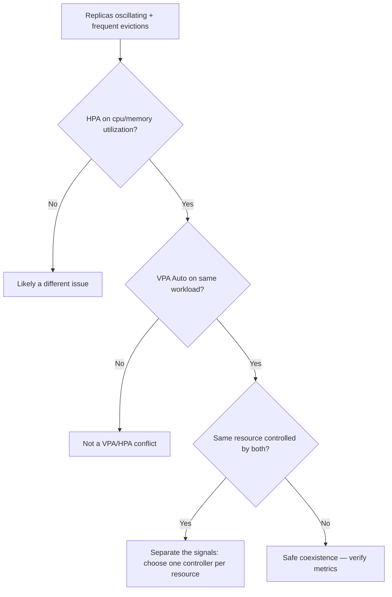

# VPA / HPA Conflict

> **Severity:** High · **Typical recovery time:** 10–30 min · **Affected versions:** 1.20+

## Error Message

```text
VPA and HPA both target CPU (conflict)

# web-hpa scales replicas on cpu Utilization (80%)
# web-vpa (updateMode: Auto) resizes the same container's cpu request
# -> the two controllers fight: VPA changes the denominator the HPA divides by
```

## Description

A HorizontalPodAutoscaler using CPU/memory **utilization** scales replica count
based on usage relative to the resource *request*. A Vertical Pod Autoscaler in
`Auto` mode changes that very request. When both target the same resource on the
same workload, they form a feedback loop: VPA raises the request, which lowers
the HPA's utilisation percentage, which makes the HPA scale *down*, which raises
per-pod load, which makes VPA raise the request again. The result is unstable
replica counts, constant pod evictions, and unpredictable capacity.

The official guidance is explicit: do not run VPA in `Auto`/`Recreate` mode and
an HPA on the *same* CPU or memory metric for the same pods. They can coexist
only when scaling on different signals.

## Affected Kubernetes Versions

Applies to any cluster with the VPA add-on plus an `autoscaling/v2` or `v2beta2`
HPA (1.20+). The conflict is architectural, not version-specific.

## Likely Root Causes

- HPA on CPU/memory `Utilization` and VPA `Auto` on the same container's CPU/memory
- VPA managing a resource the HPA also scales on (overlapping `controlledResources`)
- Both controllers enabled by separate teams unaware of the overlap
- Migration left an old HPA in place after adopting VPA (or vice versa)

## Diagnostic Flow



## Verification Steps

Confirm the HPA's metric is `Resource` cpu/memory `Utilization` and the VPA's
`updateMode` is `Auto`/`Recreate` controlling the same resource. Overlap on the
same resource is the conflict signature.

## kubectl Commands

```bash
kubectl get hpa <hpa> -n <namespace> -o jsonpath='{.spec.metrics}'
kubectl get vpa <vpa> -n <namespace> -o jsonpath='{.spec.updatePolicy.updateMode} {.spec.resourcePolicy}'
kubectl describe hpa <hpa> -n <namespace>
kubectl describe vpa <vpa> -n <namespace>
kubectl get events -n <namespace> --sort-by=.lastTimestamp
kubectl top pods -n <namespace>
```

## Expected Output

```text
HPA:  [{"type":"Resource","resource":{"name":"cpu","target":{"type":"Utilization","averageUtilization":80}}}]
VPA:  Auto  {"containerPolicies":[{"containerName":"app","controlledResources":["cpu","memory"]}]}
# Both own cpu -> conflict
```

## Common Fixes

1. Scale the HPA on a custom/external metric (RPS, queue depth) and let VPA own CPU/memory
2. Restrict VPA `controlledResources` to memory only while HPA owns CPU
3. Set VPA `updateMode: Off` (advisory) and keep the HPA in charge of replicas

## Recovery Procedures

1. Decide which controller owns which signal — they must not overlap.
2. **Disruptive — changing VPA `updateMode` or `controlledResources` can trigger pod evictions; changing the HPA metric is non-disruptive but alters scaling behaviour.** Blast radius: pods may be recreated when VPA settings change.
3. To stabilise fast, set VPA to `Off` first, let the HPA settle, then redesign the split.
4. Re-enable VPA only on non-overlapping resources or with a non-utilization HPA metric.

## Validation

Replica count stabilises, pod eviction events stop, and `kubectl top pods`
shows steady utilisation. The HPA `TARGETS` no longer swing wildly after VPA
adjusts requests.

## Prevention

Document an autoscaling ownership matrix: one controller per resource. Use
admission policy to flag a VPA `Auto` and a utilization HPA on the same
workload. Prefer scaling replicas on application-level metrics so VPA can own
right-sizing.

## Related Errors

- [VPA Recommendations Not Applied](vpa-recommendations-not-applied.md)
- [HPA Thrashing / Flapping](hpa-flapping.md)
- [HPA Missing Resource Requests](hpa-missing-resource-requests.md)

## References

- [HPA and VPA interaction guidance](https://kubernetes.io/docs/concepts/workloads/autoscaling/)
- [HorizontalPodAutoscaler concepts](https://kubernetes.io/docs/tasks/run-application/horizontal-pod-autoscale/)

## Further Reading

- [DevOps AI ToolKit — Kubernetes guides](https://devopsaitoolkit.com/blog/)
