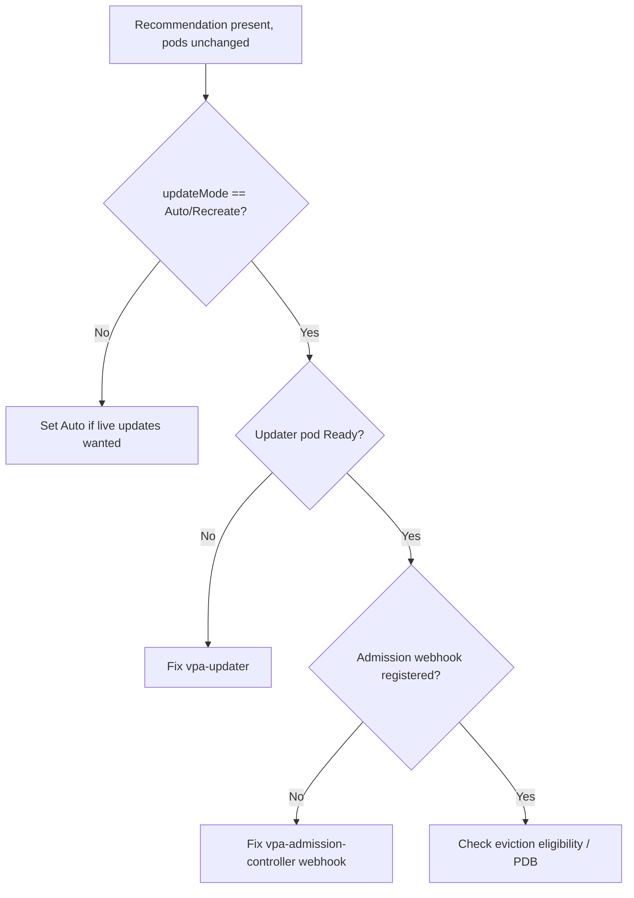

# VPA Recommendations Not Applied

> **Severity:** Medium · **Typical recovery time:** 10–30 min · **Affected versions:** 1.20+

## Error Message

```text
VPA recommendation present but pods not updated

$ kubectl describe vpa web-vpa
Recommendation:
  Container Recommendations:
    Container Name:  app
    Target:          cpu: 850m, memory: 512Mi
Update Policy:
  Update Mode:  Off        <-- recommendations computed but never applied
```

## Description

The Vertical Pod Autoscaler has three components: the *recommender* (computes
target requests), the *updater* (evicts pods that drift from target), and the
*admission controller* (rewrites requests on pod creation). Seeing a populated
`Recommendation` only proves the recommender works. If pods keep their old
requests, the updater or admission controller is not acting — most often because
`updateMode` is `Off` or `Initial`, which by design never evict running pods.

Operators frequently mistake this for a bug. In `Off` mode VPA is purely
advisory; in `Initial` it only sets requests at pod creation. Live resizing
requires `Auto`/`Recreate` mode plus a healthy updater and admission webhook.

## Affected Kubernetes Versions

Applies to clusters running the VPA add-on (works on 1.20+). VPA is not built
into Kubernetes — it is installed separately. In-place pod resize
(`InPlacePodVerticalScaling`) is alpha/beta in newer releases; classic VPA still
evicts and recreates pods to apply changes.

## Likely Root Causes

- `updateMode: Off` (advisory only) or `Initial` (apply at creation only)
- VPA updater pod not running, so no eviction happens
- VPA admission controller webhook down/not registered, so new pods keep old requests
- Pod ineligible for eviction (single replica with no PDB allowing disruption)

## Diagnostic Flow



## Verification Steps

Check `updateMode` first — if it is `Off`/`Initial`, behaviour is correct.
Then confirm all three VPA components are running and the admission webhook is
registered.

## kubectl Commands

```bash
kubectl describe vpa <vpa> -n <namespace>
kubectl get vpa <vpa> -n <namespace> -o jsonpath='{.spec.updatePolicy.updateMode}'
kubectl get pods -n kube-system -l app in (vpa-recommender,vpa-updater,vpa-admission-controller)
kubectl get mutatingwebhookconfigurations | grep vpa
kubectl get pod <pod> -n <namespace> -o jsonpath='{.spec.containers[*].resources.requests}'
kubectl logs -n kube-system -l app=vpa-updater --tail=50
```

## Expected Output

```text
Update Mode:  Off
# recommender working, updater intentionally idle

# Or, in Auto mode but webhook missing:
mutatingwebhookconfigurations  <no vpa entry>   <-- new pods keep old requests
```

## Common Fixes

1. Set `updatePolicy.updateMode: Auto` (or `Recreate`) if live updates are desired
2. Restore the vpa-updater and vpa-admission-controller deployments
3. Re-register the VPA mutating webhook so new pods get rewritten requests

## Recovery Procedures

1. Confirm the intended mode — leave `Off` if you only want recommendations.
2. **Disruptive — switching to `Auto`/`Recreate` lets the updater evict pods to apply new requests.** Blast radius: targeted pods are deleted and recreated; protect with a PDB and expect a rolling disruption.
3. If the admission webhook is down, repair it; failure-open means pods keep old requests, failure-closed can block pod creation.
4. Trigger a benign rollout so new pods pick up rewritten requests.

## Validation

`kubectl get pod -o jsonpath` shows container requests matching the VPA
`Target`, and the VPA `Conditions` show `RecommendationProvided=True` with the
updater logging successful evictions.

## Prevention

Decide intentionally between advisory (`Off`) and active (`Auto`) modes, monitor
all three VPA components, attach PDBs so eviction is safe, and never point VPA
and HPA at the same CPU/memory metric (see related error).

## Related Errors

- [VPA / HPA Conflict](vpa-hpa-conflict.md)
- [HPA Missing Resource Requests](hpa-missing-resource-requests.md)
- [HPA Not Scaling Up](hpa-not-scaling-up.md)

## References

- [Vertical Pod Autoscaler (autoscaler repo docs)](https://kubernetes.io/docs/concepts/workloads/autoscaling/)
- [Resize CPU and memory assigned to containers](https://kubernetes.io/docs/tasks/configure-pod-container/resize-container-resources/)

## Further Reading

- [DevOps AI ToolKit — Kubernetes guides](https://devopsaitoolkit.com/blog/)
