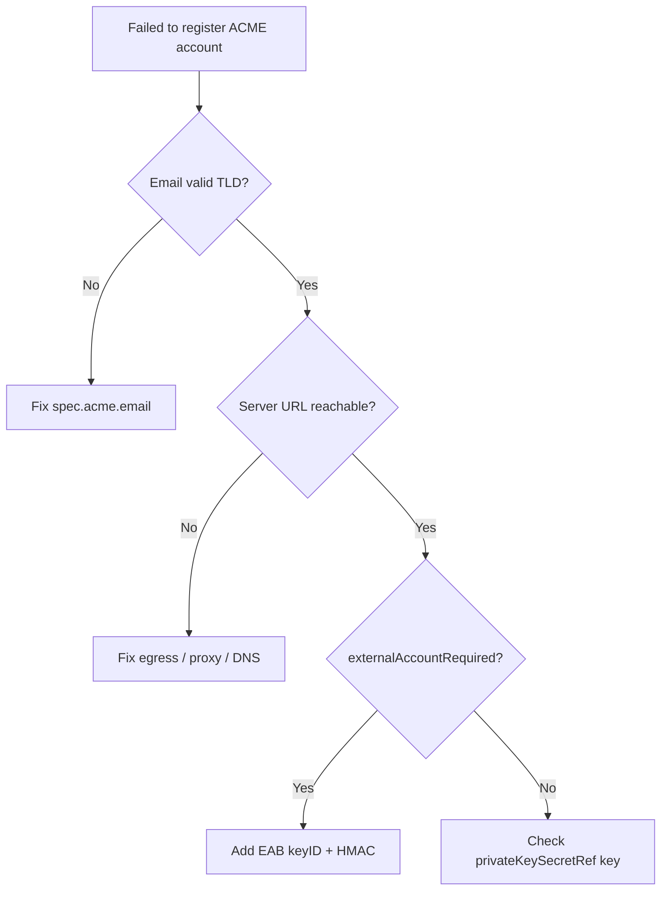

# ACME Account Registration Failed

> **Severity:** High · **Typical recovery time:** 5–30 min · **Affected versions:** 1.20+

## Error Message

```text
Warning  ErrInitIssuer  Issuer/letsencrypt-prod  Error initializing issuer:
Failed to register ACME account: acme: error code 400 "urn:ietf:params:acme:error:malformed":
Error creating new account :: contact email has invalid domain : Domain name does not end with a valid public suffix (TLD)
```

## Description

Before any certificate can be issued, an ACME `Issuer`/`ClusterIssuer` must register an account with the ACME server (Let's Encrypt, ZeroSSL, Buypass, Sectigo, or a private CA). cert-manager generates an account private key, stores it in the Secret named under `spec.acme.privateKeySecretRef`, and POSTs a `newAccount` request to the configured `server` URL. If registration fails, the Issuer becomes `Ready=False` and **no** Certificates referencing it will progress. Failures are usually configuration problems: a bad contact email, a wrong/unreachable server URL, missing External Account Binding (EAB) credentials, or network egress restrictions reaching the ACME directory endpoint.

## Affected Kubernetes Versions

All Kubernetes 1.20+ running cert-manager v1.x. The behavior is independent of cluster version; failures stem from Issuer configuration and outbound network/identity, not the Kubernetes API.

## Likely Root Causes

- Invalid or empty `spec.acme.email` (must be a real address on a valid public TLD).
- Wrong `server` URL — staging vs production confusion, or a typo in a private ACME endpoint.
- Missing/incorrect **External Account Binding (EAB)**: ZeroSSL, Sectigo, Google Public CA, and many private ACME servers require an EAB `keyID` + HMAC key. Omitting it returns `externalAccountRequired`.
- ACME server unreachable: no egress, proxy, or DNS failure to the directory URL.
- Stale or wrong `privateKeySecretRef` key causing key mismatch with an existing account.
- TLS trust failure to a private ACME CA (untrusted serving cert).

## Diagnostic Flow



## Verification Steps

1. Inspect the Issuer/ClusterIssuer status and the exact ACME error code.
2. Confirm `spec.acme.email` is a valid address (no `.local`, no bare hostnames).
3. Confirm `spec.acme.server` matches the intended provider and environment.
4. Determine whether the provider requires EAB and that the EAB Secret exists.
5. Verify cluster egress can reach the ACME directory URL.

## kubectl Commands

```bash
# READ-ONLY ONLY. Allowed: kubectl get/describe certificate,certificaterequest,order,challenge,issuer,clusterissuer ; cmctl status (read-only). NO mutating verbs.
kubectl get clusterissuer letsencrypt-prod -o wide
kubectl describe clusterissuer letsencrypt-prod
kubectl get issuer -A
kubectl describe issuer zerossl -n app
# See downstream impact (read-only):
kubectl get certificate,certificaterequest,order,challenge -A
cmctl status certificate example-tls -n app
```

## Expected Output

```text
NAME              READY   STATUS
letsencrypt-prod  False   Failed to register ACME account

Status:
  Acme:
    Last Registered Email:  ops@invalid.local
  Conditions:
    Message: Failed to register ACME account: acme: error code 400
      "urn:ietf:params:acme:error:malformed": contact email has invalid domain
    Reason:  ErrRegisterACMEAccount
    Status:  False
    Type:    Ready
```

## Common Fixes

1. Set a valid `spec.acme.email` on a public TLD (e.g. `ops@example.com`); avoid `.local`/internal-only domains.
2. Use the correct `server` URL. Let's Encrypt **staging** `https://acme-staging-v02.api.letsencrypt.org/directory` for testing (relaxed rate limits) and **production** `https://acme-v02.api.letsencrypt.org/directory` only when validated.
3. For ZeroSSL/Sectigo/Google Public CA and most private ACME servers, configure EAB: create a Secret with the HMAC key and reference it via `spec.acme.externalAccountBinding.keyID` + `keySecretRef`.
4. Fix egress: allow outbound HTTPS to the ACME directory, configure proxy env, and ensure DNS resolves the host.
5. For private ACME CAs, ensure the serving certificate's CA is trusted (mount/trust the CA bundle).

## Recovery Procedures

1. Diagnose the exact ACME error code first (read-only).
2. Correct the Issuer spec (email, server, EAB) in source/manifests and reapply via your GitOps flow.
3. **Disruptive:** Rotating the account by clearing/recreating `privateKeySecretRef` forces a brand-new account. Blast radius: prior account/orders are abandoned; on ACME prod this can consume `newAccount`/order rate-limit budget — validate on staging first.
4. **Disruptive:** Restarting the cert-manager controller after fixing config re-triggers registration. Blast radius: brief pause in all reconciliation.
5. Re-test on staging before pointing back to production.

## Validation

Confirm `kubectl get clusterissuer` shows `Ready=True` and `describe` lists the `Last Registered Email` and an account URI under `status.acme`. Then verify a dependent `Certificate` begins progressing to `Ready`.

## Prevention

- Validate Issuer specs (email format, server URL) in CI before apply.
- Store EAB credentials in a managed Secret and document per-provider requirements.
- Always prove changes on the ACME staging server before production.
- Alert on `Issuer`/`ClusterIssuer` `Ready=False`.

## Related Errors

- [Issuer Not Ready](./issuer-not-ready.md)
- [ACME Rate Limited](./acme-rate-limited.md)
- [ACME Order Invalid](./acme-order-invalid.md)
- [DNS-01 Provider Credentials Error](./dns01-provider-credentials-error.md)

## References

- https://cert-manager.io/docs/configuration/acme/
- https://cert-manager.io/docs/configuration/acme/#external-account-bindings
- https://letsencrypt.org/docs/rate-limits/
- https://kubernetes.io/docs/concepts/configuration/secret/
