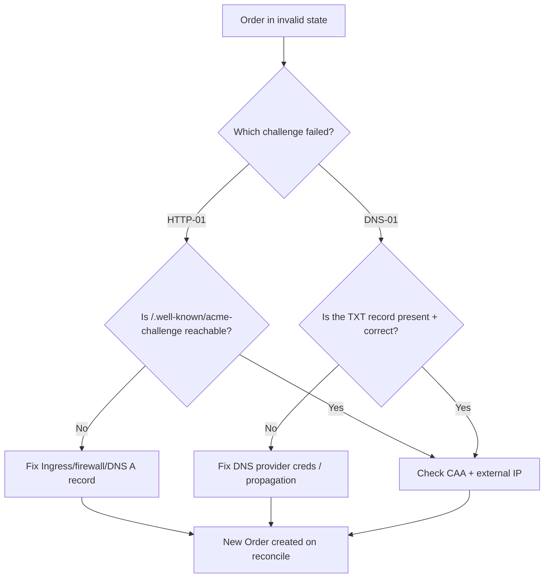

# ACME Order Invalid

> **Severity:** High · **Typical recovery time:** 5–30 min · **Affected versions:** all cert-manager releases on Kubernetes 1.20+

## Error Message
```text
Order default/my-cert-1234567890 in "invalid" state:
  authorization for identifier "app.example.com" is in "invalid" state
```

## Description
For each ACME issuance, cert-manager creates an `Order` that contains one or more `Challenge` resources (HTTP-01 or DNS-01). The ACME CA validates each authorization; if any authorization fails, the CA marks the whole `Order` as `invalid`. cert-manager surfaces this as `Order ... in "invalid" state` and does **not** retry the same Order — it abandons it and (depending on configuration) creates a fresh `CertificateRequest`/`Order` on the next reconcile.

From an SRE perspective, an `invalid` Order is a downstream symptom: the real failure is almost always a challenge that the CA could not verify (wrong DNS record, unreachable HTTP path, propagation delay, firewall). The Order object itself is terminal and immutable, so the work is to find the failing challenge, fix the root cause, and let cert-manager create a new Order. Repeatedly failing here also risks tripping the ACME *failed validations* rate limit.

## Affected Kubernetes Versions
All cert-manager versions on Kubernetes 1.20+. The Order/Challenge CRD lifecycle is stable; this is an ACME protocol state, not a Kubernetes version issue.

## Likely Root Causes
- HTTP-01 challenge path not reachable from the internet (Ingress, firewall, or load balancer misroute).
- DNS-01 TXT record not created, not propagated, or wrong value.
- DNS CAA records forbidding the issuing CA.
- Wrong external IP / split-horizon DNS so the CA validates a different endpoint.
- Challenge timed out before propagation completed.
- A previous Order's challenge artifacts left stale, confusing validation.

## Diagnostic Flow


## Verification Steps
1. Find the `Order` and read its `invalid` reason.
2. List the `Challenge` objects for that Order and read the failure message.
3. For HTTP-01, confirm the challenge URL resolves and returns the token.
4. For DNS-01, confirm the `_acme-challenge` TXT record is present and propagated.

## kubectl Commands
```bash
# READ-ONLY ONLY. No mutating verbs.
kubectl get certificate -n my-ns
kubectl describe certificate my-cert -n my-ns
kubectl get certificaterequest -n my-ns
kubectl get order -n my-ns
kubectl describe order my-cert-1234567890 -n my-ns   # shows invalid + reason
kubectl get challenge -n my-ns
kubectl describe challenge -n my-ns                    # per-domain failure detail
kubectl describe clusterissuer letsencrypt-prod
cmctl status certificate my-cert -n my-ns             # read-only
```

## Expected Output
```text
$ kubectl describe order my-cert-1234567890 -n my-ns
Status:
  State:   invalid
  Reason:  authorization for identifier "app.example.com" is in "invalid" state

$ kubectl describe challenge -n my-ns
Status:
  State:    invalid
  Reason:   Error accepting authorization: acme: authorization error for
            app.example.com: 403 urn:ietf:params:acme:error:unauthorized:
            Invalid response from http://app.example.com/.well-known/acme-challenge/...
```

## Common Fixes
1. **HTTP-01 not reachable:** ensure the domain's public DNS A/AAAA record points at the Ingress load balancer and that `http://<domain>/.well-known/acme-challenge/` is reachable without auth or redirect. See [HTTP-01 propagation failed](./challenge-http01-propagation-failed.md).
2. **DNS-01 record missing/stale:** verify provider credentials and that the `_acme-challenge` TXT record propagates before the timeout. See [DNS-01 propagation failed](./challenge-dns01-propagation-failed.md).
3. **CAA blocking:** add a CAA record permitting `letsencrypt.org` (or your CA).
4. **Wrong endpoint:** fix split-horizon DNS so the CA reaches the public ingress.

## Recovery Procedures
1. Read the failing `Challenge` message — it states exactly why the CA rejected the authorization.
2. Fix the root cause (DNS, Ingress, firewall, CAA).
3. **Test in staging first.** Point the issuer at `acme-staging-v02.api.letsencrypt.org` so repeated failed Orders do not burn the production *failed validations* limit (5 per hostname/hour) or the duplicate-cert limit.
4. The `invalid` Order is terminal; cert-manager creates a **new** Order on the next reconcile once the underlying `Certificate`/`CertificateRequest` retries. **Non-disruptive** — old Orders are garbage-collected.
5. Watch the new Order/Challenge progress to `valid`.

## Validation
- A fresh `Order` reaches `State: valid`.
- `kubectl get certificate -n my-ns` shows `READY=True`.
- The TLS Secret is populated and serves the expected chain.

## Prevention
- Validate DNS and Ingress reachability before issuing in production.
- Keep DNS-01 propagation timeouts generous for slow providers.
- Maintain correct CAA records for your CA.
- Use the staging endpoint for all experimentation to avoid rate-limit penalties from repeated invalid Orders.

## Related Errors
- [Challenge HTTP-01 Propagation Failed](./challenge-http01-propagation-failed.md)
- [Challenge DNS-01 Propagation Failed](./challenge-dns01-propagation-failed.md)
- [ACME Rate Limited](./acme-rate-limited.md)
- [Certificate Not Ready](./certificate-not-ready.md)

## References
- cert-manager ACME troubleshooting: https://cert-manager.io/docs/troubleshooting/acme/
- cert-manager HTTP-01 challenge: https://cert-manager.io/docs/configuration/acme/http01/
- cert-manager DNS-01 challenge: https://cert-manager.io/docs/configuration/acme/dns01/
- Kubernetes Ingress: https://kubernetes.io/docs/concepts/services-networking/ingress/
