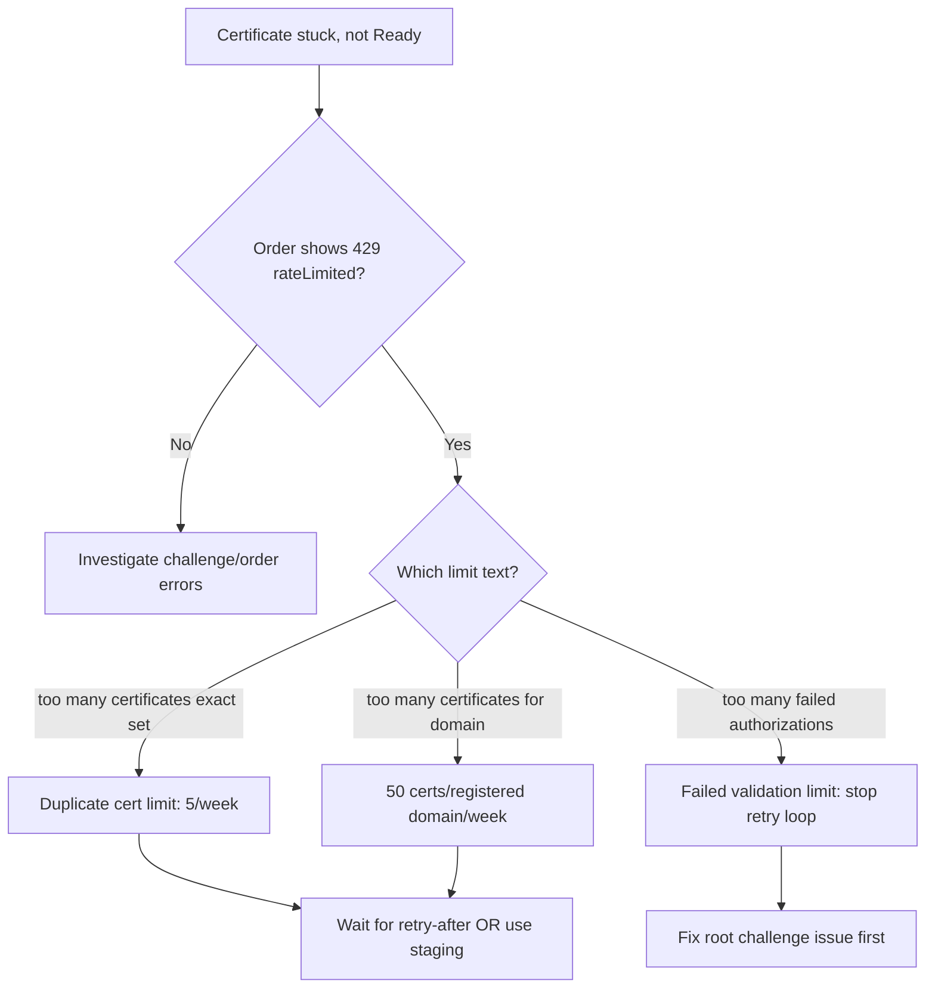

# ACME Rate Limited

> **Severity:** High · **Typical recovery time:** 5–30 min (but rate-limit windows can be up to 7 days) · **Affected versions:** all cert-manager releases on Kubernetes 1.20+

## Error Message

```text
Failed to create Order: 429 urn:ietf:params:acme:error:rateLimited:
Error creating new order :: too many certificates (5) already issued for
this exact set of identifiers in the last 168h0m0s, retry after 2026-06-25T14:03:00Z
```

## Description

cert-manager talks to an ACME certificate authority (most commonly Let's Encrypt) to issue certificates. ACME CAs enforce strict rate limits to protect their infrastructure. When cert-manager exceeds a limit, the ACME server returns HTTP `429` with `urn:ietf:params:acme:error:rateLimited`, and the `Order`/`CertificateRequest` stalls. The CA also publishes a `retry after` timestamp that cert-manager honors.

From an SRE perspective the danger is amplification: a misconfigured `Certificate`, a CrashLooping controller, or a GitOps reconcile loop can churn through Order creation and burn the weekly budget for an entire registered domain, blocking *all* certificate issuance for that domain until the window rolls off. There is no way to ask Let's Encrypt to lift a limit early, so the fix is almost always "stop the churn, switch to staging, then re-issue once."

## Affected Kubernetes Versions

This is a CA-side limit, not a Kubernetes bug. It affects every cert-manager version on Kubernetes 1.20+. Older cert-manager versions (pre-1.0) lacked good back-off and were far more likely to trip limits during reconcile storms.

## Likely Root Causes

- Re-issuing the **same** certificate (identical DNS names) more than 5 times in a rolling 7-day window — the *Duplicate Certificate* limit.
- More than **50 certificates per registered domain per week** (e.g. many subdomains under one apex).
- A failing challenge retried in a tight loop, hitting the **Failed Validations** limit (5 failures per account/hostname/hour).
- A CrashLoop or duplicate cert-manager deployment creating Orders repeatedly.
- Testing against the **production** Let's Encrypt endpoint instead of staging.
- Deleting and recreating the `Certificate`/Secret repeatedly in CI.

## Diagnostic Flow



## Verification Steps

1. Confirm the `Order` carries a 429 and read its `retry after` time.
2. Identify the issuer's ACME `server` URL — staging vs production.
3. Count how many recent Orders/Certificates target the same DNS names.
4. Check controller logs for a reconcile/CrashLoop storm.

## kubectl Commands

```bash
# READ-ONLY ONLY. No mutating verbs.
kubectl get certificate -A
kubectl describe certificate my-cert -n my-ns
kubectl get certificaterequest -n my-ns
kubectl describe certificaterequest -n my-ns
kubectl get order -n my-ns
kubectl describe order -n my-ns          # look for the 429 + retry-after
kubectl get challenge -n my-ns
kubectl describe clusterissuer letsencrypt-prod   # confirm server URL
cmctl status certificate my-cert -n my-ns          # read-only summary
```

## Expected Output

```text
Status:
  State:   errored
  Reason:  429 urn:ietf:params:acme:error:rateLimited: Error creating new
           order :: too many certificates (5) already issued for this exact
           set of identifiers in the last 168h0m0s
Events:
  Warning  Errored  3m  cert-manager  Order errored: rate limited, retry after 2026-06-25T14:03:00Z
```

## Common Fixes

1. **Stop the churn first.** Pause GitOps reconcile or scale the offending workload so no new Orders are created.
2. **Switch the issuer to the Let's Encrypt staging endpoint** (`https://acme-staging-v02.api.letsencrypt.org/directory`) for all testing. Staging has vastly higher limits and issues untrusted certs — perfect for validating config without burning the production budget.
3. Once config is verified in staging, point the production issuer back and re-issue **once**.
4. If you hit the *Duplicate Certificate* limit, wait for the `retry after` time — there is no override.

## Recovery Procedures

1. Identify and halt the source of repeated Order creation (most important).
2. **Disruptive — blast radius: the affected domain's certs.** Create/point a staging `ClusterIssuer` and reconfigure non-prod `Certificate` resources to it. New issuance there is untrusted but unlimited for practical testing.
3. Validate the full challenge flow in staging until the cert is `Ready`.
4. Switch back to the production issuer and let cert-manager issue exactly one cert.
5. If still blocked, wait out the window using the published `retry after`; production limits roll off on a 7-day sliding window.

## Validation

- `kubectl get certificate -n my-ns` shows `READY=True`.
- No new 429 events on the `Order`.
- The TLS Secret exists and the served certificate chains to a trusted root (production) or the staging root (testing).

## Prevention

- Always develop and CI-test against the **staging** endpoint.
- Use a single, deduplicated `Certificate` per host set; avoid recreating Secrets in loops.
- Set sane `renewBefore` and avoid forced re-issue automation.
- Monitor Order creation rate and alert on repeated `Errored` Orders.
- Consolidate SANs into fewer certificates to stay under per-domain limits.

## Related Errors

- [ACME Order Invalid](./acme-order-invalid.md)
- [Certificate Not Ready](./certificate-not-ready.md)
- [ACME Account Registration Failed](./acme-account-registration-failed.md)

## References

- cert-manager ACME troubleshooting: https://cert-manager.io/docs/troubleshooting/acme/
- cert-manager ACME issuer configuration: https://cert-manager.io/docs/configuration/acme/
- Let's Encrypt rate limits: https://letsencrypt.org/docs/rate-limits/
- Kubernetes Secrets (TLS): https://kubernetes.io/docs/concepts/configuration/secret/
