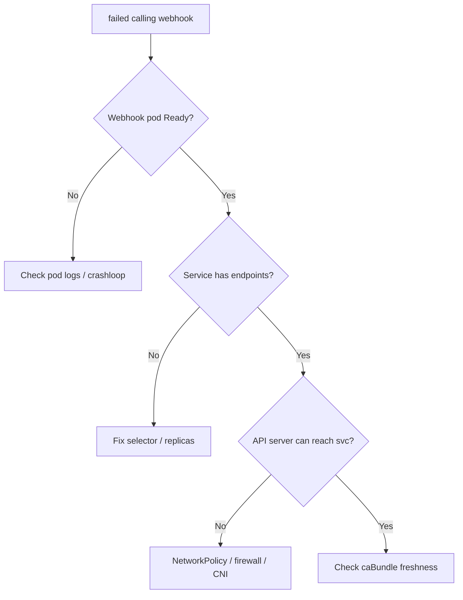

# cert-manager Webhook Not Reachable

> **Severity:** Critical · **Typical recovery time:** 5–30 min · **Affected versions:** 1.20+

## Error Message

```text
Error from server (InternalError): error when creating "issuer.yaml":
Internal error occurred: failed calling webhook "webhook.cert-manager.io":
failed to call webhook: Post "https://cert-manager-webhook.cert-manager.svc:443/validate?timeout=10s":
dial tcp 10.96.0.55:443: connect: connection refused
```

## Description

cert-manager installs a `ValidatingWebhookConfiguration` (and conversion webhook) served by the `cert-manager-webhook` Deployment. The Kubernetes API server calls this webhook to validate and convert cert-manager custom resources (`Certificate`, `Issuer`, `ClusterIssuer`, etc.) on every create/update. When the API server cannot reach the webhook pod, **all** cert-manager resource mutations are rejected — you cannot apply Issuers or Certificates at all. This is a Kubernetes admission-webhook concern as much as a cert-manager one: the same `connection refused` / `context deadline exceeded` patterns affect any `ValidatingWebhookConfiguration` whose backing service is unhealthy or unreachable from the control plane.

## Affected Kubernetes Versions

All Kubernetes 1.20+ with cert-manager v1.x. Most common immediately after install (webhook pod not yet `Ready`), after upgrades, or in clusters where control-plane-to-pod traffic on port 10250/443 is blocked. Private/EKS clusters with restrictive security groups and clusters with aggressive NetworkPolicies are especially prone.

## Likely Root Causes

- Webhook pod not yet `Ready` or crash-looping (race right after install).
- Network path from API server to the webhook Service is blocked (security group, firewall, NetworkPolicy).
- Expired or mismatched webhook serving CA bundle (`caBundle` in the webhook config).
- Webhook Service has no healthy endpoints (selector mismatch, zero replicas).
- API server cannot resolve/route to the ClusterIP (CNI or kube-proxy issue).
- Aggressive `failurePolicy: Fail` plus a transient webhook outage.

## Diagnostic Flow



## Verification Steps

1. Confirm the `cert-manager-webhook` pod is `Running` and `Ready`.
2. Confirm the webhook Service has populated endpoints.
3. Confirm the `ValidatingWebhookConfiguration` exists with a valid `caBundle`.
4. Attempt a trivial dry-run of a cert-manager resource to reproduce the failure.
5. Review webhook pod logs for TLS or CA errors.

## kubectl Commands

```bash
# READ-ONLY ONLY. Allowed: kubectl get/describe certificate,certificaterequest,order,challenge,issuer,clusterissuer ; cmctl status (read-only). NO mutating verbs.
kubectl get issuer,clusterissuer -A
kubectl describe clusterissuer letsencrypt-prod
# Inspect cert-manager resources that the webhook gates (read-only):
kubectl get certificate,certificaterequest -A
cmctl status certificate example-tls -n app
# Webhook health (read-only get/describe on infra objects):
kubectl get pods -n cert-manager -l app.kubernetes.io/component=webhook
kubectl get endpoints cert-manager-webhook -n cert-manager
kubectl get validatingwebhookconfiguration cert-manager-webhook -o yaml
```

## Expected Output

```text
NAME                                       READY   STATUS    RESTARTS   AGE
cert-manager-webhook-7f9b8c6d4-2xk9p       1/1     Running   0          3m

NAME                   ENDPOINTS            AGE
cert-manager-webhook   10.244.1.23:10250    3m

# When broken:
NAME                   ENDPOINTS            AGE
cert-manager-webhook   <none>               3m
```

## Common Fixes

1. Wait for / restart the webhook Deployment until the pod is `Ready` (common right after install).
2. Fix the Service selector or scale replicas so endpoints populate.
3. Allow control-plane → webhook traffic on the serving port in NetworkPolicy/security groups/firewalls.
4. Regenerate the webhook serving certs (cert-manager's `cainjector` normally maintains the `caBundle`; ensure `cainjector` is healthy).
5. Reinstall the matching cert-manager version's CRDs and webhook config if the `caBundle` is stale after a partial upgrade.

## Recovery Procedures

1. Diagnose with read-only commands above before changing anything.
2. **Disruptive:** Restart `cert-manager-webhook` (and `cert-manager-cainjector`) Deployments. Blast radius: cert-manager admission is briefly unavailable cluster-wide; existing certificates keep serving.
3. If the network path is blocked, update NetworkPolicy/firewall to permit API-server source ranges — coordinate with platform/security owners.
4. **Disruptive:** Reapplying cert-manager CRDs/webhook manifests during a version mismatch. Blast radius: short window where cert-manager resources cannot be mutated.
5. As a last resort, the failing webhook config can be removed to unblock emergencies, but this disables validation — reinstall promptly.

## Validation

Run a dry-run apply of a harmless `Issuer` (read-only `--dry-run=server`) and confirm it is accepted. Confirm `kubectl get endpoints cert-manager-webhook -n cert-manager` shows a healthy IP and that new Certificates reconcile normally.

## Prevention

- Set webhook `failurePolicy` thoughtfully and run multiple webhook replicas with a PodDisruptionBudget.
- Whitelist control-plane CIDRs in NetworkPolicies covering the cert-manager namespace.
- Keep cert-manager components, CRDs, and `cainjector` on matching versions.
- Add readiness alerts on the webhook Deployment and Service endpoints.

## Related Errors

- [Issuer Not Ready](./issuer-not-ready.md)
- [Certificate Not Ready](./certificate-not-ready.md)
- [Certificate Secret Not Created](./certificate-secret-not-created.md)

## References

- https://cert-manager.io/docs/concepts/webhook/
- https://cert-manager.io/docs/troubleshooting/webhook/
- https://kubernetes.io/docs/reference/access-authn-authz/admission-controllers/#validatingadmissionwebhook
- https://kubernetes.io/docs/reference/access-authn-authz/extensible-admission-controllers/
