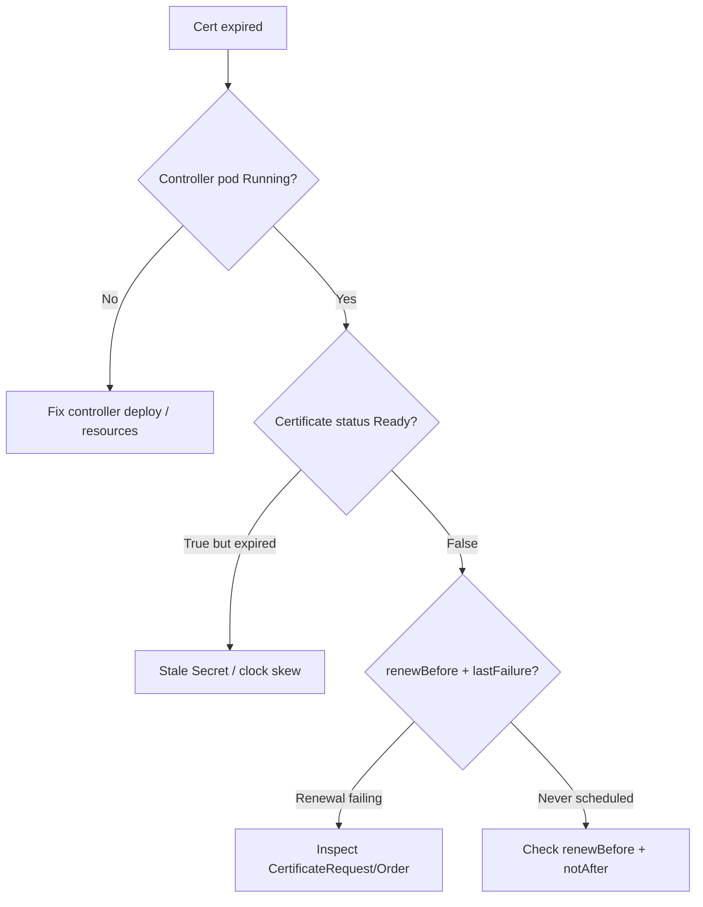

# Certificate Expired Not Renewed

> **Severity:** Critical · **Typical recovery time:** 5–30 min · **Affected versions:** 1.20+

## Error Message

```text
certificate expired and was not renewed
x509: certificate has expired or is not yet valid: current time ... is after ...
```

## Description

cert-manager normally renews a `Certificate` automatically well before its `notAfter` date. When this does not happen, clients begin failing TLS handshakes with `certificate has expired`, breaking ingress, webhooks, and mTLS. The most common reason is that the cert-manager controller is not actually reconciling the object — it is stopped, crash-looping, leader-election is stuck, or the `Certificate`/`Secret` was orphaned. Expiry is almost always operational (controller down) rather than a misconfiguration, because the renewal logic itself is robust.

## Affected Kubernetes Versions

All Kubernetes 1.20+ running cert-manager v1.x. The renewal scheduler behavior described here applies to cert-manager v1.0 and later; older v0.x releases used different annotations and are out of support.

## Likely Root Causes

- cert-manager **controller pod not running** (CrashLoopBackOff, OOMKilled, evicted, or scaled to 0).
- Leader election deadlock so no controller instance owns reconciliation.
- `renewBefore` set too small (or `0`) so the renewal window opened too late.
- Renewal repeatedly failed (ACME rate limit, DNS/HTTP-01 failure, issuer not ready) and exhausted retries while the old cert silently expired.
- `Certificate` paused via `cert-manager.io/issue-temporary-certificate` workflow, or the `Secret` was edited/replaced out of band.
- Clock skew on nodes causing premature "expired" evaluation.

## Diagnostic Flow



## Verification Steps

1. Confirm the cert-manager controller, webhook, and cainjector pods are healthy.
2. Read the `Certificate` status conditions and `renewalTime`.
3. Inspect the most recent `CertificateRequest` to see whether renewal was attempted.
4. Decode the served `Secret` to confirm the actual `notAfter`.
5. Check node clocks for skew.

## kubectl Commands

```bash
# READ-ONLY ONLY. Allowed: kubectl get/describe certificate,certificaterequest,order,challenge,issuer,clusterissuer ; cmctl status (read-only). NO mutating verbs.
kubectl get pods -n cert-manager
kubectl get certificate -A
kubectl describe certificate my-tls -n app
kubectl get certificaterequest -n app
kubectl describe certificaterequest -n app
cmctl status certificate my-tls -n app
```

## Expected Output

```text
Name:   my-tls
Status:
  Conditions:
    Type    Status  Reason  Message
    Ready   False   Expired  Certificate is expired
  Not After:      2026-06-20T10:00:00Z
  Renewal Time:   2026-06-13T10:00:00Z   # passed with no successful request
Events:
  Warning  Expired  controller  Certificate my-tls expired on 2026-06-20
```

## Common Fixes

1. **Restart / scale the controller** if it is down: `kubectl rollout restart deployment cert-manager -n cert-manager` (after diagnosing why it stopped).
2. **Fix resource limits** if OOMKilled; raise memory requests/limits on the controller.
3. **Trigger immediate renewal**: `cmctl renew my-tls -n app` once the controller is healthy.
4. **Set a sane `renewBefore`** — default is ~2/3 of lifetime (e.g. 30 days for a 90-day Let's Encrypt cert). Do not set it to `0`.
5. **Resolve the underlying issue failure** (rate limit, DNS-01) so renewal can complete; see Related Errors.

## Recovery Procedures

1. Diagnose and restore the controller (read-only checks first).
2. **Disruptive — `cmctl renew my-tls -n app`.** Blast radius: triggers a new ACME order; on production Let's Encrypt this counts against rate limits, so validate on staging first if you may loop.
3. Watch the new `CertificateRequest` → `Order` → `Challenge` complete.
4. Once `Ready=True`, **disruptive — `kubectl rollout restart`** the consuming Deployments/Ingress controller so they pick up the new `Secret` (some controllers hot-reload, others do not). Blast radius: brief pod restarts for affected workloads.

## Validation

```bash
kubectl get certificate my-tls -n app   # READY=True, fresh Renewal Time
cmctl status certificate my-tls -n app
```

Confirm the served leaf `notAfter` is in the future and `renewalTime` is ~2/3 into the new lifetime.

## Prevention

- Alert on `certmanager_certificate_expiration_timestamp_seconds` (Prometheus) and on controller `up == 0`.
- Keep `renewBefore` at the default ratio; renewal fires at ~2/3 of lifetime so failures have ample retry headroom.
- Always test issuance flows on **ACME staging** before production to avoid exhausting prod rate limits during renewal storms.
- Run the controller with adequate memory and a PodDisruptionBudget.

## Related Errors

- [Certificate Not Ready](./certificate-not-ready.md)
- [Certificate Secret Not Created](./certificate-secret-not-created.md)
- [ACME Rate Limited](./acme-rate-limited.md)

## References

- https://cert-manager.io/docs/usage/certificate/
- https://cert-manager.io/docs/reference/api-docs/#acme.cert-manager.io/v1
- https://cert-manager.io/docs/devops-tips/prometheus-metrics/
- https://kubernetes.io/docs/concepts/configuration/secret/

## Further Reading

- https://devopsaitoolkit.com/
