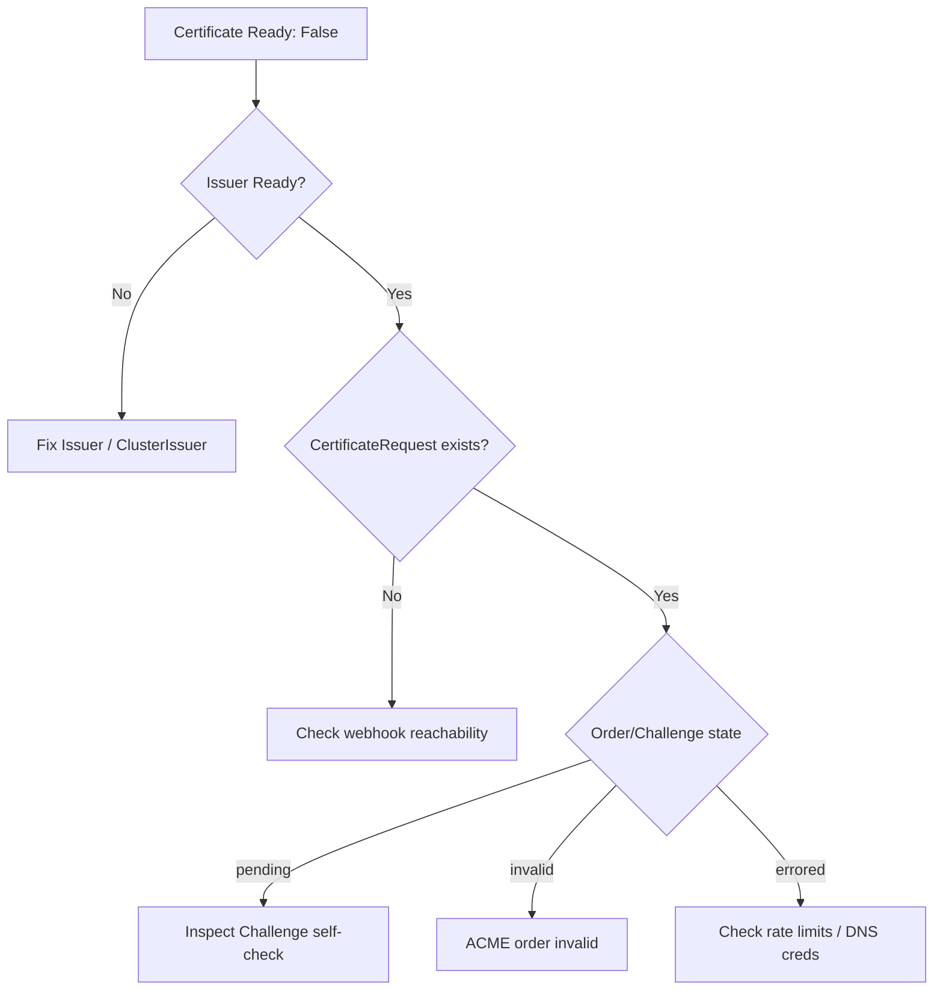

# Certificate Not Ready

> **Severity:** High · **Typical recovery time:** 5–30 min · **Affected versions:** 1.20+

## Error Message
```text
Status:
  Conditions:
    Message: Issuing certificate as Secret does not exist
    Reason:  DoesNotExist
    Status:  False
    Type:    Ready
```

## Description
A `Certificate` resource stuck with `Ready: False` is the most common cert-manager symptom an SRE encounters. The `Ready` condition is the rollup of the entire issuance pipeline: `Certificate` → `CertificateRequest` → `Order` (ACME) → `Challenge`. A failure or stall at any downstream stage surfaces here, so the top-level message is a starting point, not a root cause.

Because workloads mounting the target Secret may continue serving an old or self-signed certificate (or fail to start if the Secret is absent), a non-Ready Certificate is frequently a precursor to TLS handshake failures and ingress outages. Treat it as an active incident when it blocks production traffic.

## Affected Kubernetes Versions
Applies to all Kubernetes versions running cert-manager 1.0+ (Kubernetes 1.20+). The `Certificate` CRD schema and condition semantics are stable across these releases. On cert-manager 1.4+ the `status.conditions` include richer `Reason` values (`DoesNotExist`, `Issuing`, `Pending`). Always confirm your cert-manager version with `cmctl version` since CRD field availability differs between minor releases.

## Likely Root Causes
- The referenced `Issuer`/`ClusterIssuer` is not Ready (bad config, ACME registration failure).
- An ACME `Order`/`Challenge` is failing (HTTP-01 or DNS-01 self-check, invalid order).
- ACME rate limits reached on Let's Encrypt production.
- DNS-01 provider credential errors or missing RBAC for the solver.
- The target Secret was deleted, or `secretName` collides with an unmanaged Secret.
- Webhook unavailable, blocking admission/conversion of cert-manager resources.

## Diagnostic Flow


## Verification Steps
Confirm the condition really lives on the Certificate and not a stale cache. Inspect the condition `Type: Ready`, its `Status`, `Reason`, and `Message`, then walk one level down into the owned `CertificateRequest` to see whether the request itself is pending or denied.

## kubectl Commands
```bash
# READ-ONLY ONLY. No mutating verbs.
kubectl get certificate -A
kubectl describe certificate my-cert -n my-namespace
kubectl get certificaterequest -n my-namespace
kubectl describe certificaterequest -n my-namespace
kubectl get order,challenge -n my-namespace
cmctl status certificate my-cert -n my-namespace
```

## Expected Output
```text
Name:       my-cert
Conditions:
  Type     Status  Reason       Message
  Ready    False   Pending      Waiting on certificate issuance from order my-cert-1: "pending"
Events:
  Type    Reason     Message
  Normal  Requested  Created new CertificateRequest resource my-cert-xxxxx
```

## Common Fixes
1. Resolve the upstream `Issuer`/`ClusterIssuer` first — a non-Ready issuer can never produce a Ready certificate (see [Issuer Not Ready](./issuer-not-ready.md)).
2. Drill into the `Challenge` and fix the failing self-check (HTTP-01 or DNS-01).
3. If on Let's Encrypt production, check for [ACME rate limiting](./acme-rate-limited.md) and switch to staging while debugging.
4. Verify the cert-manager webhook is reachable so requests can be admitted.

## Recovery Procedures
1. Identify the blocked stage via `cmctl status certificate` (read-only) and `describe`.
2. Fix the root cause at that stage (issuer, challenge, credentials).
3. **Disruptive (low blast radius):** Re-trigger issuance by removing the stale `Certificate` status/owned resources — coordinate with the app owner, as the mounted Secret may briefly remain on its last value. Only the single namespace's workloads are affected.
4. Allow up to a few minutes for the controller to re-enter the issuance loop and reach `Ready: True`.

## Validation
Confirm `kubectl get certificate` shows `READY: True` and the `Not After` date is current. Verify the backing Secret exists and contains a non-empty `tls.crt`. A successful `Normal Issuing`/`Issued` event confirms completion.

## Prevention
Use the ACME staging environment in non-prod to avoid rate limits. Add CI checks that lint `Issuer`/`Certificate` references. Alert on `certmanager_certificate_ready_status` and on certificates expiring within 21 days.

## Related Errors
- [Issuer Not Ready](./issuer-not-ready.md)
- [Certificate Secret Not Created](./certificate-secret-not-created.md)
- [ACME Order Invalid](./acme-order-invalid.md)
- [ACME Rate Limited](./acme-rate-limited.md)

## References
- https://cert-manager.io/docs/usage/certificate/
- https://cert-manager.io/docs/troubleshooting/
- https://kubernetes.io/docs/concepts/configuration/secret/

## Further Reading
- [DevOps AI ToolKit](https://devopsaitoolkit.com/)
