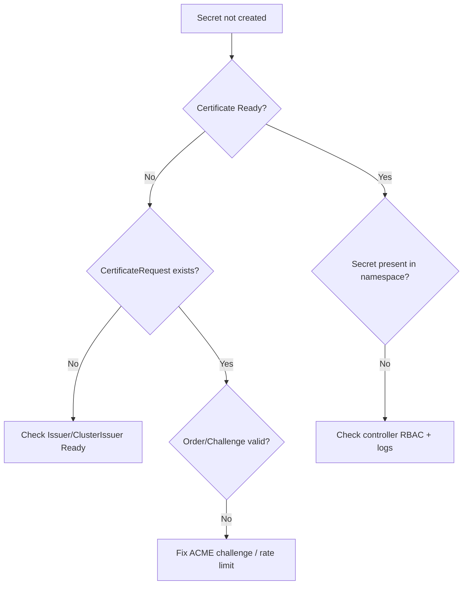

# Certificate Secret Not Created

> **Severity:** High · **Typical recovery time:** 5–30 min · **Affected versions:** 1.20+

## Error Message

```text
Normal  Generated  Certificate/example-tls  Stored new private key in temporary Secret resource "example-tls-xxxxx"
Warning  Issuing   Certificate/example-tls  The certificate request has failed to complete and will be retried:
  Secret "example-tls" for certificate not created; waiting for order to become valid
```

## Description

A `Certificate` resource references a target Secret (via `spec.secretName`) that cert-manager is expected to create and populate with the issued `tls.crt` and `tls.key`. When the Secret never appears, downstream consumers (Ingress, gateways, mTLS sidecars) cannot terminate TLS. The Secret is only written at the very end of a successful issuance: cert-manager first creates a `CertificateRequest`, then (for ACME) an `Order` and `Challenge`, and only on a fully valid order does it store the final certificate into the named Secret. A missing Secret therefore almost always means the issuance pipeline stalled before completion, not that Secret creation itself failed.

## Affected Kubernetes Versions

All Kubernetes versions running cert-manager v1.0+ (1.20 through current). Behavior is identical across managed providers (EKS, GKE, AKS) and self-managed clusters. The only version-sensitive concern is RBAC: clusters with restrictive Pod Security Admission or custom RBAC may block the cert-manager controller's `secrets` create permission in the target namespace.

## Likely Root Causes

- The `Certificate` is not `Ready` because its `CertificateRequest`/`Order`/`Challenge` is stuck (most common).
- The referenced `Issuer`/`ClusterIssuer` is not ready, so no request can succeed.
- cert-manager ServiceAccount lacks RBAC to create Secrets in the Certificate's namespace.
- `spec.secretName` typo, or another controller deletes/owns the Secret.
- Namespace mismatch: `Certificate` and Secret must live in the same namespace; a `ClusterIssuer` is required for cross-namespace issuance patterns.
- Disabled or crash-looping cert-manager controller pod.

## Diagnostic Flow



## Verification Steps

1. Confirm the `Certificate` status and whether it is `Ready=False`.
2. Trace the chain: `Certificate` → `CertificateRequest` → `Order` → `Challenge`.
3. Confirm the backing `Issuer`/`ClusterIssuer` is `Ready=True`.
4. Verify the Secret name and namespace match `spec.secretName`.
5. Inspect controller logs for RBAC `forbidden` errors on Secrets.

## kubectl Commands

```bash
# READ-ONLY ONLY. Allowed: kubectl get/describe certificate,certificaterequest,order,challenge,issuer,clusterissuer ; cmctl status (read-only). NO mutating verbs.
kubectl get certificate example-tls -n app -o wide
kubectl describe certificate example-tls -n app
kubectl get certificaterequest -n app
kubectl describe certificaterequest -n app
kubectl get order,challenge -n app
kubectl describe issuer,clusterissuer
cmctl status certificate example-tls -n app
```

## Expected Output

```text
NAME         READY   SECRET       AGE
example-tls  False   example-tls  12m

Status:
  Conditions:
    Message: Issuing certificate as Secret does not exist
    Reason:  DoesNotExist
    Status:  False
    Type:    Ready
Events:
  Warning  Issuing  The certificate request has not completed; order pending
```

## Common Fixes

1. Resolve the underlying issuance failure — fix the stuck Challenge/Order or the not-ready Issuer (see Related Errors). The Secret is created automatically once issuance succeeds.
2. Correct `spec.secretName` and ensure the `Certificate` is in the same namespace as the desired Secret.
3. Grant cert-manager's controller ServiceAccount permission to manage Secrets in the target namespace.
4. Switch to a `ClusterIssuer` if multiple namespaces need the same issuer.
5. Use the ACME **staging** server first to avoid hitting Let's Encrypt **production** rate limits (50 certs/registered-domain/week, 5 duplicate certs/week) while iterating.

## Recovery Procedures

1. Identify the failing stage via the diagnostic chain (read-only).
2. If the Issuer is broken, repair it before anything else — no Secret can be created otherwise.
3. **Disruptive:** Deleting and recreating the `Certificate` forces a fresh request. Blast radius: any Ingress/workload using the old Secret loses TLS until reissuance completes; on ACME prod this consumes rate-limit budget.
4. **Disruptive:** Restarting the cert-manager controller deployment clears stuck reconciliation. Blast radius: brief pause in all certificate reconciliation cluster-wide.
5. Re-run on staging if production rate limits are near exhaustion, then cut over.

## Validation

Confirm `kubectl get certificate -n app` shows `READY=True` and `kubectl get secret example-tls -n app` returns a Secret of type `kubernetes.io/tls` containing both `tls.crt` and `tls.key`. Inspect the consuming Ingress/gateway to confirm TLS now terminates.

## Prevention

- Always validate Issuer readiness in CI before applying Certificates.
- Pin a `ClusterIssuer` for shared platform certificates.
- Keep cert-manager RBAC intact when applying restrictive policies.
- Alert on `Certificate` `Ready=False` lasting more than 15 minutes.

## Related Errors

- [Certificate Not Ready](./certificate-not-ready.md)
- [Issuer Not Ready](./issuer-not-ready.md)
- [HTTP-01 Challenge Propagation Failed](./challenge-http01-propagation-failed.md)

## References

- https://cert-manager.io/docs/usage/certificate/
- https://cert-manager.io/docs/troubleshooting/
- https://kubernetes.io/docs/concepts/configuration/secret/#tls-secrets
- https://letsencrypt.org/docs/rate-limits/
