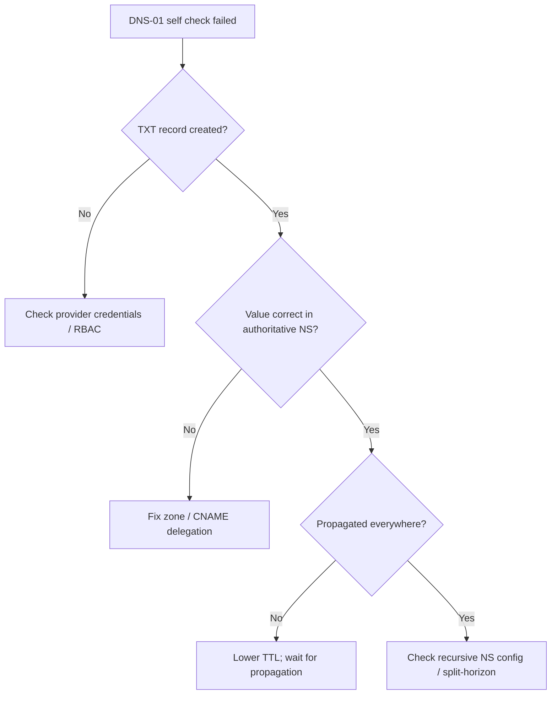

# DNS-01 Propagation Check Failed

> **Severity:** High · **Typical recovery time:** 5–30 min · **Affected versions:** 1.20+

## Error Message
```text
Waiting for DNS-01 challenge propagation: DNS-01 self check failed: propagation check failed:
DNS record for "example.com" not yet propagated
```

## Description
For a DNS-01 challenge, cert-manager creates a `_acme-challenge.<domain>` TXT record containing a hash of the challenge token, then runs a **self-check**: it queries authoritative nameservers until the expected TXT record is observed. This error means the self-check has not yet seen the correct value — the record is missing, wrong, or has not propagated.

As an SRE, distinguish two cases: the provider rejected the record write (a credentials/permissions problem) versus the record exists but is slow to propagate or split-horizon DNS is hiding it from cert-manager. The challenge stays `pending` and retries with backoff. DNS-01 is the only option for wildcard certificates and for internal domains, so failures here often block multiple downstream services at once.

## Affected Kubernetes Versions
Applies to cert-manager 1.0+ on Kubernetes 1.20+; behavior is largely independent of the Kubernetes version because DNS-01 operates against external DNS providers. cert-manager 1.x changed default recursive nameservers and added `--dns01-recursive-nameservers-only`; the set of built-in DNS solvers also varies by cert-manager release, so verify with `cmctl version`.

## Likely Root Causes
- TXT record was never created — provider API credentials missing or unauthorized.
- Wrong DNS zone / delegation, so the record lands in a zone no resolver consults.
- Slow propagation or high TTL on the authoritative zone.
- Split-horizon / internal DNS returns a different answer than the public authority.
- `CNAME` delegation for `_acme-challenge` misconfigured.
- cert-manager querying the wrong recursive nameservers (caching stale NXDOMAIN).

## Diagnostic Flow


## Verification Steps
Confirm the active solver is DNS-01 and the `Challenge` `status.state` is `pending` with a message containing `propagation check failed`. Independently query the record (read-only): `dig +short TXT _acme-challenge.example.com @1.1.1.1`. Compare the returned value against what the Challenge expects.

## kubectl Commands
```bash
# READ-ONLY ONLY. No mutating verbs.
kubectl get challenge -A
kubectl describe challenge -n my-namespace
kubectl get order -n my-namespace
kubectl describe order -n my-namespace
kubectl get clusterissuer,issuer -A
kubectl describe clusterissuer my-dns-issuer
cmctl status certificate my-cert -n my-namespace
```

## Expected Output
```text
Name:    my-cert-xxxxx-987654
Type:    DNS-01
Status:  pending
Reason:  Waiting for DNS-01 challenge propagation: DNS-01 self check failed
Events:
  Type     Reason         Message
  Normal   Presented      Presented challenge using DNS-01 challenge mechanism
  Warning  PresentError   propagation check failed: DNS record not yet propagated
```

## Common Fixes
1. Verify the DNS provider credentials and permissions — a write failure shows as "never propagated" (see [DNS-01 Provider Credentials Error](./dns01-provider-credentials-error.md)).
2. Confirm the record is created in the correct, delegated zone; fix any `_acme-challenge` CNAME delegation.
3. Lower the TTL on the challenge zone and allow propagation time.
4. Set `dns01-recursive-nameservers` to a public resolver and enable `--dns01-recursive-nameservers-only` to bypass split-horizon internal DNS.

## Recovery Procedures
1. Manually resolve the TXT record against the authoritative and public resolvers (read-only `dig`).
2. If absent, fix provider credentials/zone; if present-but-stale, wait out the TTL.
3. **Disruptive (cluster-wide blast radius):** changing the cert-manager controller's `--dns01-recursive-nameservers` flag restarts the controller and affects all DNS-01 issuances. Schedule it and coordinate.
4. Let cert-manager retry with backoff. Use ACME **staging** while debugging — production Let's Encrypt rate limits (50 certs/registered domain/week, 5 failed validations/account/host/hour) are easy to hit during DNS iteration.

## Validation
`dig TXT _acme-challenge.example.com` returns the expected hash from public resolvers, the `Challenge` becomes `valid`, the `Order` `valid`, and the `Certificate` reaches `Ready: True` with a fresh `Not After` date.

## Prevention
Keep challenge-zone TTLs low (e.g. 60s). Scope DNS provider credentials to the exact zone with least privilege. Use a dedicated delegated zone for ACME. Add CI checks against ACME staging before promoting issuers to production.

## Related Errors
- [Certificate Not Ready](./certificate-not-ready.md)
- [HTTP-01 Challenge Propagation Failed](./challenge-http01-propagation-failed.md)
- [DNS-01 Provider Credentials Error](./dns01-provider-credentials-error.md)
- [ACME Rate Limited](./acme-rate-limited.md)

## References
- https://cert-manager.io/docs/configuration/acme/dns01/
- https://cert-manager.io/docs/troubleshooting/acme/
- https://kubernetes.io/docs/concepts/services-networking/dns-pod-service/

## Further Reading
- [DevOps AI ToolKit](https://devopsaitoolkit.com/)
