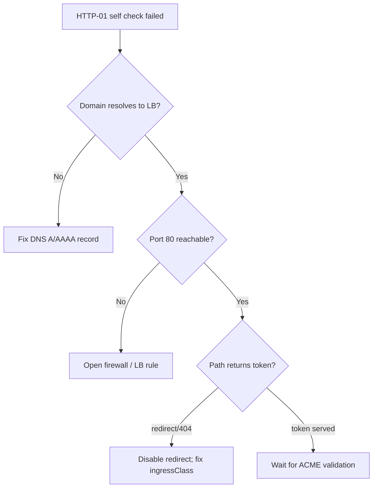

# HTTP-01 Challenge Propagation Failed

> **Severity:** High · **Typical recovery time:** 5–30 min · **Affected versions:** 1.20+

## Error Message

```text
Waiting for HTTP-01 challenge propagation: failed to perform self check GET request
'http://example.com/.well-known/acme-challenge/<token>': Get
"http://example.com/.well-known/acme-challenge/<token>": dial tcp: connection refused
```

## Description

During an ACME HTTP-01 challenge, cert-manager provisions a temporary solver Pod and Ingress (or Gateway) route that serves the challenge token at `/.well-known/acme-challenge/<token>`. Before asking the ACME server to validate, cert-manager performs its own **self-check** by fetching that URL. This error means the self-check failed: cert-manager itself could not reach the token over HTTP.

From an SRE standpoint this is almost always a routing/network problem, not a cert-manager bug. The path from the public internet (and from inside the cluster) to the solver Pod is broken — wrong DNS, blocked port 80, an ingress class mismatch, or a redirect that strips the challenge path. The challenge will stay `pending` until the self-check passes or the order times out.

## Affected Kubernetes Versions

Applies to cert-manager 1.0+ on Kubernetes 1.20+. The Gateway API solver (`gatewayHTTPRoute`) requires cert-manager 1.5+ and a compatible Gateway controller. Ingress `pathType` handling matured around Kubernetes 1.19; on older ingress controllers exact vs. prefix path matching can drop the ACME path, so confirm both your cluster and ingress-controller versions.

## Likely Root Causes

- DNS for the domain does not resolve to the ingress load balancer.
- Port 80 is blocked by a firewall, security group, or cloud LB rule.
- An HTTP→HTTPS redirect is applied to the ACME challenge path.
- Wrong `ingressClassName`/`class` on the solver, so no controller serves the route.
- NetworkPolicy blocks cert-manager → solver Pod traffic for the self-check.
- The domain is internal-only and not reachable from Let's Encrypt.

## Diagnostic Flow



## Verification Steps

Confirm the failing stage is the HTTP-01 `Challenge` (not DNS-01). Look at the `Challenge` object's `status.state` (`pending`) and its event/`reason` containing `failed to perform self check`. Note the exact URL in the message — that is the address cert-manager could not reach.

## kubectl Commands

```bash
# READ-ONLY ONLY. No mutating verbs.
kubectl get challenge -A
kubectl describe challenge -n my-namespace
kubectl get order -n my-namespace
kubectl describe order -n my-namespace
kubectl get certificate,certificaterequest -n my-namespace
cmctl status certificate my-cert -n my-namespace
```

## Expected Output

```text
Name:    my-cert-xxxxx-123456
Type:    HTTP-01
Status:  pending
Reason:  Waiting for HTTP-01 challenge propagation: failed to perform self check GET request
Events:
  Type     Reason          Message
  Normal   Presented       Presented challenge using HTTP-01 challenge mechanism
  Warning  PresentError    failed to perform self check
```

## Common Fixes

1. Point the domain's A/AAAA record at the ingress load balancer and let DNS propagate.
2. Allow inbound TCP/80 end-to-end (cloud security group, LB listener, NetworkPolicy).
3. Exclude `/.well-known/acme-challenge/` from any forced HTTPS redirect (e.g. ingress-nginx `ssl-redirect` is handled automatically, but custom redirects must whitelist this path).
4. Match the solver's ingress class to your controller via the issuer's `solvers[].http01.ingress.class`/`ingressClassName`.

## Recovery Procedures

1. Reproduce the self-check from a neutral network: `curl -v http://example.com/.well-known/acme-challenge/test` (read-only check).
2. Fix the broken hop (DNS, firewall, redirect, ingress class).
3. **Disruptive (low blast radius):** changing ingress redirect annotations can momentarily affect that host's traffic; schedule it. Only the affected Ingress host is impacted.
4. cert-manager retries the self-check automatically; allow a few minutes. Use ACME **staging** while iterating — production Let's Encrypt enforces strict rate limits (e.g. 5 failed validations per account/host/hour, 50 certs/registered domain/week).

## Validation

The `Challenge` transitions to `valid`, the `Order` to `valid`, and the `Certificate` reaches `Ready: True`. A successful manual `curl` returning the token (HTTP 200, plain text) confirms reachability.

## Prevention

Pre-create and verify DNS before requesting certs. Keep port 80 open for ACME even on HTTPS-only sites. Use ACME staging in CI smoke tests. Prefer DNS-01 for internal/non-public domains.

## Related Errors

- [Certificate Not Ready](./certificate-not-ready.md)
- [DNS-01 Propagation Check Failed](./challenge-dns01-propagation-failed.md)
- [ACME Rate Limited](./acme-rate-limited.md)
- [ACME Order Invalid](./acme-order-invalid.md)

## References

- https://cert-manager.io/docs/configuration/acme/http01/
- https://cert-manager.io/docs/troubleshooting/acme/
- https://kubernetes.io/docs/concepts/services-networking/ingress/

## Further Reading

- [DevOps AI ToolKit](https://devopsaitoolkit.com/)
