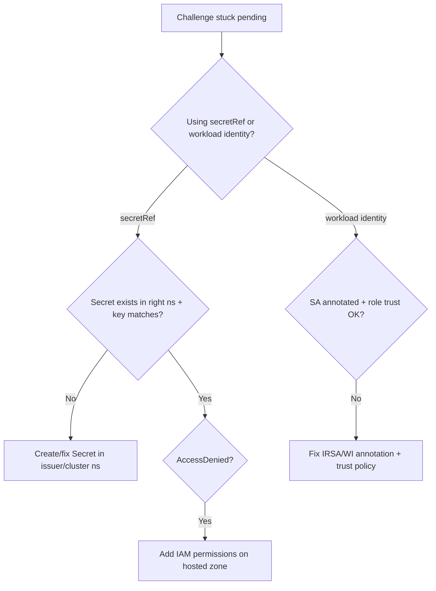

# DNS-01 Provider Credentials Error

> **Severity:** High · **Typical recovery time:** 5–30 min · **Affected versions:** 1.20+

## Error Message
```text
error getting DNS provider credentials / access denied
secret "route53-credentials" not found
AccessDenied: User ... is not authorized to perform: route53:ChangeResourceRecordSets
```

## Description
For DNS-01 ACME validation, cert-manager must create and delete a `_acme-challenge` TXT record at your DNS provider. To do that it loads provider credentials — from a referenced `Secret`, or via cloud workload identity (AWS IRSA / EKS Pod Identity, GKE Workload Identity, Azure Workload Identity). When the secret is missing, the key name is wrong, or the IAM role lacks the required permissions, the `Challenge` never reaches the `presented`/`valid` state and the `Certificate` stays not ready. This is distinct from a propagation timeout: here cert-manager cannot even authenticate to the provider.

## Affected Kubernetes Versions
All Kubernetes 1.20+ with cert-manager v1.x. IRSA/Workload Identity flows require the controller pod's `ServiceAccount` to be correctly annotated, which works on any conformant 1.20+ cluster with the relevant cloud OIDC provider configured.

## Likely Root Causes
- Referenced credentials `Secret` is missing, in the wrong namespace, or the `key` name does not match.
- For ACME `Issuer` (namespaced), the credentials Secret must live in the **same namespace as the Issuer**; for `ClusterIssuer`, in the **cert-manager controller namespace** (or `--cluster-resource-namespace`).
- IAM/role policy lacks `route53:ChangeResourceRecordSets` / `GetChange` / `ListHostedZonesByName` (or the equivalent for Cloud DNS / Azure DNS).
- IRSA misconfigured: controller `ServiceAccount` not annotated with `eks.amazonaws.com/role-arn`, or the role trust policy does not allow that SA.
- Wrong hosted zone ID / project / resource group, so the role has no rights over the actual zone.
- Static keys rotated/expired.

## Diagnostic Flow


## Verification Steps
1. Read the `Challenge` and `Order` to see the exact provider error.
2. Confirm whether the issuer uses a `secretAccessKeySecretRef` or workload identity (no secret).
3. Verify the credentials Secret exists in the correct namespace with the expected key.
4. Inspect the controller `ServiceAccount` annotations for IRSA/Workload Identity.
5. Confirm the IAM role/policy grants record changes on the target hosted zone.

## kubectl Commands
```bash
# READ-ONLY ONLY. Allowed: kubectl get/describe certificate,certificaterequest,order,challenge,issuer,clusterissuer ; cmctl status (read-only). NO mutating verbs.
kubectl describe challenge -n app
kubectl describe order -n app
kubectl describe clusterissuer letsencrypt-dns
kubectl get clusterissuer letsencrypt-dns -o yaml
kubectl describe certificate my-tls -n app
cmctl status certificate my-tls -n app
```

## Expected Output
```text
Name:    my-tls-xxxx-123456789-0
Type:    DNS-01
Status:  pending
Reason:  error getting credentials: AccessDenied: User: arn:aws:sts::...:assumed-role/cert-manager
         is not authorized to perform: route53:ChangeResourceRecordSets on resource:
         arn:aws:route53:::hostedzone/Z123EXAMPLE
Events:
  Warning  PresentError  challenge controller  ...access denied
```

## Common Fixes
1. **Create the credentials Secret in the correct namespace** with the exact key the issuer references (e.g. `secret-access-key`). For `ClusterIssuer`, put it in `cert-manager` (the `--cluster-resource-namespace`).
2. **Fix IRSA**: annotate the controller SA `eks.amazonaws.com/role-arn: arn:aws:iam::<acct>:role/cert-manager` and ensure the role trust policy allows that `system:serviceaccount:cert-manager:cert-manager` subject; restart the controller to pick up the token.
3. **Grant IAM permissions** on the hosted zone: `route53:ChangeResourceRecordSets`, `route53:GetChange`, `route53:ListHostedZonesByName` (analogous roles for Cloud DNS / Azure DNS).
4. **Correct the hosted zone / project / resource group** in the issuer `solver` config.
5. Rotate and update expired static keys.

## Recovery Procedures
1. Read-only confirm the precise error from the `Challenge`.
2. Apply the credential/IAM fix (Secret, SA annotation, or policy) — least-disruptive change first.
3. **Disruptive — `kubectl rollout restart deployment cert-manager -n cert-manager`** if you changed the SA annotation, so the pod receives a fresh projected token. Blast radius: brief reconciliation pause for all cert-manager-managed certs.
4. **Disruptive — `cmctl renew my-tls -n app`** to retry the order. Blast radius: counts against ACME rate limits; iterate on **staging** before production to avoid lockout during credential debugging.

## Validation
```bash
kubectl get challenge -n app          # should move to valid then disappear
kubectl get certificate my-tls -n app # READY=True
cmctl status certificate my-tls -n app
```

## Prevention
- Prefer workload identity (IRSA / GKE WI / Azure WI) over long-lived static keys.
- Scope IAM to the specific hosted zone, not `*`.
- Use a tightly-scoped delegated subdomain for `_acme-challenge` records.
- Keep all credential debugging on ACME **staging** to preserve production rate-limit budget.

## Related Errors
- [Challenge DNS-01 Propagation Failed](./challenge-dns01-propagation-failed.md)
- [Issuer Not Ready](./issuer-not-ready.md)
- [Certificate Not Ready](./certificate-not-ready.md)

## References
- https://cert-manager.io/docs/configuration/acme/dns01/
- https://cert-manager.io/docs/configuration/acme/dns01/route53/
- https://cert-manager.io/docs/configuration/acme/dns01/google/
- https://kubernetes.io/docs/tasks/configure-pod-container/configure-service-account/

## Further Reading
- https://devopsaitoolkit.com/
